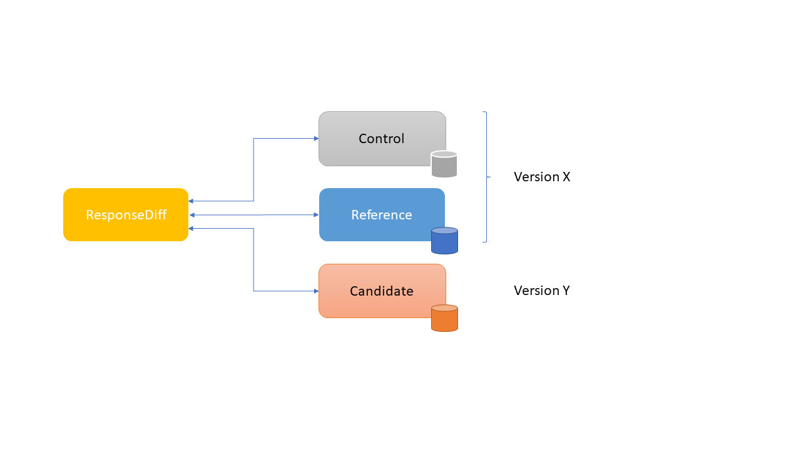

= ResponseDiff - Version 1.2.1-SNAPSHOT
:encoding: utf-8
:lang: de
:toc: left
:toclevels: 5

== Wozu dient ResponseDiff?

**Fachliche und Regressionstests**

ResponseDiff erlaubt umfassende HTTP basierte Schnittstellentests, bei denen nicht nur einzelne, erwartete Werte auf Vorhandensein und Korrektheit überprüft werden (whiteList / expected), sondern die komplette Server-Antwort. Dadurch ist ResponseDiff nicht nur für funktionale, sondern insbesondere für Regressionstests geeignet. Nicht-funktionale Test wie beispielsweise Antwortzeiten werden ebenfalls unterstützt, jedoch nur rudimentär.

**Unterstützung diverser Antwortformate**

Durch Einsatz eigener Antwortfilter ist es möglich, beliebige Antwortformate zu behandeln. Unterstützt werden bereits beliebige JSON- und XML- (und damit auch HTML-)Formate. Hypermedia-basierte JSON-Formate ("Hypermedia as the Engine of Application State", kurz "HATEOAS") wie `HAL`, `Siren`, `Collection+JSON`, `JSON:API`, etc. werden wie jedes andere JSON-Format unterstützt.

**Life-Cycle-Support**

Zusätzlich unterstützt ResponseDiff die Übernahme bestehender Tests bei Einführung einer neuen Schnittstellenversion, ohne die Test der alten Schnittstelle zu verlieren.

**Automatisiertes Testen**

Die Software kann lokal aber auch in einer Build-Pipeline eingesetzt werden. Die beim Betrieb erfassten Abweichungen werden in einem Report zusammengestellt, der sowohl zur visuellen oder technischen Analyse als auch zu Diagnosezwecken genutzt werden kann. Das Ausgabeformat des Reports ist insofern frei wählbar, als dass der technisch erzeugte XML-Report durch Angabe einer Transformationsdatei (XSLT) automatisch in das gewünschte Zielformat gewandelt wird.

== Beispiel-Szenario
Im Folgenden nennen wir unsere zu überprüfende Software "MyTool". Wir nehmen an, dass MyTool bereits in Version 1.0.0 ausgeliefert wurde.
Für die Nachfolgeversion 1.1.0 wurde

* ein Fehler korrigiert (Ticketnummer `MT-001` "firstname wird beim Person-Response nicht geliefert") und
* ein Feature hinzugefügt (Ticketnummer `MT-002` "Neues Person-Attribut hasPet (boolean) aufnehmen").

Nun soll die Nachfolgeversion dahingehend überprüft werden, dass die Funktionalität von MyTool aus der Vorgängerversion noch genauso besteht wie vorher, mit Ausnahme der beiden erwarteten Abweichungen.

== Erforderliche Infrastruktur

=== Java
ResponseDiff benötigt Java in einer Version 11 oder höher.

=== Multiserverbetrieb
Um den für einen Regressionstest notwendigen Vergleich herstellen zu können, müssen mindestens zwei Instanzen der zu prüfenden Software installiert sein.
Dabei gilt die MyTool Vorgängerversion 1.0.0 als "Referenz", während die Nachfolgeversion 1.1.0 den "Prüfkandidaten" darstellt. Für den Fall, dass für die Referenz- und die Kandidat-Instanz dieselbe URL angegeben wurde, wird eine Warnmeldung geloggt.

In der Realität kommt es nicht selten vor, dass Rückgabewerte Instanz-spezifisch sind. Dies betrifft häufig technische IDs (die z.B. als UUID serverseitig vergeben werden), aber auch Zeitstempel können aufgrund der leicht unterschiedlich laufenden Systemuhren der Server als Server-individuell angenommen werden.

Um vermeintliche, technisch bedingte Unterschiede von tatsächlichen, implementierungsbedingten Unterschieden trennen zu können, ohne diese einzeln identifizieren und im Test ausklammern zu müssen, kann optional eine Kontroll-Instanz betrieben werden. Die Kontroll-Instanz ist dabei zur Referenz-Instanz identisch. Ist eine Kontroll-Instanz verfügbar, so ermittelt ResponseDiff zunächst die Unterschiede zwischen Referenz und Kontrolle. Diese werden als technische Unterschiede (whiteNoise) im nachfolgenden Vergleich zwischen der Referenz und dem Kandidaten automatisch ignoriert.

Wichtig für ein erfolgreiches Setup ist, dass jede Instanz (Referenz, Kandidat und ggfs. Kontrolle) über eine eigene, aber identische Datenbasis verfügt, da ja auch datenändernde Zugriffe durchgeführt werden können und die Antwort eines Zweitaufrufs sich häufig von der des Erstaufrufs unterscheidet.

=== Singleserverbetrieb

Steht nur die Kandidat-Instanz zur Verfügung, so kann dieser auch gegen eine Vorgängerversion verglichen werden. Voraussetzung hierfür ist, dass die Vorgängerversion zu einem früheren Zeitpunkt im Multiserverbetrieb getestet wurde und dass der dabei ausgeleitete XML-Report noch zur Verfügung steht. Dieser "alte" XML-Report kann dann als Ersatz der Referenz-Instanz verwendet werden.

== Erste Schritte

=== Erstellen eines Test-Setups
Die Testszenarien für ResponseDiff werden in einer Setup-Datei (XML) formuliert.

.Beispiel-Setup:
====
[source,xml]
----
<?xml version="1.0" encoding="UTF-8"?>
<XmlResponseDiffSetup id="ROOT SETUP"
  xmlns:xsi="http://www.w3.org/2001/XMLSchema-instance"
  xsi:noNamespaceSchemaLocation="responseDiffSetup.xsd" <1>
>
  <description>Demo to demonstrate a basic test setup structure</description>

  <filterRegistry>
    <filter id="sortJsonBody" clazz="com.github.kreutzr.responsediff.filter.response.SortJsonBodyResponseFilter" /> <2>
  </filterRegistry>

  <testSet id="Person CRUD" order="strict"> <3>
     <description>Reading person data</description>

     <test id="Test that person firstname is no longer missing" ticketReference="MT-001,MT-002"> <4>
        <description>In version 1.0.0 a persons firstname was not returned and hasPet was not supported. In version 1.1.0 this should be fixed.</description>

        <request method="GET" endpoint="/persons" > <5>
           <description>Some optional description</description>
           <parameters>
              <parameter id="personId">1000000000000000</parameter>
           </parameters>
           <headers>
              <header name="Accept">application/json</header>
           </headers>
        </request>

        <response>
           <description>Some optional description</description>
           <filters>
              <filter id="sortJsonBody"/> <6>
           </filters>

           <ignore forEver="true"> <7>
              <header>set-cookie</header>
              <explanation>Cookie reference is random</explanation>
           </ignore>
           <ignore ticketReference="MT-001"> <7>
              <path>$.firstname</path>
              <explanation>The firstname is missing in version 1.0.0</explanation>
           </ignore>
           <ignore ticketReference="MT-002"> <7>
              <path>$.hasPet</path>
              <explanation>hasPet was not supported in version 1.0.0</explanation>
           </ignore>

           <expected> <8>
              <httpStatus ticketReference="MT-003">200</httpStatus> <9>
              <headers>
                <header name="content-type" ticketReference="MT-004">application/json</header> <10>
              </headers>
              <values> <11>
                 <value path="$.firstname" type="string" >Reinhard</value>
                 <value path="$.hasPet"    type="boolean" ticketReference="MT-005">false</value>
              </values>
              <body noBody="false" ticketReference="MT-006"/>
           </expected>
        </response>
     </test>

  </testSet>
</XmlResponseDiffSetup>
----
Schauen wir uns das Setup nun etwas genauer an:

<1> Die XSD-Datei (XSD = XML Schema Definition) in der XML-Wurzel anzugeben kann das Editieren der XML-Datei vereinfachen. Die XSD-Datei befindet sich im Verzeichnis `doc/xsds` der ResponseDiff-Version.

<2> Im Allgemeinen wird im Setup der "sortJsonBody" Filter registriert. Er wird im Beispiel weiter unten in der `response`-Definition verwendet. Der Filter sorgt dafür, dass die Map-Einträge von JSON-Antworten in einer festen und somit vergleichbaren Reihenfolge dargestellt werden.

<3> Das eingebettete TestSet kann mit einer `description` beschrieben werden und beinhaltet (in diesem Beispiel) einen einzigen Test.

<4> Der Test kann optional auf ein oder mehrere assoziierte Tickets verweisen (`ticketReference`). Links zum Ticketsystem werden im Report dargestellt. Wird mehr als ein Ticket referenziert, so müssen die Referenzen Komma-separiert hintereinander aufgeführt werden.

<5> Im `request`-Block wird definiert, mittels welcher HTTP-Methode (`method`) der angegebene Service-Endpunkt (`endpoint`) aufgerufen wird, welche Aufrufparameter (`parameters`) der Endpunkt-URL angehangen werden sollen und welche Header (`headers`) zu setzen sind.

<6> Im `response`-Block kommt nun für die hier gelieferten Antworten der oben registrierte ResponseFilter zum Einsatz. Sollten im Abschnitt `filters` mehr als ein Filter genannt sein, so werden diese in der angegebenen Reihenfolge auf der eingehenden Antwort angewendet.

<7> In den verschiedenen `ignore`-Blöcken werden nun bestimmte Aspekte vom Vergleich ausgeschlossen. Sie werden folglich nicht im Report aufgeführt. Die Angabe, welche Stellen der Antwort ignoriert werden sollen, erfolgt über per JSONPath-Syntax.

* Cookie-Referenzen sind im Allgemeinen nicht identisch und müssen daher (generell) ausgeschlossen werden.
* Der Bugfix `MT-001` bedingt ebenfalls einen `ignore`-Block, da klar ist, dass die Referenz hier nichts liefern wird. Das zugehörige Ticket ist hier verlinkt.
* Für das neue Feature `MT-002` gilt dasselbe.

<8> Da wir eine konkrete Personen-Id im Aufruf verwendet haben, können wir aber auch noch mittels `expected` einen Funktionstest realisieren.

<9> Wir erwarten, dass der HTTP-Status der Antwort 200 (`OK`) ist,
<10> der `content-type`-Header den Wert `application/json` hat und
<11> dass die Werte `firstname` und `hasPet` (definiert in `values`) ganz konkrete Ausprägungen haben. Die Angabe, an welcher Stelle der Antwort welcher Wert erwartete wird, erfolgt über per JSONPath-Syntax.
====

Das `ignore`-Tag sowie die Elemente `httpStatus`, `header`, `value` und `body` im `expected`-Block können optional mit dem Attribut `ticketReference` ausgestattet werden. Dieses kann Aufschluss darüber geben, warum eine Abweichung ignoriert werden darf oder warum ein konkreter Wert erwartet wird. So angegebene Ticketreferenzen werden dem umschließenden Test zugewiesen und tauchen somit im Report auf.

=== Starten von ResponseDiff

==== Aufruf
Ein Test mit ResponseDiff wird wie folgt gestartet:
[source,bash]
----
java -cp responsediff-<version>.jar com.github.kreutzr.responsediff.ResponseDiff <configuration>
echo $?
----

Optional kann der Log-Level von außen beim Start wie folgt gesetzt werden:
[source,bash]
----
java -cp responsediff-<version>.jar [-Dlog4j.configurationFile=file:<absolute-path>/log4j2.xml] com.github.kreutzr.responsediff.ResponseDiff <configuration>
echo $?
----

==== Konfiguration

Als Konfiguration wird ein JSON wie folgt erwartet (ohne Zeilenumbrüche):

[NOTE]
====
Es empfieht sich, das Setzen der Konfigurationsparameter innerhalb eines kleinen Skripts durchzuführen. Im `doc`-Ordner ist ein Vorschlag für solch ein Skript vorbereitet (`start-responseDiff`).
====

.Beispiel-JSON für die Aufruf-Konfiguration
====
[source,json]
----
{
  "rootPath" : "...",
  "candidateServiceUrl" : "...",
  "referenceServiceUrl" : "...",
  "referenceFilePath" : "...",
  "controlServiceUrl" : "...",
  "responseTimeoutMs" : ...,
  "ticketServiceUrl" : "...",
  "xmlFilePath" : "...",
  "reportTitle" : "...",
  "testIdPattern" : "...",
  "storeResultPath" : "...",
  "reportWhiteNoise" : [true|false],
  "maskAuthorizationHeaderInCurl" : [true|false],
  "reportControlResponse" : [true|false],
  "executionContext" : "...",
  "xsltFilePath" : "...",
  "reportFileEnding" : "...",
  "reportConversionFormats" : "...",
  "candidateHeaders" : [ { "name" : "...", "value" : "..." } ],
  "referenceHeaders" : [ { "name" : "...", "value" : "..." } ],
  "controlHeaders"   : [ { "name" : "...", "value" : "..." } ],
  "epsilon" : ...,
  "exitWithExitCode" : [true|false]
}
----
====

[NOTE]
====
* `rootPath`: Optionales Basisverzeichnis für nachfolgende relative Pfadangaben (z.B. "C:/home/rkreutz/work/develop/test/responsediff/"). Fehlt der Parameter, so wird das Ausführungsverzeichnis angenommen.
* `candidateServiceUrl`: Mandatorsiche URL der Kandidat-Instanz (z.B. "http://localhost:10500/my-tool")
* `referenceServiceUrl`: Optionale URL der Referenz-Instanz (z.B. "http://localhost:10510/my-tool")
* `referenceFilePath`: Optionaler Verweis auf einen "alten" XML-Report, der als Referenz verwendet werden soll, falls keine `referenceServiceUrl` angegeben wurde.
* `controlServiceUrl`: Optionale URL der Kontroll-Instanz (z.B. "http://localhost:10520/my-tool")
* `responseTimeoutMs`: Optionales Timeout (als Ganzzahl) für den Empfang von Antworten. (default ist 1000)
* `ticketServiceUrl`: Optionale URL zum Ticketsystem, so dass die Ticketnummer nur noch angehangen werden muss (z.B. "http://localhost/tickets/")
* `xmlFilePath`: Mandatorische Angabe der XML-Datei, welche das zu testende Setup beinhaltet. Der Pfad kann relativ zum optional angegebenen `rootPath` angegeben werden.
* `reportTitle`: Optionaler Text, der als Reporttitel verwendet werden soll. Per Default wird die `description` aus dem `XmlResponseDiffSetup`-Block verwendet. Ist der Parameter gesetzt, so wird die `description` als Untertitel verwendet.
* `testIdPattern`: Optionaler regulärer Ausdruck (in Java RegEx Syntax), um die Ausführung auf einzelne Tests einzuschränken. Wird nichts oder null übergeben, so werden alle Tests ausgeführt (default). Andernfalls werden nur diejenigen Tests ausgeführt, deren `id` zum übergebenen Ausdruck passt.
* `storeResultPath`: Mandatorische Angabe des Verzeichnisses, in dem die Ergebnisse der Tests als XML gespeichert werden sollen. (z.B. "../test-results/")
* `reportWhiteNoise`: Optionales Flag, ob auch ignorierte, technische Unterschiede (whiteNoise) ausgewiesen werden sollen (`true`) oder nicht (`false`). (default ist `false`)
* `maskAuthorizationHeaderInCurl`: Optionales Flag, ob Werte des `Authentication`-Headers maskiert werden sollen (`true`) oder nicht (`false`). (default ist `true`)
* `reportControlResponse`: Optionales Flag, ob in der ausgeleiteten XML-Datei neben den Antworten der Kandidat- und Referenz-Instanzen auch die Antwort der Kontroll-Instanz enthalten sein soll ('true') oder nicht ('false'). (default ist `false')
* `executionContext`: Optionale Auflistung (Komma-separiert) von Token, die bei bedingten Tests beachtet werden müssen (siehe Abschnitt <<Bedingte Testausführung>>). Die Wahl der Token ist frei. Es wird nicht zwischen Groß- und Kleinschreibung unterschieden.
* `xsltFilePath`: Optionaler Pfad zu einer XSLT-Datei, die zur Transformation des erzeugten XML-Reports verwendet werden soll. Das Ergebnis der Transformation wird neben dem XML-Report unter gleichem Namen abgelegt (z.B. "reporter/report-to-adoc.xslt" (default) oder "reporter/report-to-html.xslt"). **Beachte:** Die Transformationsdatei "reporter/report-to-html.xslt" ist sehr rudimentär und dient lediglich als technisches Beispiel für die Erstellung eigener Reports. Soll tatsächlich ein Report im HTML-Format erzeugt werden, so wird empfohlen, den Default-Transformer und die Default-Dateiendung (`reportFileEnding`) nicht zu verändern und stattdessen im Parameter `reportConversionFormats` den Wert `html` zu übergeben.
* `reportFileEnding`: Optionale Dateiendung für das Transformationsergebnis. (default ist `adoc`)
* `reportConversionFormats`: Optionale Auflistung der Zielformate, in die ein erzeugter AsciiDoc Report konvertiert werden soll. Die Auflistung erfolgt Komma-separiert. Folgende Aufzählungswerte werden unterstützt: `pdf`, `html`. Dieser Parameter wird nur beachtet, wenn der Parameter `reportFileEnding` den Wert `adoc` hat. Voraussetzung für ein Gelingen der Konvertierung ist selbstverständlich, dass die verwendete XSLT-Datei (vgl. Parameter `xsltFilePath`) tatsächlich den XML-Report in AsciiDoc transformiert. Das Ergebnis der AsciiDoc-Konvertierung wird neben der Reportdatei abgelegt.
* `candidateHeaders`: Optionale Header, die beim Aufruf der Kandidat-Instanz fix verwendet werden sollen. z.B. [ { "name" : "Authorization", "value" : "bearer ..." } ])
* `referenceHeaders`: Optionale Header, die beim Aufruf der Kandidat-Instanz fix verwendet werden sollen. z.B. [ { "name" : "Authorization", "value" : "bearer ..." } ])
* `controlHeaders`: Optionale Header, die beim Aufruf der Kandidat-Instanz fix verwendet werden sollen. z.B. [ { "name" : "Authorization", "value" : "bearer ..." } ])
* `epsilon`: Optionaler Epsilon-Wert für Zahlenvergleiche, bei denen kein spezielles Epsilon im Test angegeben wurde. (default ist 0.00000001)
* `exitWithExitCode`: Optionales Flag, ob Abweichungen durch einen Exit code ungleich 0 angezeigt werden sollen (`true`), oder nicht (`false`). (default ist `true`)
====

==== Exit-Code
Nach der Ausführung wird durch den Exit-Code signalisiert, ob es zu Abweichungen gekommen ist (Exit-Code != 0), oder ob der Vergleich keine Auffälligkeiten aufwies (Exit-Code = 0).
Dieses Verhalten kann bei lokaler Ausführung in einer IDE durch das optionale Flag `exitWithExitCode` abgeschaltet werden.

=== Der Report
Im konfigurierten Verzeichnis (vgl. `storeResultPath` oben) wird nach Ablauf des Tests eine XML-Datei `report_<setupName>_<timestamp>.xml` abgelegt. Wurde eine XSLT-Datei zur Transformation angegeben, so erscheint dort unter dem gleichen Namen aber mit andere Dateiendung auch der transformierte Report.

==== Die XML-Datei
Die XML-Datei entspricht der Setup-Datei.

Zudem ist je Test und TestSet vermerkt

* aus welcher XML-Datei der Test stammt (`fileName`),
* welche Variablen zur Anwendung kamen (`variables`), und
* wie der Aufruf konkret lautete (`curl`).

Die XML-Datei kann somit gut zu Debug-Zwecken verwendet werden.

==== Formatierte Reports
Der formatierte Report enthält alle bei der Transformation berücksichtigten Informationen aus der XML-Datei in einer besser strukturierten und menschenlesbareren Weise.

Wenn in der Transformation nicht alle Tests berücksichtigt werden sollen (z.B., weil man nur an den nicht erfolgreichen Tests interessiert ist), so kann das optionale Attribute `report` im Transformator verwendet werden. Ein Attributwert eines äußeren TestSets vererbt sich in die inneren TestSets und Tests solange dort kein abweichender Wert angegeben wurde.

.Beispiel für die Verwendung des report-Attributs
====
[source,xml]
----
<?xml version="1.0" encoding="UTF-8"?>
<XmlResponseDiffSetup ...>
  ...
  <testSet> <!-- Ohne Angabe des report-Attributs gilt der Wert "fail,skip" -->
     ...
     <testSet report="fail,skip,warn">
        ...
     </testSet>
     <test ... report="success">
     </test>
  </testSet>
</XmlResponseDiffSetup>
----
====

Dadurch, dass der zu verwendende Transformator konfiguriert wird, können eigene Transformatoren verwendet werden.

Die folgenden XSLT-Transformatoren stehen aktuell zur Verfügung:

===== AsciiDoc (default)
Name der Transformatordatei: `report-to-adoc.xslt`

Der AsciiDoc-Transformator ist die Referenzimplementierung eines Transformators. Es werden alle Testaggregationen (Analysis) auf TestSet-Ebene ausgewiesen. Tests werden nur ausgewiesen, wenn das Testergebnis der im `report`-Attribut angegebenen Ausprägung entspricht (default ist " `fail,skip` ").
Folgende Werte sind für die `report`-Attribute an den TestSets und Tests vorgesehen:

* `success`: Der Test wird im Report berücksichtigt, wenn er erfolgreich war.
* `fail`: Der Test wird im Report berücksichtigt, wenn er fehlgeschlagen ist.
* `warn`: Der Test wird im Report berücksichtigt, wenn eine Warnung auftrat.
* `skip`: Der Test wird im Report berücksichtigt, wenn er aufgrund von technischen Problemen abgebrochenen wurde, oder aufgrund eines angegebenen `testIdPattern` von der Ausführung ausgenommen wurde.
* `all`: Der Test wird unabhängig des Testergebnisses berücksichtigt.
* `none`: Der Test wird niemals berücksichtigt.

====== HTML via AsciiDoc
Es ist einfach, einen HTML-Report aus einem erzeugten AsciiDoc-Report zu erzeugen. Es reicht `html` (Komma-separiert) dem Wert des Konfigurationsparameters `reportConversionFormats` anzuhängen (siehe Abschnit "<<Konfiguration>>"). Es ist zu beachten, dass ein umfangreicher HTML-Report ggfs. einen Browser an seine Grenzen bringen kann. In diesen Fällen ist es geeigneter, einen PDF-Report zu erzeugen.

====== PDF via AsciiDoc
Wie für HTML ist es einfach, einen PDF-Report aus einem erzeugten AsciiDoc-Report zu erzeugen. Es reicht `pdf` (Komma-separiert) dem Wert des Konfigurationsparameters `reportConversionFormats` anzuhängen (siehe Abschnit "<<Konfiguration>>").

===== HTML
Name der Transformatordatei: `report-to-html.xslt`

Der HTML-Transformator ist in seiner Darstellung eher rudimentär und dient lediglich als technisches Beispiel für die Erstellung eigener Reports. Er berücksichtigt aktuell keines der `report`-Attribute an den TestSets und Tests.

Soll tatsächlich ein Report im HTML-Format erzeugt werden, so wird empfohlen, den Parameter `reportConversionFormats` zu verwenden (siehe Abschnitt "<<Konfiguration>>").

== Features
Neben der oben gezeigten, einfachen Konfiguration können komplexe und anspruchsvollere Test-Szenarien von ResponseDiff behandelt werden. Diese Möglichkeiten werden nachfolgend aufgeführt und erklärt.

=== Testübergreifende Vorgaben
Die vollständige Ausformulierung aller Aufrufparameter etc. je Test ist sehr aufwändig und pflegeintensiv. Häufig kommt es vor, dass zahlreiche Tests untereinander einheitlich strukturiert sind und sich nur in Details unterscheiden. Aus diesem Grund können Tests in TestSets strukturiert werden. Gemeinsamkeiten der einzelnen Tests können dann in die Konfiguration des TestSets ausgelagert werden und müssen nicht mehr je Test genannt werden. Dennoch ist es möglich, ausgelagerte Eigenschaften punktuell lokal zu überschreiben.

Weiter können TestSets ebenfalls in TestSets strukturiert werden, wodurch sich der Schreib- und Anpassungsaufwand weiter reduziert. Somit ergeben sich folgende Ebenen:

==== Ebene 0 - Setup
Die äußerste Ebene enthält (fast) nur generelle Informationen. Alle diese generellen Informationen sind optional.
Diese sind im Einzelnen:

* Die Basis-URL des Ticketsystems, um im erzeugten Report direkt auf Tickets verweisen zu können. Dieser Wert muss nicht manuell gesetzt werden. Stattdessen wird er automatisch aus der Aufruf-Konfiguration übernommen.
* Eine kurze Beschreibung des Test-Setups (`description`).
* Die namentliche Registrierung von in den Tests zu verwendenden Request- und Response-Filtern (`filterRegistry`).
* Eine Deklaration Test(Set)-übergreifend gültiger Variablen (`variables`).

Die Definition mindestens eines TestSets (`testSet`) ist mandatorisch.

.TestSetup
====
[source,xml]
----
<?xml version="1.0" encoding="UTF-8"?>
<XmlResponseDiffSetup ...>
  <description>Demo to demonstrate a basic test setup structure</description>

  <filterRegistry>
     <filter id="sortJsonBody" clazz="com.github.kreutzr.responsediff.filter.response.SortJsonBodyResponseFilter" />
  </filterRegistry>

  <variables>
     <variable id="personId">1000000000000000</variable>
  </variables>

  <testSet ...>
     ...
  </testSet>
</XmlResponseDiffSetup>
----
====

==== Ebene 1-n - TestSet
Ein TestSet umfasst eine Menge von Tests.

Ein TestSet umfasst wie das Test-Setup auch einige generelle Informationen, die für alle eingebetteten Tests und TestSets gelten. Ihre Angabe ist optional. Diese Informationen sind im Einzelnen:

* Eine kurze Beschreibung des TestSets (`description`).
* Die namentliche Registrierung von in den Tests zu verwendenden Request- und Response-Filtern (`filterRegistry`). *Hierbei ist zu beachten, dass Filternamen über alle Ebenen hinweg eindeutig sein müssen.* An beliebiger Stelle registrierte Filter stehen allen Tests zur Verfügung. Wird ein Filter unter dem selben Namen mehrfach registriert, so wird der Regressionstest noch vor dem Start abgebrochen. *Aus diesem Grund können TestSets, die mehrfach ausgeführt werden (Stichwort `iterations`), lokal keine weiteren Filter registrieren.*
* Eine Deklaration übergreifend gültiger Variablen (`variables`).
* Übergreifend geltende `request`-Informationen, um in den Tests Redundanzen zu vermeiden (`request`).
* Übergreifend geltende `response`-Informationen, um in den Tests Redundanzen zu vermeiden (`response`).

Darüber benötigt jedes TestSet verpflichtend ein `id`-Attribut.

.TestSet
====
[source,xml]
----
  <testSet id="TS-1">
     <description>Some text</description>
     <filterRegistry>
        ...
     </filterRegistry>
     <variables>
        ...
     </variables>
     <request ...>
        ...
     </request>
        ...
     <response ...>
        ...
     </response>

     <test ...>
        ...
     </test>
     <test ...>
        ...
     </test>
  </testSet>
----
====

Ein TestSet kann aber ebenso auch weitere TestSets beinhalten. Auf diese Weise ergibt sich eine Baumstruktur.

.Strukturiertes, komplexes Test-Setup
====
[source,xml]
----
<?xml version="1.0" encoding="UTF-8"?>
<XmlResponseDiffSetup ...>
  ...
  <testSet id="TS-1">
     ...
     <testSet id="TS-1/1">
        ...
     </testSet>
     <testSet id="TS-1/2">
        ...
        <testSet id="TS-1/2/1">
           ...
        </testSet>
     </testSet>
  </testSet>
  <testSet id="TS-2">
     ...
  </testSet>
</XmlResponseDiffSetup>
----
====

==== End-Ebene - Test
Die letzte Ebene (bzw. das Blatt in der Baumstruktur) bildet ein Test. Ein Test benötigt die folgenden Informationen. Fehlen diese, werden die Informationen aus der umschließenden Struktur (TestSet -> ... -> Test-Setup) übernommen.
Folgende Informationen werden benötigt:

* Eine kurze Beschreibung des Tests.
* Eine Deklaration der lokal gültigen Variablen.
* Lokale `request`-Informationen.
* Lokale `response`-Informationen.

Darüber benötigt jeder Test verpflichtend ein `id`-Attribut.

.Beispiel für einen Test
====
[source,xml]
----
     ...
     <test id="Test that a person can be updated">
        <description>A person's attributes are changed.</description>

        <request method="PUT" endpoint="/persons" >
           <description>Some optional description</description>
           <parameters>
              <parameter id="personId">1000000000000000</parameter>
           </parameters>
           <headers>
              <header name="Accept">application/json</header>
           </headers>
           <body>
           {
             "name" : "Kreutz",
             "firstname" : "Reinhard",
             "dateOfBirth" : "1967-09-27",
             "size" : 1.94,
             "hasPet" : true
           }
           </body>
        </request>

        <response>
           <description>Some optional description</description>
           <filters>
              <filter id="sortJsonBody"/>
              ...
           </filters>

           <ignore forEver="true">
              <header>set-cookie</header>
              <explanation>Cookie reference is random</explanation>
           </ignore>
           <ignore>
              <path>$.random</path>
              <explanation>The random attribute is a server specific UUID</explanation>
           </ignore>
           ...

           <expected>
              <httpStatus>200</httpStatus>
              <headers>
                 <header name="Content-Type">application/json</header>
                 ...
              </headers>
              <values>
                 <value path="$.name">Kreutz</value>
                 ...
              </values>
              <body noBody="false">
                 ...
              </body>
           </expected>
        </response>
     </test>
     <test id="Test that a person image can be uploaded">
        <description>A person's image and some image description are updated.</description>

        <request method="POST" endpoint="/persons" >
           <description>Some other optional description</description>
           <parameters>
              <parameter id="personId">1000000000000000</parameter>
           </parameters>
           <headers>
              <header name="Accept">application/json</header>
           </headers>
           <uploadParts>
              <file name="photo"     contentType="imag/png">person_1000000000000000.png</file>
              <file name="photoText" contentType="text/plain" charSet="UTF-8">someText.txt</file>
           </uploadParts>
        </request>
     </test>
     ...
----
====

===== Request
Ein `request`-Eintrag besteht aus den folgenden, optionalen Informationen:

* Eine Beschreibung (`description`).
* Eine Deklaration der lokal gültigen Variablen (`variables`).
* Eine Auflistung der für den Request anzuwendenden Filter (`filters`). Die müssen zentral im Test-Setup registriert worden sein. Die Vererbung aus umschließenden TestSets kann gezielt unterbrochen werden, indem das optionale Attribut `inherit` mit `false` belegt wird (default is `true`).
* Eine Auflistung von Parametern, die der Aufruf-URL angehangen werden sollen (`parameters`).
* Eine Auflistung der beim Aufruf zu setzenden Header (`headers`).
* Der zu sendende Nachrichtentext (`body`).
* Alternativ zu einem Nachrichtentext (`body`) können Dateien hochgeladen werden. Die Dateien (`file`) werden unter `uploadParts` zusammengefasst. Jeder `file`-Eintrag hat den Pfad zur hochzuladenden Datei als Wert. Beginnt dieser mit einem Punkt (`.`), so wird der Pfad als relativ zur Testdatei angesehen, andernfalls als absoluter Pfad. Jeder Eintrag hat zudem die folgenden Attribute:
** `name` Optionales Attribut, um der Datei einen Namen zu geben. Wird nichts angegeben, so wird der physikalische Dateiname verwendet.
** `contentType` Mandatorisches Attribut, um den MimeType des Dateidaten anzugeben.
** `charSet` Teil-mandatorisches Attribut, das bei Textdateien die jeweilige Zeichencodierung (z.B. `UTF-8`) angibt. Bei Binärdateien (z.B. Bildern) darf die Angabe fehlen.

Darüber hinaus müssen die beiden folgenden Eigenschaften gesetzt sein. Ob die Angabe lokal oder durch in einer übergreifenden Struktur (TestSet oder Test-Setup) erfolgt, ist dabei unerheblich.

* Die Aufruf-Methode (`method`). Zur Auswahl stehen "GET" (default), "HEAD", "POST", "PUT", "DELETE", "CONNECT", "OPTIONS", "TRACE" und "PATCH".
* Der aufzurufende Service-Endpunkt (`endpoint`).

===== Response
Ein `response`-Eintrag besteht aus den folgenden, optionalen Informationen:

* Eine Beschreibung (`description`).
* Eine Deklaration der lokal gültigen Variablen (`variables`).
* Eine Auflistung der für den Request anzuwendenden Filter (`filters`). Die müssen zentral im Test-Setup registriert worden sein. Die Vererbung aus umschließenden TestSets kann gezielt unterbrochen werden, indem das optionale Attribut `inherit` mit `false` belegt wird (default is `true`).
* Eine Auflistung der Antwort-Werte, die ignoriert werden sollen (`ignore`).
** Es können Header (Angabe des Namens) (`header`) und
** Antwort-Werte aus der Antwort-Nachricht (`path`) ignoriert (`ignore`) werden. (Die Angabe erfolgt per JSONPath-Syntax)
* Eine Auflistung der erwarteten Antwort-Werte für einen Funktionstest (`expected`).
** Es können der HttpStatus (`httpStatus`) geprüft werden,
** Header-Werte verglichen (Angabe des Namens) (`headers`),
** einzelne Werte aus der Antwort-Nachricht (`values`) oder
** die gesamte Antwort-Nachricht getestet werden (`body`).

Am `response`-Eintrag kann zudem das folgende, optionale Attribut gesetzt werden:

* `hideBody` Wird der Wert auf `true` gesetzt, so wird im Report keine Antwort-Nachricht dargestellt und im Falle eines Downloads keine Datei angelegt (default ist `false`). Diese Option kann interessant sein, wenn es sich um sicherheitsrelevante Informationen handelt (z.B. beim Test eines Login-Endpunkts). Als Konsequenz kann auf die Antwort-Nachricht nicht zugegriffen werden, weswegen Erwartungswerte (`expected` und `ignore`) nicht geprüft werden können.

Weitere Details zur Überprüfung der Antwort finden sich im Abschnitt "<<Features>>".

=== Strukturierung umfangreicher Test-Setups
Auf diese Weise lassen sich Test-Szenarien erstellen, in denen in einem TestSet Datenbestände aufgebaut werden, während in einem weiteren TestSet auf diesen Daten operiert wird, bis schließlich in einem letzten TestSet die Szenarien wieder abgeräumt werden.
Alternativ oder ergänzend, können verschiedene Endpunkte in unterschiedlichen TestSets gruppiert werden.

==== Einbinden externer TestSets zur Strukturierung oder Wiederverwendung
Wenn die TestSets sehr umfangreich werden, oder sich wiederkehrende Aufruffolgen ergeben, so lassen sich Test-Setups in einzelne Dateien auslagern, die aus einem TestSet eingebunden werden können. Ins einbindenden TestSet ausgelagerte Eigenschaften werden dem eingebundenen Test-Setup ebenso übergeben, wie bei geschachtelten TestSets auch. Zu beachten ist, dass die Möglichkeit des lokalen Überschreibens allgemeiner Eigenschaften auch hier zum Tragen kommt.

Das Einbetten externe Test-Setup erfolgt am Ende eines TestSets nach dem letzten Test.

.Beispiel XML zum Einbetten externer Test-Setups
====
[source,xml]
----
        ...
     </test>

     <testSetInclude file="some-folder/part_01.xml" />
     <testSetInclude file="some-folder/part_02.xml" />

  </testSet>
  ...
</XmlResponseDiffSetup>
----
====

=== Reihenfolge der Testausführung
Insbesondere bei *CRUD*-Schnittstellen (`Create`, `Read`, `Update`, `Delete`) kann die Ausführungsreihenfolge der Tests relevant sein, wenn beispielsweise zunächst ein Objekt erzeugt werden soll (`Create`), was anschließend abgefragt (`Read`), verändert (`Update`)und schließlich gelöscht (`Delete`) werden soll. Aus diesem Grund bietet ResponseDiff eine Möglichkeit, auf die Ausführungsreihenfolge Einfluss zu nehmen.

==== Das `order`-Attribut
Per default erfolgt die Ausführung der Tests und TestSets in zufälliger Reihenfolge. Ist dies nicht gewünscht, so kann man im umschließenden TestSet das optionale Attribut `order` mit dem Wert `strict` (default ist `random`) setzen.

.Beispiel XML für strikte Testausführung
====
[source,xml]
----
  <testSet id="Person CRUD" order="strict">
----
====

Diese Einstellung gilt dann für alle im TestSet eingeschlossen TestSets und Tests, es sei denn ein inneres TestSet überschreibt für seine inneren Elemente die äußere Vorgabe. Innerhalb eines TestSets werden die Tests vor den enthaltenen TestSets ausgeführt. Diese Reihenfolge kann nicht verändert werden.

==== Lokaler Testabbruch
Hängen Tests voneinander ab (beispielsweise, weil erwartet wird, dass Abfrage-Aufrufe nicht funktionieren werden, wenn die Erzeugung eines später abzufragenden Objekts fehlgeschlagen ist), so kann dem durch das Attribut `breakOnFailure` auf Test-Ebene Rechnung getragen werden. Das Attribut würde beim Test, der ein später benötigtes Objekt anlegt auf `true` gesetzt werden (default ist `false`). Schlägt dieser Aufruf dann fehl, so werden alle nachfolgenden Tests und TestSets dieser Gliederungsebene nicht mehr ausgeführt. So übersprungene Tests werden in der Testzusammenfassung als "skipped" notiert.

Um zu vermeiden, dass ein Testabfolge abgebrochen wird, "nur" weil ein eher unwichtiger Test (z.B. eine Zeitmessung) fehlschlägt, kann je Wertprüfung ein LogLevel (`logLevel`) definiert werden. Nur die Level `ERROR` und `FATAL` führen zu einem Testabbruch, nicht aber z.B. `WARN`. Wenn kein LogLevel explizit angegeben ist, wird `ERROR` als Default angenommen.

Der Mechanismus kann auf TestSet-Ebene fortgeführt werden, so dass bei einem auf diese Weise abgebrochenen TestSet die nachfolgenden TestSets der selben Gliederungsebene ebenfalls nicht mehr ausgeführt werden.

.Lokaler Testabbruch und Einsatz von `logLevel`
====
[source]
----
<XmlResponseDiffSetup ...>
  <testSet id="Complex test" order="strict"> <1>
    <testSet id="before" breakOnFailure="true> <2>
      <test id="Create test element" breakOnFailure="true"> <3>
        ...
        <response> <4>
          <httpStatus logLevel="WARN">200</httpStatus>
          <headers>
            <header name="x-duration" path="$.duration" logLevel="WARN" type="duration" epsilon="PT0.005S">PT0S</header>
          </headers>
          <maxDuration logLevel="WARN">PT0.010S</maxDuration>
          <values>
            <value path="..." logLevel="WARN">...</value>
          </values>
          <body logLevel="WARN">...</body>
        </expected>
        </response>
      </test>
      ...
      <overAllExpected> <5>
        <maxDuration logLevel="WARN">PT0S</maxDuration>
      </overAllExpected>
    </testSet>
    <testSet id=test">
      ...
    </testSet>
    <testSet id=after">
      ...
    </testSet>
  </testSet>
</XmlResponseDiffSetup>
----
<1> Das umschließende TestSet definiert durch Angabe von `order="strict"` eine sequenzielle Ausführung der inneren Elemente. Dadurch wird das TestSet mit ID "before" als erstes ausgeführt.
<2> Das TestSet "before" ist mit `breakOnFailure="true"` markiert. Scheitert die Ausführung mit nur einem (inneren) Fehler (`ERROR` oder `FATAL`), so werden die nachfolgenden TestSets  "test" und "after" übersprungen ("lokaler Testabbruch"). Wenn die Ausführungsreihenfolge der inneren Tests relevant wäre, müsste hier ebenfalls `order="strict"` gesetzt werden.
<3> Der Test mit ID "Create test element" ist ebenfalls mit `breaOnFailure="true"` markiert. Ein Scheitern führt zum Überspringen aller nachfolgenden Tests.
<4> Bei den Erwartungswerten kann optional ein LogLevel angegeben werden. Ist der LogLevel nicht `ERROR` oder `FATAL`, so löst ein Scheitern **keinen** lokalen Testabbruch aus.
<5> Das selbe gilt für die übergreifenden Erwartungswerte (`overAllExpected`).
====

[CAUTION]
====
Das Attribut `breakOnFailure` wird nicht vererbt, sondern gilt ausschließlich lokal. Zudem ist es nur erlaubt, wenn für das umschließende TestSet eine strikte Ausführung konfiguiert ist (`order`-Attribut mit Wert `strict`). Eine unzulässige Kombination der Attribute `breakOnFailure` und `order` führt zu einem sofortigen Programmabbruch.
====

==== Verzögerte Ausführung
Bei einer asynchronen Bearbeitung erhält der Aufrufer vom Server sofort eine Antwort, über die kommuniziert wird, unter welcher URL die eigentlich angefragte Antwort bezogen werden kann. Oft ist es so, dass die Erstellung dieser Antwort etwas Zeit benötigt, weswegen eine direkte Abfrage des Ergebnis meist nicht erfolgreich sein wird. Stattdessen ist eine kurze Wartezeit sinnvoll.

Mit dem optionalen `waitBefore`-Attribut kann angegeben werden, wie lange vor Beginn der Ausführung des Tests gewartet werden soll. Die Angabe erfolgt als Zeitspanne gemäß link:https://de.wikipedia.org/wiki/ISO_8601[ISO_8601]. Um sicher zu gehen, dass die angefragte Antwort erfolgreich gelesen wird, kann auch das `iterations`-Attribut (siehe Abschnitt <<Iterationen>> ) eingesetzt werden.

[CAUTION]
====
Das Attribut `waitBefore` wird nicht vererbt, sondern gilt ausschließlich lokal.
====

=== Umgang mit Server-Anfragen

Bevor eine Anfrage zu einem Server geschickt wird, durchläuft sie eine optionale Kette von Aufruf-Filtern. Die Bearbeitungsreihenfolge richtet sich dabei nach der Reihenfolge, in der die Filter im `filter`-Eintrag der Anfrage (`request`) aufgeführt sind.

Folgende Aufruf-Filter sind bereits in ResponseDiff enthalten:

==== `RemoveHeaderRequestFilter`
Im Allgemeinen werden die zu setzenden Header innerhalb eines `request`-Eintrags spezifiziert. Zusätzlich zu diesen werden aber auch immer alle die Header gesetzt, die beim Aufruf von ResponseDiff von außen übergeben wurden (vgl. JSON-Werte `referenceHeaders`, `controlHeaders` und `candidateHeaders` in der Aufruf-Konfiguration). Sollen spezielle Header beim Server-Aufruf unterdrückt werden (etwa ein von außen übergebenes Bearer-Token beim Aufruf des Login-Endpunkts), so kann der `RemoveHeaderRequestFilter` wie folgt eingesetzt werden:

.XML für eine header-Unterdrückung
====

Die Konfiguration des Filters erfolgt über den nachfolgenden Parameter:

* `names` : Eine Komma-separierte Liste der Header-Namen, die bei der Anfrage nicht gesetzt sein sollen.

[source,xml]
----
  <filterRegistry>
    ...
    <filter id="removeAuthorizationHeader" clazz="com.github.kreutzr.responsediff.filter.request.RemoveHeaderRequestFilter">
      <parameters>
         <parameter id="names">Authorization, Proxy-Authorization</parameter>
      </parameters>
    </filter>
    ...
  </filterRegistry>
  ...
  <testSet id="TestSet 00" order="random" report="all">
     ...
     <request method="GET" endpoint="http://${test-server}/some/endpoint">
        ...
        <filters>
           <filter id="removeAuthorizationHeader" />
        </filters>
        ...
     </request>
     ...
  </testSet>
  ...
----
====

==== `SetVariablesRequestFilter`

Dieser Filter ist speziell zur Behandlung von Massentest vorgesehen. Weitere Informationen finden sich im Abschnitt "<<Massentests in Requests>>".

Eigene Filter können leicht hinzugefügt werden. (vgl. Abschnitt "<<Eigene Filter>>")

=== Umgang mit unterschiedlichen Server-Antworten

ResponseDiff basiert auf der Annahme, dass Antworten im JSON-Format geliefert werden. Für den Fall, dass etwas anderes als JSON geliefert wird, kann jede Antwort optional durch eine individuell konfigurierbare Kette von Antwort-Filtern geschickt werden.
Wird also ein XML-To-JSON-Filter (z.B. `XmlToJsonResponseFilter`) vorgeschaltet, so kann ResponseDiff anschließend auch Antworten von Diensten analysieren, die XML liefern. Dasselbe gilt für den `TextToJsonResponseFilter`, der einen beliebigen Inhalt in JSON kapselt.

Die konfigurierten Filter werden in der Reihenfolge durchlaufen, in denen sie aufgeführt wurden (`filter`).

Folgende Antwort-Filter sind bereits in ResponseDiff enthalten:

==== SortJsonBodyResponseFilter
Ein ResponseFilter, der fast immer zum Einsatz kommen wird, ist der Filter `com.github.kreutzr.responsediff.filter.response.SortJsonBodyResponseFilter`. Er garantiert, dass die Attributnamen einer eintreffenden JSON-Nachricht in einer festen Reihenfolge erscheinen. Ohne diesen Filter würde der Regressionstest in vielen Fällen unbegründete Abweichungen melden.

Der Filter operiert nur auf JSON-Nachrichten. Nicht-JSON-Nachrichten bleiben unverändert.

Der Filter nimmt drei optionale Konfigurationsparameter entgegen:

* `sortArrays` : Über diesen Parameter wird spezifiziert, ob zu Vergleichzwecken auch Listeneinträge sortiert werden sollen (`true`), oder ob die Reihenfolge der Einträge in Listen unverändert bleiben soll (`false`). (default ist `false`).
* `sortArrays.keys` : Ist die Sortierung von Listeneinträgen durch den Parameter `sortArrays` aktiviert, so gilt diese Einstellung per default für alle Listen im JSON. Die Sortierung muss jedoch meist auf bestimmte Listen eingeschränkt werden. Hierzu müssen über den Parameter `sortArrays.keys` diejenigen Listen namentlich identifiziert werden, deren Einträge sortiert werden sollen (Whitelist). Mehrere Namen werden dabei durch ein Komma voneinander getrennt aufgeführt. Ist das JSON an sich bereits eine Liste und hat somit keinen umschließenden Namen, so muss bei der Angabe einer Whitelist "$" als Synonym für "root" angegeben werden, wenn diese (äußere) Liste ebenfalls sortiert werden soll. Eine Auflistung von ausschließlich nichtexistierenden Namen (oder ein leerer Eintrag) führt dazu, dass entsprechend keine Liste sortiert wird.
Zusätzlich kann je Name spezifiziert werden, welche Daten konkret zur Sortierung herangezogen werden sollen. Die Pfade zu den zu berücksichtigenden Daten werden als JSONPath in runde Klammern (`'('` und `')'`) und ggfs. durch ein Semikolon (`;`) getrennt angegeben.
* `storeOriginalResponse` : Über diesen Parameter kann die eingehende Antwort im Filterergebnis gespeichert werden, bevor der Filter seine Arbeit aufnimmt. Die Original-Antwort findet sich in der Ergebnisstruktur unter `originalResponse`. Die Speicherung wird aktiviert, wenn als Parameterwert `true` gesetzt wird (default ist `false`).

.Detaillierte Filterkonfiguration
====
Der `SortJsonBodyResponseFilter` liefert für das nachfolgende JSON-Dokument

[source,json]
----
[
  { "id" : "002", "a" : [ { "x" : 3, "y" : 1   }, { "x" : 2, "y" :  1   } ], "b" : [ 6,5,4 ], "c": [ 9,8,7 ] },
  { "id" : "001", "a" : [ { "x" : 1, "y" : 2.1 }, { "x" : 1, "y" : 11.2 } ], "b" : [ 3,2,1 ], "c": [ 8,4,2 ] }
]
----

bei dieser Filterkonfiguration

[source,xml]
----
  ...
  <filterRegistry>
    <filter id="sortJsonBody" clazz="com.github.kreutzr.responsediff.filter.response.SortJsonBodyResponseFilter">
      <parameters>
         <parameter id="sortArrays">true</parameter>
         <parameter id="sortArrays.keys">$($.id),a($.x;$.y),b</parameter>
      </parameters>
    </filter>
    ...
----

dieses Ergebnis:

----
[
  { "a" : [ { "x" : 1, "y" : 2.1 }, { "x" : 1, "y" : 11.2 } ], "b" : [ 1,2,3 ], "c": [ 8,4,2 ], "id" : "001" },
  { "a" : [ { "x" : 2, "y" : 1   }, { "x" : 3, "y" :  1   } ], "b" : [ 4,5,6 ], "c": [ 9,8,7 ], "id" : "002" }
]
----

* Die Attributnamen werden alphabetisch sortiert.
* Die Listen `a` und `b` werden sortiert. Die Liste `a` wird gemäß der Werte aus `$.x` und `$.y` (in genau dieser Reihenfolge) sortiert, während die Liste `b` einfach anhand ihrer Gesamtwerte sortiert wird. Die Sortierung der Liste `b` würde auch greifen, wenn es sich bei den Werten um weitere JSON-Strukturen handeln würde - nur eben (unfachlich) alphabetisch sortiert nach deren Text-Repräsentation.
* Liste `c` wird nicht sortiert.
* Schließlich werden die Elemente der Wurzel-Liste `$` gemäß `$.id` sortiert.

====

[NOTE]
====
Daten mit Wert `null` werden ganz nach vorne sortiert.

Daten vom Typ `Boolean` werden in der Reihenfolge `false`, `true` sortiert.

Numerische Werte werden entsprechend ihres Werts sortiert.

====

[CAUTION]
====
*Zu beachten ist*, dass aktuell negative Zahlen in identischer Reihenfolge wie positive Zahlen sortiert werden - etwa wie folgt:

[source]
----
 -1, -2, -3, 0, 1, 2, 3
----

====

[CAUTION]
====
*UUIDs* (z.B. bei automatisch erzeugten IDs) eignen sich im Allgemeinen *nicht* für eine Sortierung, da sie auf unterschiedlichen Instanzen (Referenz, Kandidat und ggfs. Kontrolle) naturgemäß individuell erzeugt werden und daher im Allgemeinen keine eindeutige Sortierreihenfolge erzielt werden kann.

In solchen Fällen empfiehlt es sich, eine möglichst starke Kombination aus anderen Attributen zu wählen.

====

[CAUTION]
====
Enthält die Anfrage ein eigenes *Sortierkriterium* (z.B. `sort=name`), so ist darauf zu achten, dass die Konfiguration des `SortJsonBodyResponseFilter` die gewünschte Sortierung nicht beeinträchtigt. Oft bietet es sich an, in solchen Fällen die Vererbung von Filtern zu unterdrücken (vgl. das Attribut `inherit` des `filters`-Elements im Abschnitt <<Response>>).

====

==== TextToJsonResponseFilter
Für Text-Antworten (etwa bei einem Bearer-Token) steht der Filter `com.github.kreutzr.responsediff.XmlHttpResponse.TextToJsonResponseFilter` zur Verfügung. Er umschließt die gesamte Server-Antwort mit einem rudimentären JSON. Das JSON hat entweder diese `{"body":"<text>"}` oder diese `{"body":null}` Form. Mit auf `true` gesetztem Konfigurationsparameter `splitIntoLines` nimmt das JSON endweder diese `{"body":{"lines":["<line1>","<line2>,...]}}` oder diese `{"body":{"lines":null}}` Form an.

Der Filter operiert nur auf Nicht-JSON-Nachrichten. JSON-Nachrichten bleiben unverändert.

Der Filter nimmt einen optionalen Konfigurationsparameter entgegen:

* `contentType` : Mit diesem Parameter kann der `Content-Type`-Header der in JSON gewandelten Antwort vorgegeben werden (default ist `application/json`).
* `splitIntoLines`: Mit diesem optionalen Parameter können die Textzeilen separat behandelt werden (default ist `false`).

==== XmlToJsonResponseFilter
Weiter steht für XML-Antworten (etwa bei SOAP-Requests) der Filter `com.github.kreutzr.responsediff.XmlHttpResponse.XmlToJsonResponseFilter` zur Verfügung. Er berücksichtigt XML-Tagattribute und das Mischen von Text und weiteren XML-Tags.

Der Filter operiert nur auf Nicht-JSON-Nachrichten. JSON-Nachrichten bleiben unverändert.

Der Filter nimmt vier optionale Konfigurationsparameter entgegen:

* `contentType` : Mit diesem Parameter kann der `Content-Type`-Header der in JSON gewandelten XML-Antwort vorgegeben werden (default ist `application/json`).
* `preserveOrder` : Dieser Parameter bewirkt, dass die Reihenfolge der eingeschachtelten Tags erhalten bleibt. Erzielt wird dies durch die Einführung einer Liste in JSON. Die Liste trägt dabei den Namen `#value`. Tag-Attribute werden im JSON übernommen, wobei der Attributname mit einem anführenden `@`  als Key fungiert. Wenn Attribute nicht berücksichtigt werden sollen, so entfällt auch der Schlüssel `#value` für den Wert und der Tag-Name fungiert direkt als Key. Weitere Informationen und Beispiele finden sich in der Java-Dokumentation der Klasse.
* `skipAttributes` : Wird der Wert `true` übergeben, so werden Tag-Attribute bei der Umwandlung in JSON ignoriert (default ist `false`).
* `storeOriginalResponse` : Über diesen Parameter kann die eingehende Antwort im Filterergebnis gespeichert werden, bevor der Filter seine Arbeit aufnimmt. Die Original-Antwort findet sich in der Ergebnisstruktur unter `originalResponse`. Die Speicherung wird aktiviert, wenn als Parameterwert `true` gesetzt wird (default ist `false`).

==== NormalizeJsonBodyResponseFilter

Für die Verwendung von JSONPath ist es unerlässlich, dass die JSON-Struktur eindeutig geparst werden kann. Diese Annahme ist verletzt, wenn beispielsweise der Name eines JSON-Attributs einen Punkt (`.`) enthält, da der Punkt vom JSONPath-Standard als Strukturierungskennzeichen interpretiert wird.

Der `NormalizeJsonBodyResponseFilter` kann verwendet werden, um eine eingehende Serverantwort zu normalisieren. Hierbei wird versucht, Attribute, die einen Punkt im Namen führen, in Strukturen zu wandeln.

Es ist zu betonen, dass hierdurch die native Serverantwort verändert wird und dass es in jedem Fall vorzuziehen ist, korrekt strukturierte Antworten vom Server zu erhalten.

Der Filter kann wie folgt konfiguriert werden:

* `replacements` : Mit diesem optionalen Parameter können einzelne Textvorkommen ersetzt werden (z.B.: `"project.id" -> "project-id"`). Die Ersetzungen werden als JSON wie folgt übergeben: `{ "<ist_1>" : "<soll_1>", "<ist_2>" : "<soll_2>;", ... }`. (default ist leer).
* `normalizeMaps` : Der optionale Parameter bewirkt, dass bei gesetztem Wert `true` versucht wird, die Serverantwort so anzupassen, dass entsprechende Unterstrukturen eingefügt werden (z.B.: `"project.id" : ...` -> `"project" : { "id" : ... }`). Damit die Anpassung sich auch auf Listeneinträge erstreckt, muss zusätzlich `normalizeArrays` auf `true` gesetzt werden. (default ist `false`)
* `normalizeArrays` : Dieser Parameter darf nur auf `true` gesetzt werden, wenn der Parameter `normalizeMaps` auf `true` gesetzt wurde. Ist dies der Fall, so bewirkt dies, dass Einträge innerhalb von JSON-Listen ebenfalls normalisiert werden (z.B.: `[ "array.length" : 1 ]' -> "[ "array" : { "length" : 1  } ]`). (default is `false`)

.Filterkonfiguration
====
[source,xml]
----
<XmlResponseDiffSetup ...>
  <description>Some setup description</description>

  <filterRegistry>
    <filter id="sortJsonBody" clazz="com.github.kreutzr.responsediff.filter.response.SortJsonBodyResponseFilter">
      <parameters>
         <parameter id="sortArrays">true</parameter>
         <parameter id="sortArrays.keys">$,myAttribute</parameter>
      </parameters>
    </filter>
    <filter id="textToJson" clazz="com.github.kreutzr.responsediff.filter.response.TextToJsonResponseFilter">
      <parameters>
         <parameter id="contentType">application/vnd.api+json</parameter>
         <parameter id="splitIntoLines">true</parameter>
      </parameters>
    </filter>
    <filter id="xmlToJson" clazz="com.github.kreutzr.responsediff.filter.response.XmlToJsonResponseFilter">
      <parameters>
         <parameter id="contentType">application/vnd.api+json</parameter>
         <parameter id="preserveOrder">true</parameter>
         <parameter id="skipAttributes">false</parameter>
         <parameter id="storeOriginalResponse">true</parameter>
      </parameters>
    </filter>
    <filter id="normalizeJson" clazz="com.github.kreutzr.responsediff.filter.response.NormalizeJsonBodyResponseFilter">
      <parameters>
         <parameter id="replace">{"project.id":"project-id"}</parameter>
         <parameter id="normalizeMaps">true</parameter>
         <parameter id="normalizeArrays">false</parameter>
      </parameters>  </filterRegistry>
    </filter>
  </filterRegistry>

  ...
</XmlResponseDiffSetup
----
====

=== Eigene Filter

Für die Erstellung eigener Request- und Response-Filter bietet ResponseDiff einige Interfaces und abstrakte Basisklassen an.

* `DiffFilter` und `DiffFilterImpl` Behandelt Filterparameter.
* `DiffRequestFilter` Definiert die Behandlung von Anfragen hinsichtlich des Nachtragens von Variablen (z.B. bei Massentests).
* `DiffResponseFilter` und `DiffResponseFilterImpl` Behandelt Antworten.

Auf diese Weise ist es einfach, eigene, parametrisierbare Filter zu erstellen.

.Eigener RequestFilter
====
[source,java]
----
public class MyRequestFilter extends DiffFilterImpl implements DiffRequestFilter
{
  private static final String MY_FILTER_PARAMETER = "...";

  @Override
  protected void registerFilterParameterNames()
  {
    super.registerFilterParameterNames();

    registerFilterParameterName( MY_FILTER_PARAMETER );
    // ...
  }

  @Override
  public void apply( final XmlRequest xmlRequest, final String serviceId, final XmlTest xmlTest ) throws DiffFilterException
  {
    // ...
  }

  @Override
  public void next()
  {
    // ...
  }
}
----
====

.Eigener ResponseFilter
====
[source,java]
----
public class MyResponseFilter extends DiffResponseFilterImpl
{
  private static final String MY_FILTER_PARAMETER = "...";

  @Override
  protected void registerFilterParameterNames()
  {
    super.registerFilterParameterNames();

    registerFilterParameterName( MY_FILTER_PARAMETER );
    // ...
  }

  @Override
  public void apply( final XmlHttpResponse xmlHttpResponse ) throws DiffFilterException
  {
    super.apply( xmlHttpResponse );
    // ...
  }
}
----
====

=== Verwendung von Variablen
Auf jeder Ebene (Test-Setup -> TestSet -> Test -> Request bzw. Response) ist es möglich, Variablen zu definieren.
Dies erfolgt einfach durch Angabe der `id` (als Tag-Attribut) und des Wertes als Text.

.Variablen-Definition
====
[source,xml]
----
<variables>
  <variable id="personId"  type="long">1000000000000000</variable>
  <variable id="idCopy"    type="long">${personId}</variable>
  <variable id="randomInt" type="int" >${randomInteger()}</variable>
  <variable id="today"     type="date">${nowDate()}</variable>
  <variable id="tomorrow"  type="date">${nowDate(1)}</variable>
  <variable id="yesterday" type="date">${nowDate(-1)}</variable>
  <variable id="todayNoon" type="datetime">${nowDate()}T12:00:00</variable>
  ...
</variables>
----
====

Die Angabe eines Datentyps ist bei der Deklaration optional und hat keinerlei Effekt. Sie ist jedoch beim Auslesen eines Werts relevant.

Variablen einer äußeren Ebene können bei Verwendung derselben `id` auf inneren Ebenen überschrieben werden. Auf diese Weise werden punktuelle Ausnahmen ermöglicht, ohne dass die Struktur umgebaut werden muss.

Diese Variablen können an folgenden Stellen verwendet werden:

* Beschreibungen (`description`)
* Request-Endpunkt (`endpoint`)
* Request-Parameter-Wert (`parameter`)
* Request-Header-Wert (`header`)
* Request-Nachricht (`body`)
* Response-Erwartungswert (`value`) vgl. Abschnitt "<<Auswerten von Antwortwerten>>"

.Variablen-Verwendung
====
[source,xml]
----
<testSet>
  <description>Tests for person ${personId}</description>
  <test>
    <description>First tests for person ${personId}</description>
    <request method="PUT" endpoint="/persons/${personId}" >
      <parameters>
        <parameter id="someParameter">${personId}</parameter>
      </parameters>
      <headers>
        <header name="someHeader">aaa_${personId}_bbb</header>
      </headers>
      <body>
        {
          "id" : "${personId}"
        }
      </body>
    </request>
    <response>
      <expected>
        <values>
          <value path="$.id">${personId}</value>
        </values>
      </expect>
    </response>)
  </test>
</testSet>
----
====

==== Funktionswerte in Variablen-Definitionen und Erwartungswerten

Für die Vergabe von dynamischen Werten bei Variablen-Definitionen und Erwartungswerten stehen folgende Funktionen für Zufallswerte und Zeitangaben zur Verfügung:

[NOTE]
====
Keiner der optional übergebenen Parameter wird in Anführungszeichen gesetzt.

* `${randomUUID()}` Es wird eine zufällige UUID erzeugt.
* `${randomUUID( TEST_ )}` Es wird eine zufällige UUID erzeugt, die von dem angegebenen Prefix angeführt wird.
* `${randomUUID( TEST_, 15 )}` Es wird eine zufällige UUID erzeugt, die von dem angegebenen Prefix angeführt wird und insgesamt nicht länger als die angebene Maximallänge ist.
* `${randomUUID( TEST_, 15, -, _ )}` Es wird eine zufällige UUID erzeugt, die von dem angegebenen Prefix angeführt wird und insgesamt nicht länger als die angebene Maximallänge ist. Zudem werden alle `-`-Zeichen durch ein `_`-Zeichen ersetzt. Weitere Ersetzungen (jeweils immer als Paar) sind möglich.
* `${randomInteger()}` Es wird ein ganzzahliger Zufallswert erzeugt.
* `${randomInteger( <min> )}` Es wird ein ganzzahliger Zufallswert erzeugt, der größer oder gleich dem angebenen Minimalwert `<min>` ist.
* `${randomInteger( <min>, <max> )}` Es wird ein ganzzahliger Zufallswert erzeugt, der größer oder gleich dem angebenen Minimalwert `<min>` und kleiner oder gleich dem angegebenen Maximalwert `<max>` ist. Weitere Parameter werden ignoriert. `min` muss kleiner als `max` sein.
* `${randomLong()}` Es wird ein ganzzahliger Zufallswert erzeugt.
* `${randomLong( <min> )}` Es wird ein ganzzahliger Zufallswert erzeugt, der größer oder gleich dem angebenen Minimalwert `<min>` ist.
* `${randomLong( <min>, <max> )}` Es wird ein zufallfälliger Kommawert erzeugt, der größer oder gleich dem angebenen Minimalwert `<min>` und kleiner oder gleich dem angegebenen Maximalwert `<max>` ist. Weitere Parameter werden ignoriert.
* `${randomDouble()}` Es wird ein zufallfälliger Kommawert erzeugt.
* `${randomDouble( <min> )}` Es wird ein ganzzahliger Zufallswert erzeugt, der größer oder gleich dem angebenen Minimalwert `<min>` ist.
* `${randomDouble( <min>, <max> )}` Es wird ein zufallfälliger Kommawert erzeugt, der größer oder gleich dem angebenen Minimalwert `<min>` und kleiner oder gleich dem angegebenen Maximalwert `<max>` ist. Weitere Parameter werden ignoriert. `min` muss kleiner als `max` sein.
* `${randomDate()}` Es wird ein Zufallsdatum (beginned ab `1970-01-01` bis `2999-12-31`) erzeugt.
* `${randomDate( <min> )}` Es wird ein Zufallsdatum erzeugt, das größer oder gleich dem angegebenen Minimalwert `<min>` (in ISO-Format `yyyy-MM-dd`) ist. Statt eines festen Datums kann für `<min>` auch `today` für den aktuellen Tag angegeben werden. `today` selbst kann zudem um einen ganzzahligen Offset (in Tagen) ergänzt werden. Beispiel: `${randomDate( today +3 )}` oder `${randomDate(today-2)}`.
* `${randomDate( <min>, <max> )}` Es wird ein Zufallsdatum erzeugt, das größer oder gleich dem angegebenen Minimalwert `<min>` (in ISO-Format `yyyy-MM-dd`) und kleiner oder gleich dem angegebenen Maximalwert `<max>` (in ISO-Format `yyyy-MM-dd`) ist. `min` muss kleiner als `max` sein. Statt eines festen Datums kann für `<min>` oder `<max>` auch `today` für den aktuellen Tag angegeben werden. `today` selbst kann zudem um einen ganzzahligen Offset (in Tagen) ergänzt werden. Beispiel: `${randomDate( today +3, "2999-12-31" )}` oder `${randomDate(today-2, today + 6)}`.
* `${randomDateTime()}` Es wird ein Zufallszeitstempel (beginned ab `1970-01-01T00:00:00.000` bis `2999-12-31T23:59:59.999`) erzeugt.
* `${randomDateTime( <min> )}` Es wird ein Zufallszeitstempel erzeugt, das größer oder gleich dem angegebenen Minimalwert `<min>` (in ISO-Format `yyyy-MM-dd HH:mm:SS`) ist. Statt eines festen Zeitstempels kann für `<min>` auch `now` für den aktuellen Zeitstempel angegeben werden. `now` selbst kann zudem um einen ganzzahligen Offset (in Millisekunden) ergänzt werden. Beispiel: `${randomDateTime( now +3000 )}` oder `${randomDateTime(now - 2000)}`.
* `${randomDateTime( <min>, <max> )}` Es wird ein Zufallszeitstempel erzeugt, das größer oder gleich dem angegebenen Minimalwert `<min>` (in ISO-Format `yyyy-MM-dd HH:mm:SS`) und kleiner oder gleich dem angegebene Maximalwert `<max>` (in ISO-Format `yyyy-MM-dd HH:mm:SS`) ist. `min` muss kleiner als `max` sein. Statt eines festen Zeitstempels kann für `<min>` und `<max>` auch `now` für den aktuellen Zeitstempel angegeben werden. `now` selbst kann zudem um einen ganzzahligen Offset (in Millisekunden) ergänzt werden. Beispiel: `${randomDateTime( now +3000, 2999-12-31T23:59:59.999 )}` oder `${randomDateTime(now-200, now+500000)}`.
* `${randomBoolean()}` Es wird ein zufälliger Boolean-Wert (`true` oder `false`) erzeugt.
* `${randomEnum( <Alternative-1>, < Alternative-2>, ... )}` Es wird einer der übergebenen Alternativen (als `string`) verwendet. Es muss mindestens eine Alternative übergeben werden. Andernfalls wird kein Wert eingetragen.
* `${nowDate()}` Es wird das aktuelle Datum erzeugt.
* `${nowDate( <offset> )}` Es wird ein Datum erzeugt, das gleich dem aktuellen Datum plus dem angebenen Offset (in Tagen) ist. Weitere Parameter werden ignoriert.
* `${nowDateTime()}` Es wird der aktuelle Zeitstempel erzeugt.
* `${nowDateTime( <offset> )}` Es wird ein Zeitstempel erzeugt, der gleich dem aktuellen Zeitstempel plus dem angebenen Offset (in Millisekunden) ist. Weitere Parameter werden ignoriert.

====

=== Auswerten von Antwortwerten
Bei Funktionstests wird geprüft, ob einzelne Antwortwerte einen erwarteten Wert haben oder nicht. Nicht selten weichen die Werte jedoch geringfügig ab, was meist technische Gründe (z.B. Rundung) hat.

ResponseDiff bietet einige Möglichkeiten, um mit solchen Abweichungen umzugehen. Hierzu kann je Erwartungswert ein Toleranzrahmen (`epsilon`) in Abhängigkeit des Datentyps definiert werden.

Zudem kann ein Erwartungswert (für `header` wie für `value`) auch dynamisch erzeugt werden (vgl. `$.lastUpdated` im nachfolgenden Beispiel). Weitere Informationen zu dynamischen Werten finden sich im Abschnitt "<<Funktionswerte in Variablen-Definitionen und Erwartungswerten>>".

.Erwartungswerte in Funktionstests
====
[source,xml]
----
     <test>
        ...
        <response>
           <expected>
              <httpStatus>201</httpStatus>
              <httpStatus checkInverse="true">500</httpStatus>
              <headers>
                 <header name="Content-Type" trim="true" ignoreCase="true">APPLICATION/JSON</header>
                 <header name="Content-Type" checkInverse="true">text/html</header>
                 <header name="SOME_ISO_DATETIME_HEADER" type="dateTime" epsilon="PT2S">${nowDateTime()}</header>
                 <header name="allow">GET,POST,OPTION</header>
              </headers>
              <values>
                 <value path="$.name"        trim="true" ignoreCase="true">kReUtZ</value>
                 <value path="$.firstname"   trim="true" match="true">^R[einhar]{6}d$</value>
                 <value path="$.id"          type="long" epsilon="1" >1000000000000000</value>
                 <value path="$.id"          type="long" >]2,4[</value>
                 <value path="$.number"      type="int" checkInverse="true">${SOME_NUMBER_VARIABLE}</value>
                 <value path="$.dateOfBirth" type="date"   epsilon="P1D">1967-09-27</value>
                 <value path="$.size"        type="double" epsilon="0.01">1.94</value>
                 <value path="$.size"        type="double" >[1.9,1.95]</value>
                 <value path="$.hasPet"      type="boolean">false</value>
                 <value path="$.lastUpdated" type="datetime" epsilon="PT30S">${nowDateTime()}</value>
                 <value path="$.timeSinceLastUpdate" type="duration" epsilon="PT0.01S">PT55.007S</value>
                 <value path="$.children[0].character" checkPathExists="true"/>
                 <value path="$.children[0].character" checkIsNull="true" checkInverse="true"/>
                 <value path="$.children[*].character">LOVELY</value>
                 <value path="$.children.length()" type="int">2</value>
              </values>
           </expected>
        </response>
     </test>
----
====

Das Beispiel wird in den nachfolgenden Abschnitten erläutert.

==== Prüfen des HttpStatus (`httpStatus`)
Bei HttpStatus ist kein Toleranzrahmen vorgesehen. Es handelt sich immer um eine dreistellige Ganzzahl zwischen 100 und 599. Hier stehen folgende Tag-Attribute zur Verfügung:

[cols="10,15,~"]
|===
| Attribut | Attributwert | Beschreibung

|checkInverse
|`true` oder `false`
|Das Vergleichsergebnis wird invertiert, wenn der Attributwert `true` lautet (default ist `false`).
|===

==== Prüfen der Header (`headers`)
Für einen Headerwert wird von ResponseDiff per default der Datentyp `string` angenommen. Wird mittels des Attributs `type` explizit ein anderer Datentyp angegeben, so kann der Wert aber auch abweichend interpretiert und geprüft werden. Insofern unterscheidet sich das Prüfen von Headern und Werten nicht (vgl. Folgeabschnitt "<<Prüfen von Werten (`values`)>>").

*Hinweis:* Beim `Allow`-Header trägt ResponseDiff dafür Sorge, dass die gelieferten, unterstützten HTTP-Verben in alphabetischer Reihenfolge aufgeführt werden. Dadurch wird eine Prüfung deutlich erleichtert.

==== Prüfen von Werten (`values`)
Die Angabe, an welcher Stelle der Antwort welcher Wert erwartete wird, erfolgt per JSONPath-Syntax. Diese Überprüfung steht somit nur für JSON-Antworten zur Verfügung.
Werte werden in Abhängigkeit des jeweiligen Datentyps behandelt. Ist kein Datentyp explizit genannt (`type`) wird `string` als Default angenommen. Je Datentyp stehen folgende Tag-Attribute zur Verfügung:

[cols="10,10,15, 15,~"]
|===
| Datentyp | Attribut | Attributwert | Erwartungswert | Beschreibung

|string
|trim
|`true` oder `false`
|
|Sowohl beim Erwartungswert als auch beim gelieferten Wert werden WhiteSpace-Zeichen am Anfang und Ende vor dem Vergleich entfernt, wenn der Attributwert `true` lautet (default ist `false`).

|string
|ignoreCase
|`true` oder `false`
|
|Beim Vergleich wird nicht zwischen Groß- und Kleinbuchstaben unterschieden, wenn der Attributwert `true` lautet.

|string
|match
|`true` oder `false`
|Regulärer Ausdruck gemäß link:https://docs.oracle.com/javase/8/docs/api/java/util/regex/Pattern.html[Java-Standard]
|Im obigen Beispiel "^R[einhar]{6}d$" wird geprüft, dass der aktuelle Wert mit "R" beginnt, dann 6 Zeichen, die jeweils "e", "i", "n", "h", "a", oder "r" sein dürfen, folgen und schließlich ein "d" am Ende des Wertes steht.

|long / int
|epsilon
|<Ganzzahl>
|
|Beim Vergleich von Ganzzahlen kann optional ein Toleranzrahmen angegeben werden. Ein Toleranzrahmen ist nur für konkrete Werte, nicht aber für Bereiche wirksam. Der als gleich erachtete Bereich ergibt sich wie folgt: [x - epsilon, x + epsilon]

|long / int
|
|`[` oder `]` <Ganzzahl>,<Ganzzahl> `[` oder `]`
|[x,y] oder [x,y[ oder ]x,y] oder ]x,y[
| Für Ganzzahlen können Bereiche definiert werden, indem die Unter- und Obergrenze durch ein Komma getrennt angegeben werden und dabei durch die Wahl der eckigen Klammern bestimmt wird, ob die Grenzwerte inklusive oder exklusive gelten sollen.

|double
|epsilon
|<Dezimalzahl>
|
|Beim Vergleich von Dezimalzahlen kann optional ein Toleranzrahmen angegeben werden. Ein Toleranzrahmen ist nur für konkrete Werte, nicht aber für Bereiche wirksam. Der als gleich erachtete Bereich ergibt sich wie folgt: [x - epsilon, x + epsilon]

|double
|
|`[` oder `]` <Dezimalzahl>,<Dezimalzahl> `[` oder `]`
|[x,y] oder [x,y[ oder ]x,y] oder ]x,y[
|Für Dezimalzahlen können Bereiche definiert werden, indem die Unter- und Obergrenze durch ein Komma getrennt angegeben werden und dabei durch die Wahl der eckigen Klammern bestimmt wird, ob die Grenzwerte inklusive oder exklusive gelten sollen.

|date
|epsilon
|Ein Datum gemäß link:https://de.wikipedia.org/wiki/ISO_8601[ISO_8601]
|
|Beim Vergleich von Datumswerten kann optional ein Toleranzrahmen angegeben werden. Der als gleich erachtete Bereich ergibt sich wie folgt: [x - epsilon, x + epsilon]. Als Epsilon wird eine Zeitspanne gemäß link:https://de.wikipedia.org/wiki/ISO_8601[ISO_8601] angeben. Im obigen Beispiel "P1D" beträgt die Toleranz ein Tag.

|date
|
|`[` oder `]` <Datum>,<Datum> `[` oder `]`
|[x,y] oder [x,y[ oder ]x,y] oder ]x,y[
|Beim Vergleich von Datumswerten können Bereiche definiert werden, indem die Unter- und Obergrenze durch ein Komma getrennt angegeben werden und dabei durch die Wahl der eckigen Klammern bestimmt wird, ob die Grenzwerte inklusive oder exklusive gelten sollen.

|datetime
|epsilon
|Ein Zeitstempel gemäß link:https://de.wikipedia.org/wiki/ISO_8601[ISO_8601]
|
|Beim Vergleich von Zeitstempeln kann optional ein Toleranzrahmen angegeben werden. Der als gleich erachtete Bereich ergibt sich wie folgt: [x - epsilon, x + epsilon]. Als Epsilon wird eine Zeitspanne gemäß link:https://de.wikipedia.org/wiki/ISO_8601[ISO_8601] angeben. Im obigen Beispiel "PT30S" beträgt die Toleranz 30 Sekunden.

|datetime
|
|`[` oder `]` <Zeitstempel>,<zeitstempel> `[` oder `]`
|[x,y] oder [x,y[ oder ]x,y] oder ]x,y[
|Beim Vergleich von Zeitstempeln können Bereiche definiert werden, indem die Unter- und Obergrenze durch ein Komma getrennt angegeben werden und dabei durch die Wahl der eckigen Klammern bestimmt wird, ob die Grenzwerte inklusive oder exklusive gelten sollen.

|duration
|epsilon
|Eine Zeitspanne gemäß link:https://de.wikipedia.org/wiki/ISO_8601[ISO_8601]
|
|Beim Vergleich von Zeitspannen kann ein optional Toleranzrahmen angegeben werden. Der als gleich erachtete Bereich ergibt sich wie folgt: [x - epsilon, x + epsilon]. Als Epsilon wird eine Zeitspanne gemäß link:https://de.wikipedia.org/wiki/ISO_8601[ISO_8601] angeben. Im obigen Beispiel "PT0.01S" beträgt die Toleranz 10 Millisekunden.

|duration
|
|`[` oder `]` <Zeitspanne>,<Zeitspanne> `[` oder `]`
|[x,y] oder [x,y[ oder ]x,y] oder ]x,y[
|Beim Vergleich von Zeitspannen können Bereiche definiert werden, indem die Unter- und Obergrenze durch ein Komma getrennt angegeben werden und dabei durch die Wahl der eckigen Klammern bestimmt wird, ob die Grenzwerte inklusive oder exklusive gelten sollen.

|boolean
|
|
|`true` oder `false`
|Bei Boolean-Werten gibt es keine Rundungsabweichungen, weswegen auf den gegebenen Wert geprüft wird.

|<alle>
|checkPathExists
|`true` oder `false`
|
|Es wird geprüft, ob der im Attribut `path` angegebene Pfad existiert (default ist `false`). Diese Prüfung kann nur mit den Attributen `checkInverse` und `checkIsNull` kombiniert werden. *Ist dieses Attribut gesetzt, so werden alle anderen Attribute (außer `checkInverse` und `checkIsNull` ) ignoriert. Ist ein Erwartungswert gesetzt, so erfolgt eine Fehlermeldung.*

|<alle>
|checkIsNull
|`true` oder `false`
|
|Es wird geprüft, ob der Wert am im Attribut `path` angegebenen Pfad `null` ist (default ist `false`). Diese Prüfung kann nur mit den Attributen `checkInverse` und `checkPathExists` kombiniert werden. Sie ist schwächer als `checkPathExists`, da sowohl `{ "key" : null }` als auch `{}` für eine Abfrage auf dem Pfad `$.key` den Wert `null` liefert.  *Ist dieses Attribut gesetzt, so werden alle anderen Attribute (außer `checkInverse` und `checkPathExists` ) ignoriert. Ist ein Erwartungswert gesetzt, so erfolgt eine Fehlermeldung.*

|<alle>
|checkInverse
|`true` oder `false`
|
|Das Vergleichsergebnis wird invertiert, wenn der Attributwert `true` lautet (default ist `false`). *Die Option ist nicht zulässig für definierte Bereiche jeden Datentyps.*
|===

==== Prüfen des Antwort-Nachricht (`body`)

ResponseDiff kann optional die Antwort-Nachricht im Ganzen prüfen. Im Allgemeinen ist ein solcher Test dauerhaft nur schwer aufrecht zu erhalten. Ein Test, dass keine Antwort-Nachricht übermittelt wurde, wird hingegen öfter sinnvoll sein. Es stehen folgende Tag-Attribute zur Verfügung:

[cols="10,15,~"]
|===
| Attribut | Attributwert | Beschreibung

|noBody
|`true` oder `false`
|Ist der Attributwert `true`, so wird geprüft, dass keine Antwort-Nachricht übermittelt wurde. Ist der Attributwert `false` (default), so wird geprüft, dass die übermittelte Antwort-Nachricht dem im `<body>`-Tag angegebenen Wert entspricht.
|===

=== Verwenden von Antwortwerten
In der `response`-Definition angegebene Variablen werden aus der Antwortnachricht herausgelesen (`<variables>` / `<variable>`).
Für die auszulesenden Variablen kann mittels des `type`-Attributs der Datentyp angegeben werden (default ist `string`).
So ausgelesene Variablen stehen allen nachfolgenden Tests zur Verfügung.
Die Angabe (`path`), die definiert, welche Stellen der Antwort ausgelesen werden sollen, erfolgt per JSONPath-Syntax. Variablen, die aus der Antwortnachricht gelesen werden sollen, werden natürlich nur bei JSON-Antworten berücksichtigt. Variablen, die aus den Headern ausgelesen werden sollen, werden immer berücksichtigt. Der JSONPath-Ausdruck für Header-Variablen muss mit `$.headers.` beginnen, gefolgt vom Header-Namen.

[CAUTION]
====
Sollen Variablen ausgelesen werden, so muss (meist) sichergestellt werden, dass eine strikte (`order="strict"`) Testreihenfolge definiert ist.

Antwortwerte können sich Instanz-spezifisch unterscheiden, weswegen Sie als zwei bzw. drei  separate Variablen vorgehalten werden (für Referenz, Kandidat und ggfs. Kontrolle). Bei der Verwendung dieser Variablen muss hierauf jedoch keine Rücksicht genommen werden, da ResponseDiff die Variablen je nach Instanz individuell ersetzt. Im ausgeleiteten XML-Report können die Variablen aber einzeln eingesehen werden.
====

.Auslesen und Verwenden von Antwortwerten
====
[source,xml]
----
<XmlResponseDiffSetup ...>
  <description>Test that response variables are handled server instance specific</description>

  <testSet id="Response Variables" order="strict">
     <test id="Step 01 - Read response variable">
        <request endpoint="/my-endpoint" />
        <response>
           <variables>
              <variable id="HEADER__CONTENT_TYPE" path="$.headers.content-type" />
              <variable id="STEP1_KEY" path="$.key" type="string" />
           </variables>
        </response>
     </test>

     <test id="Step 02 - Use response variables">
        <request endpoint="/my-endpoint?step1_key=${STEP1_KEY}" >
           <headers>
              <header name="content-type">${HEADER__CONTENT_TYPE}</header>
           </headers>
           <body>
           {
              "step1_key"  : "${STEP1_KEY}"
           }
           </body>
        </request>
     </test>

     <test id="Step 03 - Use response variables again">
        <request endpoint="/my-endpoint?step1_key=${STEP1_KEY}" >
           <headers>
              <header name="content-type">${HEADER__CONTENT_TYPE}</header>
           </headers>
           <body>
           {
              "step1_key"  : "${STEP1_KEY}"
           }
           </body>
        </request>
     </test>

  </testSet>
</XmlResponseDiffSetup>
----
====

=== Prüfen von Aufrufdauern (`maxDuration`)
Optional prüft ResponseDiff, ob ein einzelner Aufruf der Kandidat-Instanz länger als eine erwartete Zeitspanne gedauert hat.
Die Angabe der Zeitspanne erfolgt im `expected`-Block innerhalb des `response`-Tags eines Tests. Die Schreibweise erfolgt gemäß link:https://de.wikipedia.org/wiki/ISO_8601[ISO_8601].

Zu beachten ist, dass ein `expected`-Block eines äußeren TestSets zwar vererbt wird, das `maxDuration`-Tag hiervon jedoch explizit ausgeschlossen ist.

Soll die Maximaldauer vieler Aufrufe ein und desselben Tests (ggfs. mit verschiedenen Variablenwerten wie in Abschnitt "<<Massentests in Requests>>" beschrieben) geprüft werden, so kann das `iterations`-Attribut des Tests auf einen Wert größer als eins gesetzt und ein `overAllExpected`-Block definiert werden, der ein `maxDuration`-Tag aufweist. Ist der Wert des `iterations`-Attributs eins oder kleiner, so wird die übergreifende Ausführungsdauerprüfung nicht ausgeführt.

Soll die Aufrufdauer mehrerer, verschiedener Aufrufe geprüft werden, so kann innerhalb eines TestSets (analog zum Test) ebenfalls ein `overAllExpected`-Block definiert werden. Gemessen wird dann die Dauer aller, beliebig tief eingeschachtelter Tests.

[CAUTION]
====
`overAllExpected`-Blocks werden weder auf Test- noch auf TestSet-Ebene vererbt.
====

[NOTE]
====
ResponseDiff wurde nicht speziell für Performanztest konzipiert. Auch bei einzelnen Tests spiegelt die gemessene Zeit nicht notwendigerweise die reine Aufrufdauer wider. Daher sollte diese Option lediglich für grobe Zeitanforderungen verwendet werden.

Insbesondere bei Verwendung eines `overAllExpected`-Blocks bei TestSets wird (technisch bedingt) nicht nur die reine Aufrufdauer des Kandidat-Aufrufs gemessen, sondern auch die Dauern der Aufrufe der Referenz- und ggfs. der Kontroll-Instanzen - zuzüglich der internen Ausführungszeiten zwischen diesen Aufrufen.
====

.Prüfung von Aufrufdauern
====
[source,xml]
----
  <testSet iterations="3">
     <test iterations="2">
        ...
        <response>
           <expected>
              ...
              <maxDuration>PT1S</maxDuration>
              ...
           </expected>
        </response>

        <overAllExpected>
           <maxDuration>PT2S</maxDuration>
        </overAllExpected>
     </test>

     <overAllExpected>
        <maxDuration>PT6S</maxDuration>
     </overAllExpected>
  </testSet>
----
====

=== Massentests in Requests
Um viele Tests durchzuführen ist der Schreib- und Pflegeaufwand sehr hoch.

Wollen wir beispielsweise in unseren Testaufrufen 1000 verschiedene Personen berücksichtigen, könnten wir entweder (naiver Ansatz) eine `personId`-Variable in einem TestSet definieren, das TestSet 1000-mal in einem Test-Setup oder Basis-TestSet einbinden und jeweils die Variable anpassen. Das an sich ist schon aufwändig, stellen wir uns jedoch vor, dass ein Test angepasst werden muss oder ein neuer Test hinzukommt, so sehen wir uns dem 1000-fachen Aufwand gegenübergestellt - plus der Unsicherheit, dass uns dabei ein Fehler unterläuft.

Oft ist es besser, die zu variierenden Variablen offen zu lassen erst und beim Durchlaufen eines Request-Filters setzen zu lassen. ResponseDiff bietet hierzu bereits einen passenden Filter `SetVariablesRequestFilter` an.

==== `SetVariablesRequestFilter`

Dieser Filter ersetzt alle Variablen im ausgehenden Request (`request`) durch die zugehörigen, konfigurierten Variablenwerte. Zusätzlich ersetzt er die Variablen des umschließenden `test`-Elements in `id` und `description`, um den erzeugten Report aussagekräftiger zu machen.

===== Konfiguration von Variablenwerten
Der Filter wird wie folgt konfiguriert:

[source,xml]
----
<XmlResponseDiffSetup ...>
  <description>Some setup description</description>

  <filterRegistry>
    <filter id="setVariables" clazz="com.github.kreutzr.responsediff.filter.request.setvariables.SetVariablesRequestFilter">
      <parameters>
         <parameter id="source">./setVariables.json</parameter>
         <parameter id="useVariables">false</parameter>
      </parameters>
    </filter>
  </filterRegistry>

  ...
</XmlResponseDiffSetup>
----

Der Filter liest eine JSON-Struktur aus der im Parameter `source` angegebenen Datei aus. Der Pfad sollte relativ zur Test-Setup XML-Datei angegeben werden. Er kann aber auch relativ zum Ausführungsverzeichnis oder alternativ absolut angegeben werden. Im Fall von Problemen kann die Log-Datei konsultiert werden. Hier wird im Log-Level `Debug` eine Meldung wie folgt ausgegeben:

[source,txt]
----
Trying to read variables file "<filePath>".
----

Die Struktur der unter `source` angegebenen JSON-Datei ist wie folgt:

.Konfiguration für den SetVariablesRequestFilter (Im Ergebnis sind die beiden Alternativen identisch.)
====
----
{
 "variables" : {
   "key1" : [ "A", "B", "C" ],
   "key2" : [ "D", "E", "F" ]
 },
 "variableSets" : [
   { "key1" : "A", "key2" : "D" },
   { "key1" : "B", "key2" : "D" },
   { "key1" : "C", "key2" : "D" },
   { "key1" : "A", "key2" : "E" },
   { "key1" : "B", "key2" : "E" },
   { "key1" : "C", "key2" : "E" },
   { "key1" : "A", "key2" : "F" },
   { "key1" : "B", "key2" : "F" },
   { "key1" : "C", "key2" : "F" }
 ]
}
----
====

Die Konfiguration bietet die Möglichkeit

* **entweder** nur Variablen und ihre jeweils möglichen Ausprägungen aufzulisten. Der Filter bildet dann automatisch alle möglichen Kombinationen und beginnt am Ende wieder mit der ersten Kombination
* **oder** alle gewünschten Kombinationen selbst anzugeben.

Beide Attributnamen `variables` und `variableSets` müssen aktuell genannt werden. Wenn Sie nicht befüllt werden sollen, kann der Wert `null` gesetzt werden.

Über den Filter-Parameter `useVariables` kann konfiguriert werden, ob die Werte aus dem Attribut `variables` verwendet werden sollen (`true`) oder die Werte aus dem Attribut `variableSets` (`false`).

[NOTE]
Es ist möglich, auch komplexe Strukturen als Variablen zu setzen. Es ist jedoch zu beachten, dass dabei die Variablenwerte immer nur als String behandelt werden und dadurch innere Anführungszeichen maskiert werden müssen.

.Konfiguration mit strukturierten Variablen
====
[source,json]
----
{
 "variables" : {
   "key1" : [ "[ \"A\", \"B\" ]", "[ \"C\", \"D\" ]" ],
   "key2" : ...
   ...
 },
 "variableSets" : [
   { "key1" : "[ \"A\", \"B\" ]", "key2" : ... },
   { "key1" : "[ \"C\", \"D\" ]", "key2" : ... },
   ...
 ]
}
----
====

====== Zufallswerte in Massendaten

Dynamische Werte (vgl. auch Abschnitt "<<Funktionswerte in Variablen-Definitionen und Erwartungswerten>>") in Requests für Massendaten können in der Filterkonfiguration wie folgt definiert werden:

.Konfiguration mit Zufallswerten
====
[source,json]
----
{
 "variables" : {
   "key1" : [ "A", "${randomUUID()}", "${randomUUID(TEST_)}", "${randomUUID(TEST_, 15)}" ],
   "key2" : [ "1", "${randomInteger()}", "${randomInteger( 5 )}", "${randomInteger( 5, 8 )}" ],
   "key3" : [ "1", "${randomLong()}", "${randomLong( 5 )}", "${randomLong( 5, 8 )}" ],
   "key4" : [ "2.4", "${randomDouble()}", "${randomDouble( 5.5 )}", "${randomDouble( 5.5, 8.3 )}" ],
   "key5" : [ "${randomDate()}", "${randomDate( 2023-10-01 )}", "${randomDate( today - 1, today + 3 )}" ],
   "key6" : [ "${randomDateTime()}", "${randomDateTime( 2023-10-01T00:00.00.000 )}", "${randomDateTime( now - 5000, now + 3000 )}" ],
   "key7" : [ "${nowDate()}", "${nowDate( -1 )}" ]
   "key8" : [ "${nowDateTime()}", "${nowDateTime( 1000 )}" ]

 },
 "variableSets" : [
   { "key1" : "${randomUUID()}", "key2" : "${randomInteger( 1,4 )}", "key3" : "${randomLong(1,2)}", "key4" : "${randomDouble(4.75)}", ... },
   { "key1" : "${randomUUID()}", "key2" : "${randomInteger( 5 )}",   "key3" : "${randomLong(3,4)}", "key4" : "${randomDouble(5.0,6.75)}", ... }
 ]
}
----
====

==== Iterationen

Alles, was wir nun noch benötigen, ist die Möglichkeit, einen Test oder ein TestSet mehrfach ausführen zu können.

ResponseDiff erlaubt die Mehrfachausführung sowohl auf TestSet- als auch auf Test-Ebene.

.Mehrfachausführung eines TestSets und eines Tests
====
[source,xml]
----
  <testSet id="..." iterations="5">
     <test id="..." iterations="400">
       ...
     </test>
  </testSet>
----
====

Bei Mehrfachausführung werden die einzelnen Test-Aufrufe im XML-Report ausgeleitet, so dass individuell geprüft werden kann, welche Variablen-Kombination zu welchem Ergebnis geführt hat.
Tests einer Itertation werden automatisch durch ein TestSet gruppiert, um Aussage über die wiederholte Ausführung treffen zu können.
**Beachte:** Durch die Gruppierung in ein eigenes TestSet wird der Test aus der Folge auszuführender Tests entfernt und den TestSets (am Ende) hinzugefügt. Da ResponseDiff zunächst Tests und erst anschließend TestSets ausführt, haben Iterationen einen unvermeidbaren Einfluss auf die Ausführungsreihenfolge.

=== Unterstützte JSONPath-Syntax
Pfad-Angaben (`path`-Attribut) erfolgen in den `ignore`-, `value`- und `variable`-Tags.

Die wesentlichen Syntax-Elemente lauten wie folgt: (Weitere Details können der link:https://www.ietf.org/archive/id/draft-ietf-jsonpath-base-21.html[JSONPath Spezifikation] entnommen werden.)

[cols="20,80"]
|===
| Operator | Beschreibung

| $ | Das Wurzel-Element. Jede Pfad-Angabe beginnt hiermit.

| * | Platzhalter. Kann Namen oder Zahlenangaben (z.B. Array-Index) ersetzten.

| .. | Beliebig tief geschachtelte Kind-Elemente.

| .<name> | Punkt-Notation für ein Kind-Element mit dem angegebenen Namen.

| [<number>] | Index in einem Array.

| [?(@<query>)] | Arrayfilter.

| .length() | Abfrage einer Array-Länge

|===

[CAUTION]
====

Bei der Angabe von Pfaden in `ignore`-Tags können aktuell *weder die `..`-Notation noch ein `?(@...)`-Arrayfilter* verwendet werden.
====

Beim Auslesen von Variablenwerten und bei Erwartungswerten kann die komplette Syntax von JSONPath verwendet werden.

[CAUTION]
====
JSONPath liefert beim Einsatz von Filtern (`..`-Notation oder `?(@...)`-Arrayfilter) selber Arrays, *auf die jedoch nicht per Index zugegriffen werden kann*, da die link:https://www.ietf.org/archive/id/draft-ietf-jsonpath-base-21.html[JSONPath Spezifikation] dies leider (noch) nicht vorsieht.

Aus diesem Grund bietet ResponseDiff eine proprietäre *Syntax-Erweiterung* (`#<index>`), um auf einzelne Elemente einer Filter-Liste zuzugreifen. Dieser Index-Zugriff kann ausschließlich am Ende des JSONPath stehen. Mehrfache Index-Zugriffe sind nicht zulässig. *Sollte JSONPath die Spezifikationslücke schließen, so wird diese proprietäre Syntax durch den Standard ersetzt werden.*
Daher wird die Verwendung der regulären Syntax wo immer möglich empfohlen.
====

.Proprietäre JSONPath-Syntax-Erweiterung
====
[source,xml]
----
  <variables>
     <variable id="THIRD_ENTRY_WITH_NAME_TEST" path="$.myEntries[$(@.name == 'test')]#2" />
  <variables>
----
====

== Testauswertung

Im XML-Report wird automatisch ein Analyse-Block je Test und ein aggregierter Analyse-Block je TestSet ausgeleitet.
Mehrfach ausgeführte Tests werden durch ein ggfs. automatisch eingeschobenes (Wrapper) TestSet zusammengefasst.

Ein Analyse-Block gibt Auskunft über

* Den Startzeitpunkt des Tests (bzw. TestSets) (`begin`)
* Den Endzeitpunkt des Tests (bzw. TestSets) (`end`)
* Die Ausführungsdauer (Zwischen `begin`und `end`) (`duration`)
* Die minimale Ausführungsdauer (`minDuration`)
* Die maximale Ausführungsdauer (`maxDuration`)
* Die durchschnittliche Ausführungsdauer (`avgDuration`)
* Die Anzahl der durchgeführten Erwartungswertüberprüfungen (`expectedCount`)
* Die Anzahl der erfolgreichen Tests (`successCount`)
* Die Anzahl der fehlgeschlagenen Tests (`failCount`)
* Die Anzahl der aufgrund technischer Probleme abgebrochenen Tests (`skipCount`)
* Die Gesamtzahl der berücksichtigten Tests (`totalCount`)
* Alle bei der Durchführung erkannten Auffälligkeiten (`messages/message`)

.Analyse-Block
====
[source,xml]
----
    <analysis>
        <begin>2023-06-15T10:47:04.805229900</begin>
        <end>2023-06-15T10:47:05.776370</end>
        <duration>PT0.9711401S</duration>
        <minDuration>PT0.0104639S</minDuration>
        <maxDuration>PT0.7886017S</maxDuration>
        <avgDuration>PT0.237148375S</avgDuration>
        <expectedCount>10</expectedCount>
        <successCount>0</successCount>
        <failCount>4</failCount>
        <skipCount>2</skipCount>
        <totalCount>4</totalCount>
        <messages>
            <message level="ERROR" path="$.headers.content-length">String value expected: [317] but was [622]</message>
            <message level="ERROR" path="$.httpStatus">Http status expected: 201 but was: 400</message>
            <message level="ERROR" path="$.warningMessage">...</message>
            <message level="ERROR" path="Exception">Error reading candidate response variable personId from path $.id . (Exception=com.jayway.jsonpath.PathNotFoundException, message=No results for path: $['id'])</message>
        </messages>
    </analysis>
----
====

== Sonderfälle

=== Endpunkt mit Aufrufparameters

Wenn der Endpunkt (`endpoint`) in der Definition des Aufrufs (`request`) schon Aufrufparameter enthält (statt sie im `parameters`-Block zu definieren), so muss folgendes beachtet werden:

* Der erste Parameter muss mit `?` der URL angehangen werden.
* Jeder weitere Parameter muss mit `*\&amp;*` statt `&` angehangen werden, da ansonsten die XML-Datei technisch nicht gelesen werden kann. Grund hierfür sind die durch XML vorgegebenen Syntaxvorgaben.

.Aufrufparameter
====
[source,xml]
----
     ...
     <test id="..." ticketReference="...">

        <request method="GET" endpoint="/persons?include=addresses&amp;fields[persons]=firstname" >
           ...
        </request>

        ...
     </test>
     ...
----
====

=== Umgang mit komprimierten Antworten

Manche Endpunkte liefern komprimierte Antworten (z.B. `gzip`), um das zu transportierende Datenvolumen zu begrenzen. Komprimierte Antworten können von ResponseDiff nicht ausgewertet werden, ohne dass hierzu ein spezieller Responsefilter zum Dekomprimieren bereitgestellt wird.
Wird kein Dekomprimierungsfilter vorgeschaltet, so ist zu beachten, dass vorgeschaltete ResponseFilter, die eine JSON-Antwort erwarten, aus der Filterliste entfernt werden müssen, da die Filter sonst scheitern würden.
An dieser Stelle sei auf die Verwendung des Attributs `inherit` verwiesen (vgl. Abschnitt "<<Response>>").

.Entfernen von Antwortfiltern
====
[source,xml]
----
     ...
     <test id="..." ticketReference="...">

        <request method="GET" endpoint="/persons" >
           <parameters>
              <parameter id="personId">1000000000000000</parameter>
           </parameters>
           <headers>
              <header name="Accept">application/json</header>
              <header name="Accept-encoding">deflate, gzip;q=1.0, *;q=0.5</header>
           </headers>
        </request>

        <response>
           <description>Some optional description</description>
           <filters inherit="false"> <!-- This will remove all inherited filters -->
           </filters>
           ...
        </response>
     </test>
     ...
----
====

Die Komprimierung lässt sich im Allgemeinen mit `HTTP`-Mitteln vermeiden, indem dem Server per `Accept-Encoding`-Header mitgeteilt wird, dass keine Komprimierung akzeptiert wird.

.Vermeiden von komprimierten Antworten - Alternative 1
====
[source]
----
<request>
  <headers>
    <header name="Accept-Encoding">identity</header>
  </headers>
</request>
----
====

.Vermeiden von komprimierten Antworten - Alternative 2
====
[source]
----
<request>
  <headers>
    <header name="Accept-Encoding">*;q=0.0</header>
  </headers>
</request>
----
====

=== Fehlender Content-Length Header

Manche Webserver liefern keine `content-length`-Header (z.B. Jetty 12).

Damit der Header für Tests zuverlässig zur Verfügung steht, fügt ResponseDiff ihn in solchen Fällen automatisch hinzu.
Der Wert entspricht dabei der Länge des empfangenen Byte-Array - also der gegebenenfalls komprimierten Daten vor dem Entpacken.

=== Punkte in Attributnamen

Die JSONPath-Syntax erlaubt keine Punkte in Attributnamen, da Punkte als Suchpfadseparatoren interpretiert werden. Punkte lassen sich auch nicht maskieren (siehe Abschnitt "<<Unterstützte JSONPath-Syntax>>"). Durch Verwendung des <<NormalizeJsonBodyResponseFilter>> können Attributnamen jedoch angepasst werden.

Werden Punkte in Attributnamen nicht angepasst, so können irreführende Abweichungen im Test gemeldet werden, die auf einen fehlenden Wert bei der Kandidateninstanz hinweisen (z.B.: " `... expected: ... *but was: null*` "). Die Ursache hierfür ist, dass der Referenzwert mit dem Kandidatenwert oder dem konfigurierten Erwartungswert (`expected`) verglichen wird, wobei hierfür versucht wird, den Wert per JSONPath aus der Kandidatenantwort zu lesen, was aufgrund der abweichenden Struktur fehlschlägt.

=== Generische TestSets

Bisweilen kommt es vor, dass Tests (fast) identisch für mehrere Services ausgeführt werden sollen. Zum Beispiel ist dies der Fall, wenn verschiedene Services  einheitliche Endpunkte für Healthchecks oder Lizenz- und Versionsinformationen aufweisen.

Es ist möglich, solche Tests in einem zentralen, generischen TestSet zu formulieren, das auf die bekannte Weise mittels `testSetInclude` eingebettet wird. Dies reduziert sowohl die Aufwände beim Anlegen der Tests als auch bei gelegentlichen Anpassungen

Dabei ist jedoch zu beachten, dass die Einbettung eines generischen TestSets Auswirkungen auf Dateipfade hat, die beispielsweise beim Download verwendet werden. Um  Überschreibungen solcher Dateien zu vermeiden und sie fachlich zu gruppieren, wird empfohlen, das Arbeitsverzeichnis im eingebetteten TestSet mittels `workPath` explizit anzugeben. Häufig wird dieses Arbeitsverzeichnis identisch zum Servicenamen sein.

Unterschiede, die sich aus dem Kontext der Einbettung ergeben, können in Variablen festgehalten werden. Diese stehen innerhalb des eingebetteten TestSets zur Verfügung.

[CAUTION]
Das Attribut `workPath` wird nicht vererbt, sondern gilt ausschließlich lokal.

.Einbinden eines generischen TestSets
====
[source]
----
<?xml version="1.0" encoding="UTF-8"?>
<XmlResponseDiffSetup id="client-management setup">
  <testSet id="service-A"> <1>
    <variables>
      <variable id="service">service-A</variable> <2>
    </variables>

    <testSetInclude file="../generic-service-info.xml" /> <3>
  </testSet>

  <testSet id="service-B"> <1>
    <variables>
      <variable id="service">service-B</variable> <2>
    </variables>

    <testSetInclude file="../generic-service-info.xml" /> <3>
  </testSet>
</XmlResponseDiffSetup>
----
<1> Die TestSets werden im Allgemeinen in getrennten Dateien gehalten werden (z.B.: `service-A/setup.xml` und `service-B/setup.xml`).
<2> Die Variable "service" ist je TestSet unterschiedlich definiert.
<3> Die Einbettungen je Service verweisen auf dieselbe XML-Datei.
====

.Generisches TestSet
====
[source]
----
<?xml version="1.0" encoding="UTF-8"?>
<XmlResponseDiffSetup id="generic service info setup">
  <testSet id="info" workPath="${service}/"> <1>
    <test id="Read license info">
      <request method="GET" endpoint="/${service}/info/license" /> <2>
    </test>
    <test id="Read health info">
      <request method="GET" endpoint="/${service}/info/health-check" /> <2>
    </test>
    <test id="Read version info">
      <request method="GET" endpoint="/${service}/info/version" /> <2>
    </test>
  </testSet>
</XmlResponseDiffSetup>
----
<1> Als Arbeitsverzeichnis wird der Wert der Variable "service" verwendet. Dies ist für die meisten Anwendungen eine passende Heuristik.
<2> Die Aufrufe der Endpunkte unterscheiden sich lediglich im Servicenamen. Durch Einsatz der Variable "service" kann das TestSet wiederverwendet werden.
====

=== Bedingte Testausführung

In Fällen, in denen die Ausführung einer Prüfung nur in besonderen Situationen (z.B. bei einem Release) ausgeführt werden soll, kann beim Start von ResponseDiff ein Ausführungskontext über den Parameter `executionContext` definiert werden. Ist eine innerhalb des Test-Setups eine Ausführungsbedingung mittels `ifExecutionContextContains` definiert, so erfolgt die Auswertung nur, wenn mindestens eines der angegebenen Tokens im konfigurierten Ausführungskontext enthalten ist. Mehrere Tokens werden durch Kommata getrennt. Abweichungen in der Großkleinschreibung sind unerheblich und leere Bedingungen (inkl. Leerzeichen, Tabs etc.) werden ignoriert.
Das Attribut `ifExecutionContextContains` wird in folgenden XML-Blocks akzeptiert:

* `testSet`
* `test`
* `expected/headers/header`
* `expected/values/value`

.Bedingte Testausführung
====
[source]
----
<?xml version="1.0" encoding="UTF-8"?>
<XmlResponseDiffSetup id="client-management setup">
  <testSet ifExecutionContextContains=" "> <1>

    <test id="Read version info">
      <request method="GET" endpoint="/${service}/version" />
      <response>
        <expected>
          <values>
            <value path="$.project.version" ifExecutionContextContains="releasing" checkInverse="true" match="true">.*SNAPSHOT.*</value> <2>
          </values>
        </expected>
      </response>
    </test>

  </testSet>
</XmlResponseDiffSetup>
----
<1> Leere Ausführungsbedingungen werden ignoriert. Das TestSet wird also in jedem Fall ausgeführt.
<2> Der Test, dass der Wert unter `$.project.version` die Zeichenkette "SNAPSHOT" nicht enthalten darf, erfolgt nur, wenn beim Aufruf von ResponseDiff der Konfigurationsparameter `executionContext` den Wert "releasing" enthält.
====

=== Antwort-Header mit JSON-Inhalt

Falls ein Antwort-Header eine JSON-Struktur beinhaltet, so kann auch auf deren Inhalt für Tests zugegriffen werden.

.Der Antwort-Header "x-duration"
====
In diesem Beispiel wurde eine serverseitige Performanzmessung so implementieren, dass der Zeitpunkt bei Eingang einer Anfrage und der beim Ausgang der Antwort festgehalten werden, die Dauer zwischen den Zeitpunkten bestimmt und alles in einer JSON-Struktur als Header zurückliefert wird.

Nachfolgend sehen wir den Wert einer solchen Messung als JSON-Struktur und nehmen an, dass er als `x-duration`-Header in der Antwort geliefert wird.
[source]
----
{"begin":"2025-11-12T18:54:40.225345222Z","duration":"PT0.003391786S","end":"2025-11-12T18:54:40.228737008Z"}
----
====
Für die Auswertung hat das `<header>`-Tag das Attribut `path`. Das Attribut wird *ausschließlich* bei `<header>`-Tags innerhalb einer `<expected><headers>`-Tag-Struktur berücksichtigt. Der Wert des `path`-Attributs muss als JSONPath formuliert sein. Für den Test stehen alle Möglichkeiten aus dem Abschnitt "<<Prüfen von Werten (`values`)>>" zur Verfügung.

.Test eine JSON Antwort-Headers
====
[source]
----
<?xml version="1.0" encoding="UTF-8"?>
<XmlResponseDiffSetup id="client-management setup">
  <testSet id="Performance">
    <test id="Check maximum speed of person endpoint request execution">
      <request method="GET" endpoint="/persons" />
      <response>
        <expected>
          <headers>
            <header name="x-duration" path="$.duration" type="duration" epsilon="PT0.003S">PT0.005S</header> <1>
          </headers>
        </expected>
      </response>
    </test>
  </testSet>
</XmlResponseDiffSetup>
----
<1> Wir gehen von einer Ausführungszeit (serverseitig gemessen) von 5 Millisekunden aus, wobei wir eine Toleranz von 3 Millisekunden erlauben. Die maximal akzeptierte Ausführungszeit beträgt also 8 Millisekunden. Dass die Ausführungszeit weniger als 2 Millisekunden dauern kann, wird in diesem Beispiel nicht angenommen.

====

== Automatische Anpassung der Tests bei Versionswechsel

Ist der Vergleichstest zwischen zwei Versionen erstellt, so nutzt dieser (nur) so lange, wie es sinnvoll ist, gegen die Referenzversion zu testen. In einem Szenario, indem beispielsweise die letzte ausgelieferte Version als Referenz für den NightlyBuild der gerade entwickelten Folgeversion verwendet wird, endet dieser Zeitraum im Allgemeinen mit der Auslieferung einer neuen Version und dem Entwicklungsstart einer Folgeversion.
Ist Version 1.0.0 beispielsweise ausgeliefert und es wird an der Folgeversion 1.1.0 gearbeitet, so wird 1.1.0-SNAPSHOT gegen die Referenz 1.0.0 getestet.
Wurde dann 1.1.0 freigegeben und mit der Entwicklung von 1.2.0 begonnen, so dient 1.1.0 nun als Referenz für den neuen Kandidaten 1.2.0-SNAPSHOT.

Mit einer neuen Version gehen oft auch Erweiterungen und Anpassungen (ggfs. Bugfixes) an einer API einher.

Während die Erwartungswerte der funktionalen Tests im Allgemeinen ihre Gültigkeit behalten, so müssen ignorierte Werte (`<ignore>`-Tags) meist neu bewertet werden. Nicht selten basieren ignorierte Abweichungen auf Neuerungen, die in der Referenz nicht enthalten sind. Diese Neuerungen dürfen bei der Nachfolgeversion natürlich nicht weiter ignoriert werden. Im Gegenteil! Diese Werte müssen nun gegenüber versehentlichen Änderungen abgesichert werden.

Letztendlich muss das gesamte Test-Setup manuell überarbeitet werden. Im Allgemeinen sind hierzu einige wenige Testläufe notwendig.

Diese nicht nichttriviale Arbeit kann maschinell unterstützt werden. Im ResponseDiff-JAR ist das Tool "CloneTestSetup" bereits enthalten, was die oben genannten Anforderungen erfüllt.

Es arbeitet wie folgt:

* Das Test-Setup mit allen verlinkten Unterdateien wird 1:1 in einen neuen Ordner kopiert. Hierzu gehören auch Dateien, die Filtern per `source`-Parameter übergeben werden und solche, die in den `uploadParts` aufgeführt sind. Zu beachten ist, dass nur Dateien mit relativen Pfadangaben kopiert werden. Relative Pfade erkennt ResponseDiff daran, dass sie mit einem Punkt (`.`) beginnen.
* Alle `<ignore>`-Tags werden im XML auskommentiert, und greifen somit nicht mehr. Eventuell im `ignore`-Tag enthaltene Kommentare werden dabei berücksichtigt und bleiben erhalten, indem sie als `<!-x- ... -x\->` maskiert werden. Für `ignore`-Tags, bei denen klar ist, dass die Antwortwerte niemals übereinstimmen können, ist es möglich hier eine Ausnahme vorzusehen. Eine solche Ausnahme stellt beispielsweise der `set-cookie`-Header dar. Dass Werte prinzipiell abweichen, trifft aber ebenfalls auf viele Zeitangaben und insbesondere UUIDs zu. In solchen Fällen kann im `ignore`-Tag das Attribut `forEver` mit dem Wert `true` gesetzt werden. Das führt dazu, dass ein so markiertes Tag durch CloneTestSetup niemals auskommentiert wird.
* Die auskommentierten Tags sind zur besseren Auffindbarkeit durch drei `#`-Zeichen kenntlich gemacht. Somit können weiterhin gültige Abweichungen schnell wieder korrigiert werden, indem die auskommentierten `<ignore>`-Tags selektiv wieder reaktiviert werden.

=== Starten von CloneTestSetup

==== Aufruf
Ein Test mit CloneTestSetup wird wie folgt gestartet:
[source,bash]
----
java -cp responsediff-<version>.jar com.github.kreutzr.responsediff.CloneTestSetup <configuration>
echo $?
----

Optional kann der Log-Level von außen beim Start wie folgt gesetzt werden:
[source,bash]
----
java -cp responsediff-<version>.jar [-Dlog4j.configurationFile=file:<absolute-path>/log4j2.xml] com.github.kreutzr.responsediff.CloneTestSetup <configuration>
echo $?
----

==== Konfiguration

Als Konfiguration wird ein JSON wie folgt erwartet (ohne Zeilenumbrüche):

.JSON für die Aufruf-Konfiguration
====
[source,json]
----
{
  "rootPath" : "...",
  "sourceFilePath" : "...",
  "targetFolderPath" : "...",
  "overwriteTarget" : ...,
  "disableIgnoreTags" : ...
}
----
====

[NOTE]
====
* `rootPath`: Optionales Basisverzeichnis für nachfolgende relative Pfadangaben (z.B. "C:/home/rkreutz/work/develop/test/responsediff/"). Fehlt der Parameter, so wird das Ausführungsverzeichnis angenommen.
* `sourceFilePath`: Mandatorischer Pfad der zu kopierenden (Basis) Test-Setups.
* `targetFolderPath`: Mandatorischer Pfad zum Ordner, in den die Test-Setup-Datei kopuiert werden soll. Die hier genannten Ordner werden bei Bedarf erzeugt.
* `overwriteTarget`: Optionales Flag, ob eine eventuell bereits existierende Datei überschrieben werden soll (`true`) oder nicht (`false`) (default). Ist die Option deaktiviert und existiert die Zieldatei bereits, so bricht das Programm ab (Exit-Code != 0).
* `disableIgnoreTags`: Optionales Flag, ob `<ignore>`-Tags beim Kopieren auskommentiert werden sollen (`true`) oder nicht (`false`) (default). Ist diese Option aktiviert, so können die hinzugefügten XML-Kommentare daran erkannt werden, dass sie mit drei `#`-Zeichen markiert sind. *HINWEIS:* Sollte das auskommentierte `<ignore>`-Tag selbst XML-Kommentare enthalten haben, so müssen diese manuell maskiert werden (etwa als `<!-x- ... -x\->`, um wieder ein valides XML-Dokument zu erhalten.
====

==== Exit-Code
Nach der Ausführung wird durch den Exit-Code signalisiert, ob es zu Abweichungen gekommen ist (Exit-Code != 0), oder ob der Vergleich keine Auffälligkeiten aufwies (Exit-Code = 0).

== Best Practice

=== Kurze Response-Bodies

Bei der Auswahl von Requests ist es sinnvoll, solche Varianten zu wählen, deren Antworten nicht allzu umfangreich ausfallen. Andernfalls werden im Fehlerfall (bzw. je nach `report`-Einstellung) die erzeugten Reports sehr umfangreich und damit schwerer zu lesen und zu analysieren.

=== Vergleichsorientierte Verzeichnisstruktur

Eine Struktur `project/vergleich/service/endpunkt` hat sich als hilfreich erwiesen.

* Eigene Dateien Dienst, weiter aufgeteilt je Endpunkt erleichtern paralleles Arbeiten und halten die Dateien knapp und übersichtlich.
* Die Vergleichsversionen sind klar strukturiert.
* Die Historie kann bewahrt werden, so dass jederzeit Regressionstest für Hotfix-Lieferungen gegen die fehlerhafte Version möglich sind. Alle zur Referenz passenden Einstellungen sind dann noch vorhanden und müssen nicht mühevoll und fehlerträchtig rekonstruiert werden.

.Verzeichnisstruktur für Regressiontests
====
[source]
----
./regression/project-A/v1.0.0_vs_v0.8.0/setup.xml
                                       /endpoint-X/x.xml
                                       /endpoint-Y/y.xml
                      /v1.1.0_vs_v1.0.0/...
            /project-B/v5.6.0_vs_v5.5.3/setup.xml
                                       /endpoint-Z/z.xml
                      /v5.6.1_vs_v5.6.0/....
----
====

=== Auf- und Abbau von Testszenarien

Manchmal müssen zur Testdurchführung zunächst Daten erzeugt werden. Solche Daten werden meist nach dem eigentlichen Test auch wieder entfernt. Dieser Umstand kann innerhalb der Test-Struktur berücksichtigt werden. Beispielsweise kann für die Phasen "Aufbau", "Test" und "Abbau" je ein separates TestSet angelegt werden.

[NOTE]
====
Da gerade Fehler beim Aufbau des Test-Szenarios zu Folgefehlern führen werden, lohnt es sich, sich mit den Attributen `breakOnFailure` und `logLevel` in Abschnitt "<<Lokaler Testabbruch>>" vertraut zu machen.
====

.Lokale Aufbau-, Test- und Abbau-Aufrufe
====
[source]
----
<XmlResponseDiffSetup ...>
  <testSet id="Complex test" order="strict">
    <testSet id="before" breakOnFailure="true">
      ...
    </testSet>
    <testSet id=test">
      ...
    </testSet>
    <testSet id=after">
      ...
    </testSet>
  </testSet>
</XmlResponseDiffSetup>
----
====

Wird die Setup-Datei zu umfangreich, können die "Aufbau" und "Abbau" TestSets in eigene Dateien ausgelagert und per `testSetInclude`-Tag eingebunden werden. Eine Auslagerung ist zudem sinnvoll, wenn die so ausgelagerten Aufrufe auch an anderer Stelle Verwendung finden sollen. Ein gewünschtes Attribut `breakOnFailure` muss bei Auslagerung in der ausgelagerten Datei gesetzt werden.

[NOTE]
====
Wenn Aufbau und Abbau ausgelagert werden, müssen (technisch bedingt) auch die eigentlichen Test-Aufrufe ausgelagert werden, da sonst die gewünschte Ausführungsreihenfolge nicht gewährleistet ist.
====

.Ausgelagerte Aufbau-, Test- und Abbau-Aufrufe
====
[source]
----
<XmlResponseDiffSetup ...>
  <testSet id="Complex data 1" order="strict">
    <testSetInclude file="./before.xml" />
    <testSetInclude file="./test_1.xml" />
    <testSetInclude file="./after.xml" />
  </testSet>

  <testSet id="Complex data 2" order="strict">
    <testSetInclude file="./before.xml" />
    <testSetInclude file="./test_2.xml" />
    <testSetInclude file="./after.xml" />
  </testSet>
</XmlResponseDiffSetup>
----
====

Alternativ kann, wenn für einen Test ein spezieller "Aufbau" und "Abbau" benötigt wird, ein solcher komplexer Test in seiner Gesamtheit in eine eigene Datei ausgelagert werden. Das erleichtert zudem die Pflege und vermeidet Seiteneffekte auf andere benachbarte Tests.

=== Lokale Filter ===

Wie in Abschnitt "<<Ebene 1-n - TestSet>>" beschrieben, müssen Filternamen über alle Tests und Dateien hinweg eindeutig sein. Um Test-spezifische Filter dennoch erfolgreich lokal definieren zu können, bietet es sich an, dem Filternamen ein fachlich sinnvolles Präfix zu geben. Hierzu bietet sich meist der Verzeichnisname der Testdatei an (z.B. `person-readVariables`, `address-readVariables`, ...).

=== Spezifische `ignore`-Anweisungen

Es mag verlockend erscheinen, `ignore`-Anweisungen für verschiedene Tests zentral in `response`-Tag eines TestSets abzulegen. Dies führt jedoch dazu, dass alle Tests weniger spezifisch geprüft werden können und im schlimmsten Fall sogar Abweichungen im Verhalten verborgen bleiben. `ignore`-Anweisungen müssen immer Test-spezifisch sein und dürfen nicht mehr abdecken, als die vom Server gelieferte Antwortstruktur beinhaltet.

Sollten `ignore`-Anweisungen für mehrere Tests zutreffen, so können diese ggfs. innerhalb eines inneren TestSets gruppiert und so von betroffenen Tests gemeinsam verwendet werden. Hierbei muss im Allgemeinen die Ausführungsreihenfolge der Tests beachtet werden.

Es kann jedoch vorkommen, dass ein Test erwarteterweise fehlschlägt, ohne dass dies aber technisch ignoriert werden kann. Das ist der Fall, wenn der JSONPath Zeichenfolgen wie `..` oder `?(@` enthält. In solchen Fällen kann ein `ignore`-Block angelegt werden, bei dem das Attribut `justExplain` auf `true` gesetzt wird (default ist `false`). Dies bewirkt, dass der angegebene Pfad `path` beim Test *nicht ignoriert* wird, jedoch gesondert mit einem Erklärtext (`explanation`) im Report ausgewiesen wird. So werden keine Abweichungen verdeckt, jedoch ist die Erklärung für einen Teil der ausgewiesenen Abweichungen dokumentiert, so dass ein Mensch einfacher überprüfen kann, wie das Fehlschlagen des Tests zu bewerten ist.

Zuletzt muss der Fall erwähnt werden, bei dem erwarteterweise Abweichungen auftreten, das Request-Ergebnis jedoch Grundlage für nachfolgende Tests ist (siehe `breakOnFailure`). Können die Abweichungen technisch nicht speziell ignoriert werden, da der JSONPath Zeichenfolgen wie `..` oder `?(@` enthält, so muss hier ein `ignore`-Block angelegt werden, bei dem der JSONPath weniger spezialisiert greift (etwa durch Verwenden eine `*`-Zeichen an geeigneter Stelle). Hierdurch werden zwar möglicherweise einzelne Abweichungen verdeckt, jedoch steht beispielsweise ein im Test erzeugtes Objekt für die nachfolgenden Tests zur Verfügung, die ansonsten aufgrund der `breakOnFailure`-Einstellung alle übersprungen würden. Hier gilt es abzuwägen, welche Variante die aussagekräftigsten Testergebnisse liefert.

=== Test-Server-Infrastruktur

Der nachfolgende Vorschlag für eine Infrastruktur laufender Instanzen bietet große Flexibilität:

(Je Produkt und/oder Projekt kann einfach ein Port-Offset von 100 vergeben werden.)

[cols="10,70,20"]
|===
| Anzahl | Zweck | Ports

| 1 | Kandidat-Version des aktuellen Entwicklungsstands (NightlyBuild). | 8000

| n | Referenz-Instanz je produktiver Version. | 8010, 8012, 8014, ...

| n | Kontroll-Instanz je produktiver Version (optional). | 8011, 8013, 8015, ...

| 1 | On-demand Instanz, die für einen beliebigen Entwicklungs-Branch untertägig gestartet werden kann (etwa für fachliche Kontrollen), ohne dass regelmäßige Tests (NightlyBuild vs. Referenz) deswegen umkonfiguriert werden müssen. | 8005

|===

Laufende Versionen ganztägig zur Verfügung zu stellen ist aufwendig und nicht immer möglich. Dennoch ist es sinnvoll, frühzeitig über eine weit ausgebaute Infrastruktur nachzudenken, um über eine dauerhaft stabile Port-Zuweisung zu verfügen. Dokumentation, Automatisierung und spontane Ausführbarkeit von Tests werden hierdurch stark unterstützt.

== CompareJson
Um zwei JSON-Strukturen miteinander zu vergleichen, ohne dabei eine REST-Schnittstelle aufzurufen kann das Tool "CompareJson" verwendet werden. Das Ergebnis des Vergleichs wird als AsciiDoc-Report in eine konfigurierbare Datei ausgeleitet.

=== Starten von CompareJson

==== Aufruf
Ein Vergleich mit CompareJson wird wie folgt gestartet:
[source,bash]
----
java -cp responsediff-<version>.jar com.github.kreutzr.responsediff.CompareJson <configuration>
echo $?
----

Optional kann der Log-Level von außen beim Start wie folgt gesetzt werden:
[source,bash]
----
java -cp responsediff-<version>.jar [-Dlog4j.configurationFile=file:<absolute-path>/log4j2.xml] com.github.kreutzr.responsediff.CompareJson <configuration>
echo $?
----

==== Konfiguration

Als Konfiguration wird ein JSON wie folgt erwartet (ohne Zeilenumbrüche):

.JSON für die Aufruf-Konfiguration
====
[source,json]
----
{
  "referenceFilePath" : "...",
  "candidateFilePath" : "...",
  "storeResultPath" : "...",
  "trim" : ...,
  "ignoreCase" : "...",
  "epsilon" : ...,
  "ignorePaths" : "...",
  "sortArrays" : ...,
  "sortArrays.keys" : "..."
}
----
====

[NOTE]
====
* `referenceFilePath`: Mandatorischer Pfad zu einer JSON-Datei.
* `candidateFilePath`: Mandatorischer Pfad zur Vergleichs-JSON-Datei.
* `storeResultPath`: Mandatorischer Pfad zu der Datei, in der das Vergleichsergebnis als AsciiDoc-Report gespeichert werden soll.
* `trim`: Optionales Flag, ob bei Textvergleichen führende und abschließende Whitespacezeichen entfernt werden sollen (`true`) oder nicht (`false`). (default ist `false`)
* `ignoreCase`: Bei Textvergleichen wird nicht zwischen Groß- und Kleinbuchstaben unterschieden, wenn der optionale Attributwert `true` lautet. (default ist `false`)
* `epsilon`: Bei Zahlenvergleichen wird das optional angegebene epsilon verwendet. (default ist 0.0000001)
* `ignorePaths`: Optionale, komma-separierte Liste von JSON-Pfaden, die beim Vergleich ignoriert werden sollen. (default ist "")
* `sortArrays`: Optionales Flag, ob JSON-Arrays vor dem Vergleich sortiert werden sollen (`true`) oder nicht (`false`). (default ist `false`)
* `sortArrays.keys`: Optionale, komma-separierte Liste von JSON-Array-Keys, die im Fall, dass `sortArrays` den Wert `true` gesetzt hat, sortiert werden sollen. Wird nichts oder ein leerer String angegeben, so werden alle JSON-Arrays sortiert. (default ist "")
====

==== Exit-Code
Nach der Ausführung wird durch den Exit-Code signalisiert, ob es zu Abweichungen gekommen ist (Exit-Code = 1), oder ob der Vergleich keine Auffälligkeiten aufwies (Exit-Code = 0). Das Vorkommen technischer Probleme während der Ausführung wird ebenfalls ausgewiesen (Exit-Code = 2).
