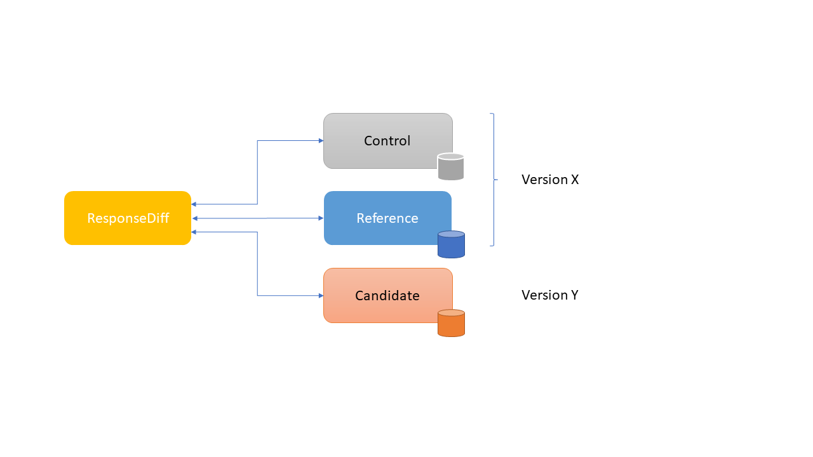

= ResponseDiff - Version 1.0.0
:encoding: utf-8
:lang: de
:toc: left
:toclevels: 5

image::img/responsediff-logo_320x160.png[ResponseDiff]

== What is ResponseDiff?

**Functional and Regression Testing**

ResponseDiff enables comprehensive HTTP-based interface tests, where not only individual expected values are checked for existence and correctness (whiteList / expected), but the entire server response is evaluated. This makes ResponseDiff suitable not only for functional but especially for regression testing. Non-functional tests such as response times are also supported, but only only rudimentarily.

**Support for Various Response Formats**

By using custom response filters, it is possible to handle any response format. Currently, JSON and XML (and thus also HTML) formats are supported. Hypermedia-based JSON formats ("Hypermedia as the Engine of Application State," short "HATEOAS") such as `HAL`, `Siren`, `Collection+JSON`, `JSON:API`, etc., are supported just like any other JSON format.

**Life-Cycle Support**

In addition, ResponseDiff supports the adoption of existing tests when introducing a new interface version, without losing the tests of the old interface.

**Automated Testing**

The software can be used locally or in a build pipeline. The deviations recorded during operation are compiled in a report, which can be used both for visual or technical analysis and for diagnostic purposes. The output format of the report is freely selectable, as the technically generated XML report can be automatically transformed into the desired target format by specifying a transformation file (XSLT).

== Example Scenario
In the following, we refer to our software to be tested as "MyTool". We assume that MyTool was already released in version 1.0.0.
For the successor version 1.1.0, the following changes were made:

* A bug was fixed (ticket number `MT-001` "firstname is not returned in the person response").
* A feature was added (ticket number `MT-002` "Add new person attribute hasPet (boolean)").

Now, the successor version needs to be checked to ensure that the functionality of MyTool from the previous version remains unchanged, except for the two expected deviations.

== Required infrastructure

=== Java
ResponseDiff requires Java version 11 or higher.

=== Multiserver operation
In order to be able to make the comparison required for a regression test, at least two instances of the software to be tested must be installed.
The previous MyTool version 1.0.0 is the “reference”, while the successor version 1.1.0 is the “test candidate”. In the event that the same URL is specified for the reference and candidate instances, a warning message is logged.

In reality, it is not uncommon for return values to be instance-specific. This often concerns technical IDs (which are assigned as UUIDs on the server side, for example), but timestamps can also be assumed to be server-specific due to the slightly different system clocks of the servers.

In order to be able to separate supposed, technically caused differences from actual, implementation-related differences without having to identify them individually and exclude them from the test, a control instance can optionally be operated. The control instance is identical to the reference instance. If a control instance is available, ResponseDiff first determines the differences between the reference and control. These are automatically ignored as technical differences (white noise) in the subsequent comparison between the reference and the candidate.

It is important for a successful setup that each instance (reference, candidate and, if applicable, control) has its own but identical database, as data-changing accesses can also be carried out and the response of a second call often differs from that of the first call.

=== Single server operation

If only the candidate instance is available, it can also be compared with a previous version. The prerequisite for this is that the previous version was tested in multiserver mode at an earlier point in time and that the XML report derived from this is still available. This “old” XML report can then be used as a replacement for the reference instance.

== First steps

=== Creating a test setup
The test scenarios for ResponseDiff are formulated in a setup file (XML).

.Example setup:
====
[source,xml]
----
<?xml version="1.0" encoding="UTF-8"?>
<XmlResponseDiffSetup id="ROOT SETUP"
  xmlns:xsi="http://www.w3.org/2001/XMLSchema-instance"
  xsi:noNamespaceSchemaLocation="responseDiffSetup.xsd" <1>
>
  <description>Demo to demonstrate a basic test setup structure</description>

  <filterRegistry>
    <filter id="sortJsonBody" clazz="com.github.kreutzr.responsediff.filter.response.SortJsonBodyResponseFilter" /> <2>
  </filterRegistry>

  <testSet id="Person CRUD" order="strict"> <3>
     <description>Reading person data</description>

     <test id="Test that person firstname is no longer missing" ticketReference="MT-001,MT-002"> <4>
        <description>In version 1.0.0 a persons firstname was not returned and hasPet was not supported. In version 1.1.0 this should be fixed.</description>

        <request method="GET" endpoint="/persons" > <5>
           <description>Some optional description</description>
           <parameters>
              <parameter id="personId">1000000000000000</parameter>
           </parameters>
           <headers>
              <header name="Accept">application/json</header>
           </headers>
        </request>

        <response>
           <description>Some optional description</description>
           <filters>
              <filter id="sortJsonBody"/> <6>
           </filters>

           <ignore forEver="true"> <7>
              <header>set-cookie</header>
              <explanation>Cookie reference is random</explanation>
           </ignore>
           <ignore ticketReference="MT-001"> <7>
              <path>$.firstname</path>
              <explanation>The firstname is missing in version 1.0.0</explanation>
           </ignore>
           <ignore ticketReference="MT-002"> <7>
              <path>$.hasPet</path>
              <explanation>hasPet was not supported in version 1.0.0</explanation>
           </ignore>

           <expected> <8>
              <httpStatus ticketReference="MT-003">200</httpStatus> <9>
              <headers>
                <header name="content-type" ticketReference="MT-004">application/json</header> <10>
              </headers>
              <values> <11>
                 <value path="$.firstname" type="string" >Reinhard</value>
                 <value path="$.hasPet"    type="boolean" ticketReference="MT-005">false</value>
              </values>
              <body noBody="false" ticketReference="MT-006"/>
           </expected>
        </response>
     </test>

  </testSet>
</XmlResponseDiffSetup>
----
Now let's take a look at the setup:

<1> Specifying the XSD file (XSD = XML Schema Definition) in the XML root can simplify the editing of the XML file. The XSD file is located in the `doc/xsds` directory of the ResponseDiff version.

<2> In general, the “sortJsonBody” filter is registered in the setup. It is used in the example further below in the `response` definition. The filter ensures that the map entries of JSON responses are displayed in a fixed and therefore comparable order.

<3> The embedded TestSet can be described with a `description` and contains a single test (in this example).

<4> The test can optionally refer to one or more associated tickets (`ticketReference`). Links to the ticket system are displayed in the report. If more than one ticket is referenced, the references must be listed one after the other, separated by commas.

<5> The `request` defines which HTTP method (`method`) is used to call the given service endpoint (`endpoint`), which call parameters (`parameters`) are to be appended to the endpoint URL and which headers are to be set.

<6> The response filter registered above is now used in the `response` for the responses delivered here. If more than one filter is specified in the `filters` section, these are applied to the incoming response in the specified order.

<7> In the various `ignore` blocks, certain aspects are now excluded from the comparison. They are therefore not listed in the report. The specification of which parts of the response are to be ignored is made using JSONPath syntax.

* Cookie references are generally not identical and must therefore (generally) be excluded.
* The `MT-001` bugfix also requires an `ignore` block, as it is clear that the reference will not return anything here. The corresponding ticket is linked here.
* The same applies to the new feature `MT-002`.

<8> As we have used a specific person ID in the call, we can also implement a functional test via `expected`.

<9> We expect the HTTP Status of the reponse to be 200 (`OK`),
<10> the `content-type` header as `application/json` and
<11> the values `firstname` and `hasPet` (defined in `values`) to have very specific characteristics. The specification of which value is expected at which point in the response is made using JSONPath syntax.
====

The `ignore` tag and the `httpStatus`, `header`, `value` and `body` elements in the `expected` block can optionally be equipped with the `ticketReference` attribute. This can provide information as to why a deviation may be ignored or why a specific value is expected. Ticket references specified in this way are assigned to the enclosing test and thus appear in the report.

=== Starting ResponseDiff

==== Call
A test with ResponseDiff is started as follows:
[source,bash]
----
java -cp responsediff-<version>.jar com.github.kreutzr.responsediff.ResponseDiff <configuration>
echo $?
----

Optionally, the log level can be set externally at startup as follows
[source,bash]
----
java -cp responsediff-<version>.jar [-Dlog4j.configurationFile=file:<absolute-path>/log4j2.xml] com.github.kreutzr.responsediff.ResponseDiff <configuration>
echo $?
----

==== Configuration

A JSON is expected as configuration as follows (without line breaks):

[NOTE]
====
It is recommended to set the configuration parameters within a small script. A suggestion for such a script is provided in the `doc` folder. (`start-responseDiff`).
====

.Example JSON for the call configuration
====
[source,json]
----
{
  "rootPath" : "...",
  "candidateServiceUrl" : "...",
  "referenceServiceUrl" : "...",
  "referenceFilePath" : "...",
  "controlServiceUrl" : "...",
  "responseTimeoutMs" : ...,
  "ticketServiceUrl" : "...",
  "xmlFilePath" : "...",
  "reportTitle" : "...",
  "testIdPattern" : "...",
  "storeResultPath" : "...",
  "reportWhiteNoise" : [true|false],
  "maskAuthorizationHeaderInCurl" : [true|false],
  "reportControlResponse" : [true|false],
  "executionContext" : "...",
  "xsltFilePath" : "...",
  "reportFileEnding" : "...",
  "reportConversionFormats" : "...",
  "candidateHeaders" : [ { "name" : "...", "value" : "..." } ],
  "referenceHeaders" : [ { "name" : "...", "value" : "..." } ],
  "controlHeaders"   : [ { "name" : "...", "value" : "..." } ],
  "epsilon" : ...,
  "exitWithExitCode" : [true|false]
}
----
====

[NOTE]
====

* `rootPath`: Optional base directory for subsequent relative path specifications (e.g., "C:/home/rkreutz/work/develop/test/responsediff/"). If this parameter is omitted, the execution directory is assumed.
* `candidateServiceUrl`: Mandatory URL of the candidate instance (e.g. "http://localhost:10500/my-tool")
* `referenceServiceUrl`: Optional URL of the reference instance (e.g. "http://localhost:10510/my-tool")
* `referenceFilePath`: Optional reference to an "old" XML report to be used as a reference if no `referenceServiceUrl` was specified.
* `controlServiceUrl`: Optional URL of the control instance (e.g. "http://localhost:10520/my-tool")
* `responseTimeoutMs`: Optional timeout (as an integer) for receiving responses. (default is 1000)
* `ticketServiceUrl`: Optional URL to the ticket system, so that the ticket number only needs to be appended (e.g. "http://localhost/tickets/")
* `xmlFilePath`: Mandatory specification of the XML file containing the setup to be tested. The path can be specified relative to the optionally specified `rootPath`.
* `reportTitle`: Optional text that shall be used as report title when set. If not set the `description` text of the `XmlResponseDiffSetup` block is used as default. If set, the `description` is used as subtitle.
* `testIdPattern`: Optional regular expression (in Java RegEx syntax) to restrict execution to specific tests. If nothing or null is passed, all tests are executed (default). Otherwise, only those tests whose `id` matches the passed expression are executed.
* `storeResultPath`: Mandatory specification of the directory in which the test results should be saved as XML. (e.g., "../test-results/")
* `reportWhiteNoise`: Optional flag indicating whether ignored technical differences (whiteNoise) should also be reported (`true`) or not (`false`). (Default is `false`)
* `maskAuthorizationHeaderInCurl`: Optional Flag indicating whether values of the `Authentication` header shall be masked (`true`) or not (`false`). (default is `true`)
* `reportControlResponse`: Optional Flag indicating whether additionally to the response of the candidate and reference instances the response of the control instance shall be included to the exported XML file, too (`true`) or not (`false'). (default is `false`)
* `executionContext`: Optional (comma separated) list of tokens, that are used for conditional test executions (see section <<Conditional Test Execution>>). The choice of tokens is free. The usage of the tokens is case insensitive.
* `xsltFilePath`: Optional path to an XSLT file to be used to transform the generated XML report. The result of the transformation is saved next to the XML report under the same name (e.g., "reporter/report-to-adoc.xslt" (default) or "reporter/report-to-html.xslt"). **Note:** The transformation file "reporter/report-to-html.xslt" is very rudimentary and serves only as a technical example for creating your own reports. If you actually want to generate a report in HTML format, we recommend not changing the default transformer and the default file extension (`reportFileEnding`) and instead passing the value `html` in the `reportConversionFormats` parameter.
* `reportFileEnding`: Optional file extension for the transformation result. (default is `adoc`)
* `reportConversionFormats`: Optional list of target formats into which a generated AsciiDoc report should be converted. The list is comma-separated. The following enumeration values ​​are supported: `pdf`, `html`. This parameter is only considered if the `reportFileEnding` parameter has the value `adoc`. A prerequisite for successful conversion is, of course, that the XSLT file used (see `xsltFilePath` parameter) actually transforms the XML report into AsciiDoc. The result of the AsciiDoc conversion is stored next to the report file.
* `candidateHeaders`: Optional headers that should be used when calling the candidate instance. e.g. [ { "name" : "Authorization", "value" : "bearer ..." } ])
* `referenceHeaders`: Optional headers that should be used when calling the candidate instance. e.g. [ { "name" : "Authorization", "value" : "bearer ..." } ])
* `controlHeaders`: Optional headers that should be used when calling the candidate instance. e.g. [ { "name" : "Authorization", "value" : "bearer ..." } ])
* `epsilon`: Optional epsilon value for numerical comparisons where no specific epsilon was specified in the test. (default is 0.00000001)
* `exitWithExitCode`: Optional flag whether deviations with an exit code other than 0 should be displayed (`true`), or not (`false`). (default is `true`)
====

==== Exit code
After execution, the exit code indicates whether there were any deviations (exit code != 0) or whether the comparison showed no abnormalities (exit code = 0).
This behavior can be disabled when running locally in an IDE using the optional flag `exitWithExitCode`.

=== The Report
After the test has completed, an XML file named `report_<setupName>_<timestamp>.xml` is stored in the configured directory (see `storeResultPath` above). If an XSLT file was specified for transformation, the transformed report will also appear there under the same name but with a different file extension.

==== The XML file
The XML file corresponds to the setup file.

In addition, each test and test set is noted

* which XML file the test comes from (`fileName`),
* which variables were used (`variables`), and
* what the call actually was (`curl`).

The XML file can therefore be used for debugging purposes.

==== Formatted reports
The formatted report contains all the information from the XML file taken into account during the transformation in a better structured and more human-readable manner.

If not all tests should be considered in the transformation (e.g., because you are only interested in failed tests), the optional attribute `report` can be used in the transformer. An attribute value of an outer test set is inherited by the inner test sets and tests unless a different value is specified.

.Example of using the report attribute
====
[source,xml]
----
<?xml version="1.0" encoding="UTF-8"?>
<XmlResponseDiffSetup ...>
  ...
  <testSet> <!-- If the report attribute is not specified, the value "fail,skip" applies -->
     ...
     <testSet report="fail,skip">
        ...
     </testSet>
     <test ... report="success">
     </test>
  </testSet>
</XmlResponseDiffSetup>
----
====

By configuring the transformer to be used, you can use your own transformers.

The following XSLT transformers are currently available:

===== AsciiDoc (default)
Transformer file name: `report-to-adoc.xslt`

The AsciiDoc transformer is the reference implementation of a transformer. All test aggregations (analysis) are reported at the test set level. Tests are only reported if the test result matches the value specified in the `report` attribute (the default is " `fail,skip` ").
The following values ​​are provided for the `report` attributes on the test sets and tests:

* `success`: The test will be included in the report if it was successful.
* `fail`: The test will be included in the report if it failed.
* `skip`: The test will be included in the report if it was aborted due to technical problems or was excluded from execution due to a specified `testIdPattern`.
* `all`: The test is considered regardless of the test result.
* `none`: The test is never considered.

===== HTML
Transformer file name: `report-to-html.xslt`

The HTML transformer is rather rudimentary in its presentation and serves only as a technical example for creating your own reports. It currently does not take any of the `report` attributes of the test sets and tests into account.

If you actually want to generate a report in HTML format, we recommend using the parameter `reportConversionFormats` (see section "<<Configuration>>").

== Features
In addition to the simple configuration shown above, ResponseDiff can handle more complex and demanding test scenarios. These options are listed and explained below.

=== Cross-test specifications
The complete formulation of all call parameters, etc., for each test is very time-consuming and requires a lot of maintenance. It often happens that numerous tests have a uniform structure and differ only in details. For this reason, tests can be structured into test sets. Commonalities between individual tests can then be outsourced to the test set configuration and no longer need to be specified for each test. However, it is possible to override outsourced properties locally at specific points.

Furthermore, test sets can also be structured within test sets, further reducing the writing and adaptation effort. This results in the following levels:

==== Level 0 - Setup
The outermost level contains (almost) only general information. All of this general information is optional.
These are in detail:

* The base URL of the ticket system, which allows direct reference to tickets in the generated report. This value does not need to be set manually. Instead, it is automatically adopted from the call configuration.
* A short description of the test setup (`description`).
* The registration of request and response filters to be used in the tests (`filterRegistry`).
* A declaration of variables (`variables`) that are valid across all tests (sets).

The definition of at least one test set (`testSet`) is mandatory.

.Example TestSetup
====
[source,xml]
----
<?xml version="1.0" encoding="UTF-8"?>
<XmlResponseDiffSetup ...>
  <description>Demo to demonstrate a basic test setup structure</description>

  <filterRegistry>
     <filter id="sortJsonBody" clazz="com.github.kreutzr.responsediff.filter.response.SortJsonBodyResponseFilter" />
  </filterRegistry>

  <variables>
     <variable id="personId">1000000000000000</variable>
  </variables>

  <testSet ...>
     ...
  </testSet>
</XmlResponseDiffSetup>
----
====

==== Level 1-n - TestSet
A test set contains a set of tests.

Like the test setup, a test set also includes some general information that applies to all embedded tests and test sets. Entering this information is optional. This information includes:

* A short description of the test set (`description`).
* The registration of request and response filters to be used in the tests (`filterRegistry`). *Please note that filter names must be unique across all levels.* Filters registered anywhere are available to all tests. If a filter is registered multiple times under the same name, the regression test will be aborted before it even starts. *For this reason, test sets that are executed multiple times (keyword `iterations`) cannot register additional filters locally.*
* A declaration of universally valid variables (`variables`).
* Universally applicable `request` information to avoid redundancies in the tests (`request`).
* Common `response` information to avoid redundancies in the tests (`response`).

In addition, each test set requires an `id` attribute.

.Example of a test set
====
[source,xml]
----
  <testSet id="TS-1">
     <description>Some text</description>
     <filterRegistry>
        ...
     </filterRegistry>
     <variables>
        ...
     </variables>
     <request ...>
        ...
     </request>
        ...
     <response ...>
        ...
     </response>

     <test ...>
        ...
     </test>
     <test ...>
        ...
     </test>
  </testSet>
----
====

A test set can also contain additional test sets, resulting in a tree structure.

.Example of a structured, complex test setup
====
[source,xml]
----
<?xml version="1.0" encoding="UTF-8"?>
<XmlResponseDiffSetup ...>
  ...
  <testSet id="TS-1">
     ...
     <testSet id="TS-1/1">
        ...
     </testSet>
     <testSet id="TS-1/2">
        ...
        <testSet id="TS-1/2/1">
           ...
        </testSet>
     </testSet>
  </testSet>
  <testSet id="TS-2">
     ...
  </testSet>
</XmlResponseDiffSetup>
----
====

==== End-Level Test
The last level (or leaf in the tree structure) is a test. A test requires the following information. If this is missing, the information is taken from the enclosing structure (TestSet -> ... -> Test Setup).
The following information is required:

* A brief description of the test.
* A declaration of the locally valid variables.
* Local request information.
* Local response information.

In addition, every test requires an `id` attribute.

.Example of a test
====
[source,xml]
----
     ...
     <test id="Test that a person can be updated">
        <description>A person's attributes are changed.</description>

        <request method="PUT" endpoint="/persons" >
           <description>Some optional description</description>
           <parameters>
              <parameter id="personId">1000000000000000</parameter>
           </parameters>
           <headers>
              <header name="Accept">application/json</header>
           </headers>
           <body>
           {
             "name": "Kreutz",
             "firstname": "Reinhard",
             "dateOfBirth" : "1967-09-27",
             "size": 1.94,
             "hasPet" : true
           }
           </body>
        </request>

        <response>
           <description>Some optional description</description>
           <filters>
              <filter id="sortJsonBody"/>
              ...
           </filters>

           <ignore forEver="true">
              <header>set-cookie</header>
              <explanation>Cookie reference is random</explanation>
           </ignore>
           <ignore>
              <path>$.random</path>
              <explanation>The random attribute is a server specific UUID</explanation>
           </ignore>
           ...

           <expected>
              <httpStatus>200</httpStatus>
              <headers>
                 <header name="Content-Type">application/json</header>
                 ...
              </headers>
              <values>
                 <value path="$.name">Kreutz</value>
                 ...
              </values>
              <body noBody="false">
                 ...
              </body>
           </expected>
        </response>
     </test>
     <test id="Test that a person image can be uploaded">
        <description>A person's image and some image description are updated.</description>

        <request method="POST" endpoint="/persons" >
           <description>Some other optional description</description>
           <parameters>
              <parameter id="personId">1000000000000000</parameter>
           </parameters>
           <headers>
              <header name="Accept">application/json</header>
           </headers>
           <uploadParts>
              <file name="photo" contentType="imag/png">person_1000000000000000.png</file>
              <file name="photoText" contentType="text/plain" charSet="UTF-8">someText.txt</file>
           </uploadParts>
        </request>
     </test>
     ...
----
====

===== Request
A `request` entry consists of the following optional information:

* A description (`description`).
* A declaration of the locally valid variables (`variables`).
* A list of the filters to be applied to the request (`filters`). These must be registered centrally in the test setup. Inheritance from enclosing test sets can be specifically interrupted by setting the optional attribute `inherit` to `false` (default is `true`).
* A list of parameters to be appended to the call URL (`parameters`).
* A list of the headers to be set when calling.
* The message text (`body`) to be sent.
* As an alternative to a message body (`body`), files can be uploaded. The files (`file`) are grouped under `uploadParts`. Each `file` entry has the path to the file to be uploaded as its value. If this begins with a period (`.`), the path is considered relative to the test file; otherwise, it is considered an absolute path. Each entry also has the following attributes:
** `name` Optional attribute to give the file a name. If omitted, the physical file name is used.
** `contentType` Mandatory attribute to specify the MIMEType of the file data.
** `charSet` Semi-mandatory attribute that specifies the character encoding (e.g., `UTF-8`) for text files. This specification may be omitted for binary files (e.g., images).

In addition, the following two properties must be set. Whether this is done locally or in a cross-domain structure (TestSet or Test Setup) is irrelevant.

* The calling method (`method`). Options are "GET" (default), "HEAD", "POST", "PUT", "DELETE", "CONNECT", "OPTIONS", "TRACE", and "PATCH".
* The service endpoint to call.

===== Response
A `response` entry consists of the following optional information:

* A description (`description`).
* A declaration of the locally valid variables (`variables`).
* A list of the filters to be applied to the request (`filters`). These must be registered centrally in the test setup. Inheritance from enclosing test sets can be specifically interrupted by setting the optional attribute `inherit` to `false` (default is `true`).
* A list of response values ​​to ignore.
** Headers (specify the name) (`header`) and
** Response values ​​from the response message (`path`) are ignored (`ignore`). (The specification is made using JSONPath syntax)
* A list of the expected response values ​​for a functional test (`expected`).
** The HttpStatus (`httpStatus`) can be checked,
** Header values ​​compared (specify the name) (`headers`),
** individual values ​​from the response message (`values`) or
** the entire response message is tested (`body`).

The following optional attribute can also be set on the `response` entry:

* `hideBody` If the value is set to `true`, no response message will be displayed in the report, and no file will be created in the case of a download (default is `false`). This option can be useful when security-relevant information is involved (e.g., when testing a login endpoint). As a result, the response message cannot be accessed, which is why expected values ​​(`expected` and `ignore`) cannot be checked.

Further details on answer verification can be found in the "<<Features>>" section.

=== Structuring extensive test setups
In this way, test scenarios can be created in which data sets are built up in one test set, while another test set operates on this data, until finally the scenarios are cleared away again in a final test set.
Alternatively or additionally, different endpoints can be grouped into different test sets.

==== Integration of external test sets for structuring or reuse
If test sets become very extensive or if recurring call sequences arise, test setups can be outsourced to individual files that can be included from a test set. Properties outsourced to the incorporating test set are passed to the included test setup in the same way as with nested test sets. It should be noted that the option of locally overwriting common properties also applies here.

Embedding external test setup occurs at the end of a test set after the last test.

.Example XML for embedding external test setups
====
[source,xml]
----
        ...
     </test>

     <testSetInclude file="some-folder/part_01.xml" />
     <testSetInclude file="some-folder/part_02.xml" />

  </testSet>
  ...
</XmlResponseDiffSetup>
----
====

=== Order of test execution
Especially for *CRUD* interfaces (`Create`, `Read`, `Update`, `Delete`), the execution order of the tests can be relevant, for example, if an object is to be created first (`Create`), then queried (`Read`), modified (`Update`), and finally deleted (`Delete`). For this reason, ResponseDiff offers a way to influence the execution order.

==== The `order` attribute
By default, tests and test sets are executed in a random order. If this is not desired, you can set the optional attribute `order` in the enclosing test set with the value `strict` (default is `random`).

.Example XML for strict test execution
====
[source,xml]
----
  <testSet id="Person CRUD" order="strict">
----
====

This setting then applies to all test sets and tests included in the test set, unless an inner test set overrides the outer default for its inner elements. Within a test set, the tests are executed before the contained test sets. This order cannot be changed.

==== Local test abort
If tests depend on each other (for example, because it is expected that query calls will fail if the creation of an object to be queried later fails), this can be accounted for by the `breakOnFailure` attribute at the test level. The attribute would be set to `true` for the test that creates an object required later (the default is `false`). If this call then fails, all subsequent tests and test sets at this structure level are no longer executed. Tests skipped in this way are noted as "skipped" in the test summary.

The mechanism can be continued at TestSet level, so that if a TestSet is aborted in this way, the subsequent TestSets of the same structure level are also no longer executed.

[CAUTION]
====
The `breakOnFailure` attribute is not inherited, but is valid only locally. Furthermore, it is only permitted if strict execution is configured for the enclosing test set (`order` attribute with the value `strict`). An illegal combination of the `breakOnFailue` and `order` attributes leads to an immediate program termination.
====

==== Delayed execution
With asynchronous processing, the caller immediately receives a response from the server, which communicates the URL at which the requested response can be obtained. Often, generating this response takes some time, which is why directly querying the result is usually unsuccessful. Instead, a short wait time is recommended.

The optional `waitBefore` attribute can be used to specify how long to wait before starting the test execution. This is specified as a time period according to link: https://de.wikipedia.org/wiki/ISO_8601[ISO_8601]. To ensure that the requested response is successfully read, the `iterations` attribute (see section <<Iterations>> ) can also be used.

[CAUTION]
====
The `waitBefore` attribute is not inherited but is only valid locally.
====

=== Handling server requests

Before a request is sent to a server, it passes through an optional chain of call filters. The order of processing depends on the order in which the filters are listed in the `filter` entry of the request.

The following call filters are already included in ResponseDiff:

==== `RemoveHeaderRequestFilter`
Generally, the headers to be set are specified within a `request` entry. In addition to these, all headers passed externally when calling ResponseDiff are also always set (see JSON values ​​`referenceHeaders`, `controlHeaders`, and `candidateHeaders` in the call configuration). If specific headers are to be suppressed during the server call (such as a bearer token passed externally when calling the login endpoint), the `RemoveHeaderRequestFilter` can be used as follows:

.Example XML for header suppression
====

The filter is configured using the following parameter:

* `names` : A comma-separated list of header names that should not be set in the request.

[source,xml]
----
  <filterRegistry>
    ...
    <filter id="removeAuthorizationHeader" clazz="com.github.kreutzr.responsediff.filter.request.RemoveHeaderRequestFilter">
      <parameters>
         <parameter id="names">Authorization, Proxy Authorization</parameter>
      </parameters>
    </filter>
    ...
  </filterRegistry>
  ...
  <testSet id="TestSet 00" order="random" report="all">
     ...
     <request method="GET" endpoint="http://${test-server}/some/endpoint">
        ...
        <filters>
           <filter id="removeAuthorizationHeader" />
        </filters>
        ...
     </request>
     ...
  </testSet>
  ...
----
====

==== `SetVariablesRequestFilter`

This filter is specifically designed to handle bulk testing. For more information, see the "Mass Testing in Requests" section.

Custom filters can be easily added. (See section "<<Custom filters>>")

=== Dealing with different server responses

ResponseDiff assumes that responses are delivered in JSON format. If something other than JSON is delivered, each response can optionally be passed through a customizable chain of response filters.
If an XML-to-JSON filter (e.g., `XmlToJsonResponseFilter`) is used upstream, ResponseDiff can also parse responses from services that return XML. The same applies to the `TextToJsonResponseFilter`, which encapsulates any content in JSON.

The configured filters are processed in the order in which they were listed (`filter`).

The following response filters are already included in ResponseDiff:

==== SortJsonBodyResponseFilter
One response filter that will almost always be used is the filter `com.github.kreutzr.responsediff.filter.response.SortJsonBodyResponseFilter`. It guarantees that the attribute names of an incoming JSON message appear in a fixed order. Without this filter, the regression test would often report unfounded deviations.

The filter operates only on JSON messages. Non-JSON messages remain unchanged.

The filter accepts three optional configuration parameters:

* `sortArrays` : This parameter specifies whether list entries should also be sorted for comparison purposes (`true`), or whether the order of the entries in lists should remain unchanged (`false`). (default is `false`).
* `sortArrays.keys` : If the sorting of list entries is enabled using the `sortArrays` parameter, this setting applies by default to all lists in the JSON. However, sorting usually needs to be restricted to specific lists. To do this, the `sortArrays.keys` parameter must be used to identify the lists whose entries are to be sorted (whitelist). Multiple names are separated by a comma. If the JSON itself is already a list and therefore has no enclosing name, "$" must be specified as a synonym for "root" when specifying a whitelist if this (outer) list is to be sorted as well. A list of only non-existent names (or an empty entry) will result in no list being sorted.
Additionally, you can specify for each name which data should be used for sorting. The paths to the data to be considered are specified as JSONPaths in round brackets (`'('` and `')'`) and, if necessary, separated by a semicolon (`;`).
* `storeOriginalResponse` : This parameter allows the incoming response to be saved in the filter result before the filter begins its operation. The original response can be found in the result structure under `originalResponse`. Saving is enabled when the parameter value is set to `true` (default is `false`).

.Example of a detailed filter configuration
====
The `SortJsonBodyResponseFilter` returns for the following JSON document

[source,json]
----
[
  { "id" : "002", "a" : [ { "x" : 3, "y" : 1 }, { "x" : 2, "y" : 1 } ], "b" : [ 6,5,4 ], "c" : [ 9,8,7 ] },
  { "id" : "001", "a" : [ { "x" : 1, "y" : 2.1 }, { "x" : 1, "y" : 11.2 } ], "b" : [ 3,2,1 ], "c" : [ 8,4,2 ] }
]
----

with this filter configuration

[source,xml]
----
  ...
  <filterRegistry>
    <filter id="sortJsonBody" clazz="com.github.kreutzr.responsediff.filter.response.SortJsonBodyResponseFilter">
      <parameters>
         <parameter id="sortArrays">true</parameter>
         <parameter id="sortArrays.keys">$($.id),a($.x;$.y),b</parameter>
      </parameters>
    </filter>
    ...
----

this result:

----
[
  { "a" : [ { "x" : 1, "y" : 2.1 }, { "x" : 1, "y" : 11.2 } ], "b" : [ 1,2,3 ], "c" : [ 8,4,2 ], "id" : "001" },
  { "a" : [ { "x" : 2, "y" : 1 }, { "x" : 3, "y" : 1 } ], "b" : [ 4,5,6 ], "c" : [ 9,8,7 ], "id" : "002" }
]
----

* The attribute names are sorted alphabetically.
* Lists `a` and `b` are sorted. List `a` is sorted according to the values ​​in `$.x` and `$.y` (in that exact order), while list `b` is simply sorted by its total values. The sorting of list `b` would also work if the values ​​were further JSON structures—just (unprofessionally) sorted alphabetically according to their text representation.
* List `c` is not sorted.
* Finally, the elements of the root list `$` are sorted according to `$.id`.

====

[NOTE]
====
Data with value `null` is sorted to the front.

Data of type `Boolean` is sorted in the order `false`, `true`.

Numerical values ​​are sorted according to their value.

====

[CAUTION]
====
*Please note* that currently negative numbers are sorted in the same order as positive numbers - something like this:

[source]
----
-1, -2, -3, 0, 1, 2, 3
----

====

[CAUTION]
====
*UUIDs* (e.g. automatically generated IDs) are generally *not* suitable for sorting, since they are naturally generated individually on different instances (reference, candidate and possibly control) and therefore a unique sorting order cannot generally be achieved.

In such cases, it is advisable to choose the strongest possible combination of other attributes.

====

==== TextToJsonResponseFilter
For text responses (e.g., with a bearer token), the filter `com.github.kreutzr.responsediff.XmlHttpResponse.TextToJsonResponseFilter` is available. It encloses the entire server response in a rudimentary JSON. The JSON has either this `{"body":"<text>"}` or this `{"body":null}` form.

The filter only operates on non-JSON messages. JSON messages remain unchanged.

The filter accepts an optional configuration parameter:

* `contentType` : This parameter can be used to specify the `Content-Type` header of the response converted to JSON (default is `application/json`).

==== XmlToJsonResponseFilter
The filter `com.github.kreutzr.responsediff.XmlHttpResponse.XmlToJsonResponseFilter` is also available for XML responses (e.g., SOAP requests). It takes into account XML tag attributes and the mixing of text and other XML tags.

The filter only operates on non-JSON messages. JSON messages remain unchanged.

The filter accepts four optional configuration parameters:

* `contentType` : This parameter can be used to specify the `Content-Type` header of the XML response converted to JSON (default is `application/json`).
* `preserveOrder` : This parameter preserves the order of the nested tags. This is achieved by introducing a list in JSON. The list is named `#value`. Tag attributes are copied from JSON, with the attribute name preceded by a `@` serving as the key. If attributes are not to be considered, the `#value` key for the value is also omitted, and the tag name serves directly as the key. Further information and examples can be found in the class's Java documentation.
* `skipAttributes` : If the value `true` is passed, tag attributes are ignored when converting to JSON (default is `false`).
* `storeOriginalResponse` : This parameter allows the incoming response to be saved in the filter result before the filter begins its operation. The original response can be found in the result structure under `originalResponse`. Saving is enabled when the parameter value is set to `true` (default is `false`).

==== NormalizeJsonBodyResponseFilter

To use JSONPath, it is essential that the JSON structure can be parsed uniquely. This assumption is violated if, for example, the name of a JSON attribute contains a dot (`.`), as the dot is interpreted by the JSONPath standard as a structuring indicator.

The `NormalizeJsonBodyResponseFilter` can be used to normalize an incoming server response. This attempts to convert attributes with a dot in their name into structures.

It should be emphasized that this changes the native server response and that it is always preferable to receive correctly structured responses from the server.

The filter can be configured as follows:

* `replacements` : This optional parameter can be used to replace individual text occurrences (e.g.: `“project.id” -> “project-id”`). The replacements are passed as JSON as follows: `{ “<source_1>” : “<target_1>”, “<source_2>” : “<target_2>;”, ... }`. (default is empty).
* `normalizeMaps` : The optional parameter means that if the value `true` is set, an attempt is made to adapt the server response so that corresponding substructures are inserted (e.g.: `“project.id” : ...` -> `“project” : { “id” : ... }`). So that the adjustment also extends to list entries, `normalizeArrays` must also be set to `true`. (default is `false`)
* `normalizeArrays` : This parameter may only be set to `true` if the `normalizeMaps` parameter has been set to `true`. If this is the case, this means that entries within JSON lists are also normalized (e.g.: `[ “array.length” : 1 ]' -> “[ ‘array’ : { ‘length’ : 1 } ]`). (default is `false`)

.Example of a filter configuration
====
[source,xml]
----
<XmlResponseDiffSetup ...>
  <description>Some setup description</description>

  <filterRegistry>
    <filter id="sortJsonBody" clazz="com.github.kreutzr.responsediff.filter.response.SortJsonBodyResponseFilter">
      <parameters>
         <parameter id="sortArrays">true</parameter>
         <parameter id="sortArrays.keys">$,myAttribute</parameter>
      </parameters>
    </filter>
    <filter id="textToJson" clazz="com.github.kreutzr.responsediff.filter.response.TextToJsonResponseFilter">
      <parameters>
         <parameter id="contentType">application/vnd.api+json</parameter>
      </parameters>
    </filter>
    <filter id="xmlToJson" clazz="com.github.kreutzr.responsediff.filter.response.XmlToJsonResponseFilter">
      <parameters>
         <parameter id="contentType">application/vnd.api+json</parameter>
         <parameter id="preserverOrder">true</parameter>
         <parameter id="skipAttributes">false</parameter>
         <parameter id="storeOriginalResponse">true</parameter>
      </parameters>
    </filter>
    <filter id="normalizeJson" clazz="com.github.kreutzr.responsediff.filter.response.NormalizeJsonBodyResponseFilter">
      <parameters>
         <parameter id="replace">{"project.id":"project-id"}</parameter>
         <parameter id="normalizeMaps">true</parameter>
         <parameter id="normalizeArrays">false</parameter>
      </parameters>
    </filter>
  </filterRegistry>

  ...
</XmlResponseDiffSetup
----
====

=== Custom filters

ResponseDiff offers several interfaces and abstract base classes for creating your own request and response filters.

* `DiffFilter` and `DiffFilterImpl` Handles filter parameters.
* `DiffRequestFilter` Defines the handling of requests regarding the addition of variables (e.g. in mass tests).
* `DiffResponseFilter` and `DiffResponseFilterImpl` Handles responses.

This makes it easy to create your own parameterizable filters.

.Example of a custom RequestFilter
====
[source,java]
----
public class MyRequestFilter extends DiffFilterImpl implements DiffRequestFilter
{
  private static final String MY_FILTER_PARAMETER = "...";

  @Override
  protected void registerFilterParameterNames()
  {
    super.registerFilterParameterNames();

    registerFilterParameterName( MY_FILTER_PARAMETER );
    // ...
  }

  @Override
  public void apply( final XmlRequest xmlRequest, final String serviceId, final XmlTest xmlTest ) throws DiffFilterException
  {
    // ...
  }

  @Override
  public void next()
  {
    // ...
  }
}
----
====

.Example of a custom ResponseFilter
====
[source,java]
----
public class MyResponseFilter extends DiffResponseFilterImpl
{
  private static final String MY_FILTER_PARAMETER = "...";

  @Override
  protected void registerFilterParameterNames()
  {
    super.registerFilterParameterNames();

    registerFilterParameterName( MY_FILTER_PARAMETER );
    // ...
  }

  @Override
  public void apply( final XmlHttpResponse xmlHttpResponse ) throws DiffFilterException
  {
    super.apply( xmlHttpResponse );
    // ...
  }
}
----
====

=== Using variables
It is possible to define variables at every level (Test Setup -> TestSet -> Test -> Request or Response).
This is done simply by specifying the `id` (as a tag attribute) and the value as text.

.Example of a variable definition
====
[source,xml]
----
<variables>
  <variable id="personId" type="long">1000000000000000</variable>
  <variable id="randomInt" type="int" >${randomInteger()}</variable>
  <variable id="today" type="date">${nowDate()}</variable>
  <variable id="tomorrow" type="date">${nowDate(1)}</variable>
  <variable id="yesterday" type="date">${nowDate(-1)}</variable>
  <variable id="todayNoon" type="datetime">${nowDate()}T12:00:00</variable>
  ...
</variables>
----
====

Specifying a data type is optional during declaration and has no effect. However, it is relevant when reading a value.

Variables of an outer level can be overridden in inner levels using the same `id`. This allows for point exceptions without having to rebuild the structure.

These variables can be used in the following places:

* Descriptions (`description`)
* Request endpoint (`endpoint`)
* Request parameter value (`parameter`)
* Request header value (`header`)
* Request message (`body`)
* Expected response value (`value`) see section "<<Evaluating response values>>"

.Example of variable usage
====
[source,xml]
----
<testSet>
  <description>Tests for person ${personId}</description>
  <test>
    <description>First tests for person ${personId}</description>
    <request method="PUT" endpoint="/persons/${personId}" >
      <parameters>
        <parameter id="someParameter">${personId}</parameter>
      </parameters>
      <headers>
        <header name="someHeader">aaa_${personId}_bbb</header>
      </headers>
      <body>
        {
          "id" : "${personId}"
        }
      </body>
    </request>
    <response>
      <expected>
        <values>
          <value path="$.id">${personId}</value>
        </values>
      </expect>
    </response>)
  </test>
</testSet>
----
====

==== Function values ​​in variable definitions and expected values

The following functions for random values ​​and time specifications are available for assigning dynamic values ​​to variable definitions and expected values:

[NOTE]
====
None of the optional parameters are enclosed in quotes.

* `${randomUUID()}` A random UUID is generated.
* `${randomUUID( TEST_ )}` A random UUID is generated, which is led by the specified prefix.
* `${randomUUID( TEST_, 15 )}` A random UUID is generated, which is led by the specified prefix and is not longer than the specified maximum length.
* `${randomUUID( TEST_, 15, -, _ )}` A random UUID is generated, starting with the specified prefix and not exceeding the specified maximum length. In addition, all `-` characters are replaced with a `_` character. Further replacements (always in pairs) are possible.
* `${randomInteger()}` A random integer value is generated.
* `${randomInteger( <min> )}` A random integer value is generated that is greater than or equal to the specified minimum value `<min>`.
* `${randomInteger( <min>, <max> )}` Generates a random integer value greater than or equal to the specified minimum value `<min>` and less than or equal to the specified maximum value `<max>`. Further parameters are ignored. `min` must be less than `max`.
* `${randomLong()}` A random integer value is generated.
* `${randomLong( <min> )}` A random integer value is generated that is greater than or equal to the specified minimum value `<min>`.
* `${randomLong( <min>, <max> )}` Generates a random decimal value that is greater than or equal to the specified minimum value `<min>` and less than or equal to the specified maximum value `<max>`. Further parameters are ignored.
* `${randomDouble()}` A random decimal value is generated.
* `${randomDouble( <min> )}` A random integer value is generated that is greater than or equal to the specified minimum value `<min>`.
* `${randomDouble( <min>, <max> )}` Generates a random decimal value that is greater than or equal to the specified minimum value `<min>` and less than or equal to the specified maximum value `<max>`. Further parameters are ignored. `min` must be less than `max`.
* `${randomDate()}` A random date (starting from `1970-01-01` to `2999-12-31`) is generated.
* `${randomDate( <min> )}` A random date is generated that is greater than or equal to the specified minimum value `<min>` (in ISO format `yyyy-MM-dd`). Instead of a fixed date, `<min>` can also be specified as `today` for the current day. `today` itself can also be supplemented with an integer offset (in days). Example: `${randomDate( today +3 )}` or `${randomDate(today-2)}`.
* `${randomDate( <min>, <max> )}` A random date is generated that is greater than or equal to the specified minimum value `<min>` (in ISO format `yyyy-MM-dd`) and less than or equal to the specified maximum value `<max>` (in ISO format `yyyy-MM-dd`). `min` must be less than `max`. Instead of a fixed date, `<min>` or `<max>` can also be specified as `today` for the current day. `today` itself can also be supplemented with an integer offset (in days). Example: `${randomDate( today +3, "2999-12-31" )}` or `${randomDate(today-2, today + 6)}`.
* `${randomDateTime()}` A random timestamp (starting from `1970-01-01T00:00:00.000` to `2999-12-31T23:59:59.999`) is generated.
* `${randomDateTime( <min> )}` A random timestamp is generated that is greater than or equal to the specified minimum value `<min>` (in ISO format `yyyy-MM-dd HH:mm:SS`). Instead of a fixed timestamp, `<min>` can also be specified as `now` for the current timestamp. `now` itself can also be supplemented with an integer offset (in milliseconds). Example: `${randomDateTime( now +3000 )}` or `${randomDateTime(now - 2000)}`.
* `${randomDateTime( <min>, <max> )}` A random timestamp is generated that is greater than or equal to the specified minimum value `<min>` (in ISO format `yyyy-MM-dd HH:mm:SS`) and less than or equal to the specified maximum value `<max>` (in ISO format `yyyy-MM-dd HH:mm:SS`). `min` must be less than `max`. Instead of a fixed timestamp, `<min>` and `<max>` can also be specified as the current timestamp. `now` itself can also be supplemented with an integer offset (in milliseconds). Example: `${randomDateTime( now +3000, 2999-12-31T23:59:59.999 )}` or `${randomDateTime(now-200, now+500000)}`.
* `${randomBoolean()}` A random Boolean value (`true` or `false`) is generated.
* `${randomEnum( <Alternative-1>, < Alternative-2>, ... )}` One of the passed alternatives (as a `string`) is used. At least one alternative must be passed. Otherwise, no value is entered.
* `${nowDate()}` The current date is generated.
* `${nowDate( <offset> )}` Creates a date equal to the current date plus the specified offset (in days). Further parameters are ignored.
* `${nowDateTime()}` The current timestamp is generated.
* `${nowDateTime( <offset> )}` Creates a timestamp equal to the current timestamp plus the specified offset (in milliseconds). Further parameters are ignored.

====

=== Evaluating response values
Functional tests check whether individual response values ​​match the expected value. However, it's not uncommon for the values ​​to deviate slightly, usually due to technical reasons (e.g., rounding).

ResponseDiff offers several options for dealing with such deviations. For this purpose, a tolerance range (`epsilon`) can be defined for each expected value, depending on the data type.

In addition, an expected value (for `header` as well as for `value`) can also be generated dynamically (see `$.lastUpdated` in the following example). Further information on dynamic values ​​can be found in the section "<<Function values ​​in variable definitions and expected values>>".

.Example of expected values ​​in functional tests
====
[source,xml]
----
     <test>
        ...
        <response>
           <expected>
              <httpStatus>201</httpStatus>
              <httpStatus checkInverse="true">500</httpStatus>
              <headers>
                 <header name="Content-Type" trim="true" ignoreCase="true">APPLICATION/JSON</header>
                 <header name="Content-Type" checkInverse="true">text/html</header>
                 <header name="SOME_ISO_DATETIME_HEADER" type="dateTime" epsilon="PT2S">${nowDateTime()}</header>
                 <header name="allow">GET,POST,OPTION</header>
              </headers>
              <values>
                 <value path="$.name" trim="true" ignoreCase="true">kReUtZ</value>
                 <value path="$.firstname" trim="true" match="true">^R[einhar]{6}d$</value>
                 <value path="$.id" type="long" epsilon="1" >1000000000000000</value>
                 <value path="$.id" type="long" >]2,4[</value>
                 <value path="$.number" type="int" checkInverse="true">${SOME_NUMBER_VARIABLE}</value>
                 <value path="$.dateOfBirth" type="date" epsilon="P1D">1967-09-27</value>
                 <value path="$.size" type="double" epsilon="0.01">1.94</value>
                 <value path="$.size" type="double" >[1.9,1.95]</value>
                 <value path="$.hasPet" type="boolean">false</value>
                 <value path="$.lastUpdated" type="datetime" epsilon="PT30S">${nowDateTime()}</value>
                 <value path="$.timeSinceLastUpdate" type="duration" epsilon="PT0.01S">PT55.007S</value>
                 <value path="$.children[0].character" checkPathExists="true"/>
                 <value path="$.children[0].character" checkIsNull="true" checkInverse="true"/>
                 <value path="$.children[*].character">LOVELY</value>
                 <value path="$.children.length()" type="int">2</value>
              </values>
           </expected>
        </response>
     </test>
----
====

The example is explained in the following sections.

==== Checking the HttpStatus (`httpStatus`)
HttpStatus has no tolerance range. It is always a three-digit integer between 100 and 599. The following tag attributes are available:

[cols="10,15,~"]
|===
| Attribute | Attribute value | Description

|checkInverse
|`true` or `false`
|The comparison result is inverted if the attribute value is `true` (default is `false`).
|===

==== Checking the headers (`headers`)
For a header value, ResponseDiff defaults to the data type `string`. If a different data type is explicitly specified using the `type` attribute, the value can be interpreted and checked differently. In this respect, checking headers and values ​​is no different (see the following section "<<Checking values ​​(`values`)>>").

*Note:* With the `Allow` header, ResponseDiff ensures that the provided, supported HTTP verbs are listed in alphabetical order. This makes verification much easier.

==== Checking values ​​(`values`)
The JSONPath syntax specifies where in the response each value is expected. This check is therefore only available for JSON responses.
Values ​​are treated depending on their respective data type. If no data type is explicitly specified (`type`), `string` is assumed by default. The following tag attributes are available for each data type:

[cols="10,10,15, 15,~"]
|===
| Data type | Attribute | Attribute value | Expected value | Description

|string
|trim
|`true` or `false`
|
|For both the expected value and the returned value, whitespace characters at the beginning and end are removed before the comparison if the attribute value is `true` (default is `false`).

|string
|ignoreCase
|`true` or `false`
|
|The comparison is case-insensitive if the attribute value is `true`.

|string
|match
|`true` or `false`
|Regular expression according to link:https://docs.oracle.com/javase/8/docs/api/java/util/regex/Pattern.html[Java Standard]
|In the above example "^R[einhar]{6}d$" it is checked that the current value begins with "R", followed by 6 characters, each of which can be "e", "i", "n", "h", "a", or "r", and finally a "d" is placed at the end of the value.

|long / int
|epsilon
|<integer>
|
|When comparing integers, a tolerance range can optionally be specified. A tolerance range is only effective for specific values, not for ranges. The range considered equal is calculated as follows: [x - epsilon, x + epsilon]

|long / int
|
|`[` or `]` <integer>,<integer> `[` or `]`
|[x,y] or [x,y[ or ]x,y] or ]x,y[
| Ranges can be defined for integers by specifying the lower and upper limits separated by a comma and by choosing the square brackets to determine whether the limits should be inclusive or exclusive.

|double
|epsilon
|<decimal number>
|
|When comparing decimal numbers, a tolerance range can optionally be specified. A tolerance range is only effective for specific values, not for ranges. The range considered equal is calculated as follows: [x - epsilon, x + epsilon]

|double
|
|`[` or `]` <decimal number>,<decimal number> `[` or `]`
|[x,y] or [x,y[ or ]x,y] or ]x,y[
|For decimal numbers, ranges can be defined by specifying the lower and upper limits separated by a comma and by choosing the square brackets to determine whether the limits should be inclusive or exclusive.

|date
|epsilon
|A date according to link:https://de.wikipedia.org/wiki/ISO_8601[ISO_8601]
|
|When comparing date values, a tolerance range can optionally be specified. The range considered equal is calculated as follows: [x - epsilon, x + epsilon]. Epsilon is a time span according to ISO 8601. In the above example, "P1D," the tolerance is one day.

|date
|
|`[` or `]` <Date>,<Date> `[` or `]`
|[x,y] or [x,y[ or ]x,y] or ]x,y[
|When comparing date values, ranges can be defined by specifying the lower and upper limits separated by a comma and by choosing the square brackets to determine whether the limits should be inclusive or exclusive.

|datetime
|epsilon
|A timestamp according to link:https://de.wikipedia.org/wiki/ISO_8601[ISO_8601]
|
|When comparing timestamps, a tolerance range can optionally be specified. The range considered equal is calculated as follows: [x - epsilon, x + epsilon]. Epsilon is specified as a time span according to ISO 8601. In the above example, "PT30S," the tolerance is 30 seconds.

|datetime
|
|`[` or `]` <timestamp>,<timestamp> `[` or `]`
|[x,y] or [x,y[ or ]x,y] or ]x,y[
|When comparing timestamps, ranges can be defined by specifying the lower and upper limits separated by a comma and by choosing the square brackets to determine whether the limits should be inclusive or exclusive.

|duration
|epsilon
|A period of time according to link:https://de.wikipedia.org/wiki/ISO_8601[ISO_8601]
|
|When comparing time spans, an optional tolerance range can be specified. The range considered equal is calculated as follows: [x - epsilon, x + epsilon]. Epsilon is defined as a time span according to ISO 8601. In the above example, "PT0.01S," the tolerance is 10 milliseconds.

|duration
|
|`[` or `]` <timespan>,<timespan> `[` or `]`
|[x,y] or [x,y[ or ]x,y] or ]x,y[
|When comparing time periods, ranges can be defined by specifying the lower and upper limits separated by a comma and by choosing the square brackets to determine whether the limits should be inclusive or exclusive.

|boolean
|
|
|`true` or `false`
|There are no rounding errors for Boolean values, which is why the given value is checked.

|<all>
|checkPathExists
|`true` or `false`
|
|The path specified in the `path` attribute is checked to see if it exists (default is `false`). This check can only be combined with the `checkInverse` and `checkIsNull` attributes. *If this attribute is set, all other attributes (except `checkInverse` and `checkIsNull`) are ignored. If an expected value is set, an error message is displayed.*

|<all>
|checkIsNull
|`true` or `false`
|
|It checks whether the value at the path specified in the `path` attribute is `null` (default is `false`). This check can only be combined with the `checkInverse` and `checkPathExists` attributes. It is weaker than `checkPathExists` because both `{ "key" : null }` and `{}` return the value `null` for a query on the path `$.key`. *If this attribute is set, all other attributes (except `checkInverse` and `checkPathExists`) are ignored. If an expected value is set, an error message is displayed.*

|<all>
|checkInverse
|`true` or `false`
|
|The comparison result is inverted if the attribute value is `true` (default is `false`). *This option is not allowed for defined ranges of any data type.*
|===

==== Checking the response message (`body`)

ResponseDiff can optionally check the entire response message. Generally, such a test is difficult to maintain over time. However, testing that no response message was sent will often be useful. The following tag attributes are available:

[cols="10,15,~"]
|===
| Attribute | Attribute value | Description

|noBody
|`true` or `false`
|If the attribute value is `true`, it is checked that no response message was sent. If the attribute value is `false` (default), it is checked that the sent response message corresponds to the value specified in the `<body>` tag.
|===

=== Using response values
Variables specified in the `response` definition are read from the response message (`<variables>` / `<variable>`).
The data type of the variables to be read can be specified using the `type` attribute (default is `string`).
Variables read in this way are available for all subsequent tests.
The specification (`path`), which defines which parts of the response should be read, is done using JSONPath syntax. Variables that should be read from the response message are, of course, only considered for JSON responses. Variables that should be read from the headers are always considered. The JSONPath expression for header variables must begin with `$.headers.` followed by the header name.

[CAUTION]
====
If variables are to be read, it must (usually) be ensured that a strict (`order="strict"`) test order is defined.

Response values ​​can vary from instance to instance, which is why they are stored as two or three separate variables (for reference, candidate, and possibly control). However, this need not be taken into account when using these variables, as ResponseDiff replaces the variables individually depending on the instance. However, the variables can be viewed individually in the output XML report.
====

.Example for reading and using response values
====
[source,xml]
----
<XmlResponseDiffSetup ...>
  <description>Test that response variables are handled server instance specific</description>

  <testSet id="Response Variables" order="strict">
     <test id="Step 01 - Read response variable">
        <request endpoint="/my-endpoint" />
        <response>
           <variables>
              <variable id="HEADER__CONTENT_TYPE" path="$.headers.content-type" />
              <variable id="STEP1_KEY" path="$.key" type="string" />
           </variables>
        </response>
     </test>

     <test id="Step 02 - Use response variables">
        <request endpoint="/my-endpoint?step1_key=${STEP1_KEY}" >
           <headers>
              <header name="content-type">${HEADER__CONTENT_TYPE}</header>
           </headers>
           <body>
           {
              "step1_key" : "${STEP1_KEY}"
           }
           </body>
        </request>
     </test>

     <test id="Step 03 - Use response variables again">
        <request endpoint="/my-endpoint?step1_key=${STEP1_KEY}" >
           <headers>
              <header name="content-type">${HEADER__CONTENT_TYPE}</header>
           </headers>
           <body>
           {
              "step1_key" : "${STEP1_KEY}"
           }
           </body>
        </request>
     </test>

  </testSet>
</XmlResponseDiffSetup>
----
====

=== Checking call durations (`maxDuration`)
Optionally, ResponseDiff checks whether a single call to the candidate instance took longer than an expected amount of time.
The time span is specified in the `expected` tag within the `response` tag of a test. The notation follows the link: https://de.wikipedia.org/wiki/ISO_8601[ISO_8601].

It should be noted that an `expected` block of an outer TestSet is inherited, but the `maxDuration` tag is explicitly excluded from this.

If you want to check the maximum duration of multiple calls to the same test (possibly with different variable values ​​as described in the section "<<Mass testing in requests>>"), you can set the test's `iterations` attribute to a value greater than one and define an `overAllExpected` block with a `maxDuration` tag. If the value of the `iterations` attribute is one or less, the overall execution duration check will not be executed.

If the call duration of several different calls is to be tested, an `overAllExpected` block can also be defined within a test set (similar to the test). The duration of all tests, nested at any depth, is then measured.

[CAUTION]
====
`overAllExpected` blocks are not inherited at either the Test or TestSet level.
====

[NOTE]
====
ResponseDiff was not specifically designed for performance testing. Even for individual tests, the measured time does not necessarily reflect the actual call duration. Therefore, this option should only be used for rough time requirements.

In particular, when using an `overAllExpected` block in TestSets, not only the pure call duration of the candidate call is measured (for technical reasons), but also the durations of the calls to the reference and, if applicable, the control instances - plus the internal execution times between these calls.
====

.Example for checking call durations
====
[source,xml]
----
  <testSet iterations="3">
     <test iterations="2">
        ...
        <response>
           <expected>
              ...
              <maxDuration>PT1S</maxDuration>
              ...
           </expected>
        </response>

        <overAllExpected>
           <maxDuration>PT2S</maxDuration>
        </overAllExpected>
     </test>

     <overAllExpected>
        <maxDuration>PT6S</maxDuration>
     </overAllExpected>
  </testSet>
----
====

=== Mass testing in requests
To carry out many tests, the writing and maintenance effort is very high.

For example, if we want to consider 1,000 different people in our test calls, we could either (naive approach) define a `personId` variable in a test set, include the test set 1,000 times in a test setup or base test set, and adjust the variable each time. This in itself is time-consuming, but if we imagine that a test needs to be adjusted or a new test is added, we are faced with 1,000 times the effort – plus the uncertainty of making a mistake.

It's often better to leave the variables to be varied open and let them be set when a request filter is run. ResponseDiff already provides a suitable filter for this, `SetVariablesRequestFilter`.

==== `SetVariablesRequestFilter`

This filter replaces all variables in the outgoing request (`request`) with the corresponding, configured variable values. It also replaces the variables of the enclosing `test` element in `id` and `description` to make the generated report more meaningful.

===== Configuration of variable values
The filter is configured as follows:

[source,xml]
----
<XmlResponseDiffSetup ...>
  <description>Some setup description</description>

  <filterRegistry>
    <filter id="setVariables" clazz="com.github.kreutzr.responsediff.filter.request.setvariables.SetVariablesRequestFilter">
      <parameters>
         <parameter id="source">./setVariables.json</parameter>
         <parameter id="useVariables">false</parameter>
      </parameters>
    </filter>
  </filterRegistry>

  ...
</XmlResponseDiffSetup>
----

The filter reads a JSON structure from the file specified in the `source` parameter. The path should be specified relative to the test setup XML file. However, it can also be specified relative to the execution directory or, alternatively, absolute. If problems occur, the log file can be consulted. A message like this is output at the `Debug` log level:

[source,txt]
----
Trying to read variables file "<filePath>".
----

The structure of the JSON file specified under `source` is as follows:

.Example of a configuration for the SetVariablesRequestFilter (The result is identical for both alternatives.)
====
----
{
"variables" : {
   "key1" : [ "A", "B", "C" ],
   "key2" : [ "D", "E", "F" ]
},
"variableSets" : [
   { "key1" : "A", "key2" : "D" },
   { "key1" : "B", "key2" : "D" },
   { "key1" : "C", "key2" : "D" },
   { "key1" : "A", "key2" : "E" },
   { "key1" : "B", "key2" : "E" },
   { "key1" : "C", "key2" : "E" },
   { "key1" : "A", "key2" : "F" },
   { "key1" : "B", "key2" : "F" },
   { "key1" : "C", "key2" : "F" }
]
}
----
====

The configuration offers the possibility

* **either** to list only variables and their possible values. The filter then automatically creates all possible combinations and starts again with the first combination at the end
* **or** specify all desired combinations yourself.

Currently both attribute names, `variables` and `variableSets`, must be set. If they should not be populated, the value `null` can be set.

The filter parameter `useVariables` can be used to configure whether the values ​​from the attribute `variables` should be used (`true`) or the values ​​from the attribute `variableSets` (`false`).

[NOTE]
It is also possible to set complex structures as variables. However, please note that the variable values ​​are always treated as strings, and therefore inner quotation marks must be escaped.

.Example of a configuration with structured variables.
====
[source,json]
----
{
"variables" : {
   "key1" : [ "[ \"A\", \"B\" ]", "[ \"C\", \"D\" ]" ],
   "key2": ...
   ...
},
"variableSets" : [
   { "key1" : "[ \"A\", \"B\" ]", "key2" : ... },
   { "key1" : "[ \"C\", \"D\" ]", "key2" : ... },
   ...
]
}
----
====

====== Random values ​​in mass data

Dynamic values ​​(see also section "<<Function values ​​in variable definitions and expected values>>") in requests for mass data can be defined in the filter configuration as follows:

.Example of a configuration with random values.
====
[source,json]
----
{
"variables" : {
   "key1" : [ "A", "${randomUUID()}", "${randomUUID(TEST_)}", "${randomUUID(TEST_, 15)}" ],
   "key2" : [ "1", "${randomInteger()}", "${randomInteger( 5 )}", "${randomInteger( 5, 8 )}" ],
   "key3" : [ "1", "${randomLong()}", "${randomLong( 5 )}", "${randomLong( 5, 8 )}" ],
   "key4" : [ "2.4", "${randomDouble()}", "${randomDouble( 5.5 )}", "${randomDouble( 5.5, 8.3 )}" ],
   "key5" : [ "${randomDate()}", "${randomDate( 2023-10-01 )}", "${randomDate( today - 1, today + 3 )}" ],
   "key6" : [ "${randomDateTime()}", "${randomDateTime( 2023-10-01T00:00.00.000 )}", "${randomDateTime( now - 5000, now + 3000 )}" ],
   "key7" : [ "${nowDate()}", "${nowDate( -1 )}" ]
   "key8" : [ "${nowDateTime()}", "${nowDateTime( 1000 )}" ]

},
"variableSets" : [
   { "key1" : "${randomUUID()}", "key2" : "${randomInteger( 1,4 )}", "key3" : "${randomLong(1,2)}", "key4" : "${randomDouble(4.75)}", ... },
   { "key1" : "${randomUUID()}", "key2" : "${randomInteger( 5 )}", "key3" : "${randomLong(3,4)}", "key4" : "${randomDouble(5.0,6.75)}", ... }
]
}
----
====

==== Iterations

All we need now is the ability to run a test or test set multiple times.

ResponseDiff allows multiple execution at both the test set and test level.

.Example of multiple execution of a test set and a test
====
[source,xml]
----
  <testSet id="..." iterations="5">
     <test id="..." iterations="400">
       ...
     </test>
  </testSet>
----
====

When executed multiple times, the individual test calls are output in the XML report so that you can individually check which variable combination led to which result.
Tests of an iteration are automatically grouped by a test set in order to be able to make statements about repeated execution.
**Note:** Grouping the test into its own TestSet removes the test from the sequence of tests to be executed and adds it to the TestSets (at the end). Because ResponseDiff executes tests first and then TestSets, iterations inevitably affect the execution order.

=== Supported JSONPath syntax
Path information (`path` attribute) is provided in the `ignore`, `value` and `variable` tags.

The essential syntax elements are as follows: (Further details can be found at the link:https://www.ietf.org/archive/id/draft-ietf-jsonpath-base-21.html[JSONPath specification].)

[cols="20.80"]
|===
| Operator | Description

| $ | The root element. Every path specification begins with this.

| * | Placeholder. Can replace names or numbers (e.g., array index).

| .. | Child elements nested to any depth.

| .<name> | Dot notation for a child element with the specified name.

| [<number>] | Index in an array.

| [?(@<query>)] | Array filter.

| .length() | Querying an array length

|===

[CAUTION]
====

When specifying paths in `ignore` tags, *neither the `..` notation nor a `?(@...)` array filter* can currently be used.
====

The complete syntax of JSONPath can be used when reading variable values ​​and expected values.

[CAUTION]
====
When using filters (`..` notation or `?(@...)` array filters), JSONPath itself returns arrays, *which, however, cannot be accessed via index*, since the link:https://www.ietf.org/archive/id/draft-ietf-jsonpath-base-21.html[JSONPath spezification] unfortunately does not (yet) allow for this.

For this reason, ResponseDiff provides a proprietary *syntax extension* (`#<index>`) for accessing individual elements of a filter list. This index access can only occur at the end of the JSONPath. Multiple index accesses are not permitted. *Should JSONPath close the specification gap, this proprietary syntax will be replaced by the standard.*
Therefore, the use of regular syntax is recommended wherever possible.
====

.Example of the proprietary JSONPath syntax extension
====
[source,xml]
----
  <variables>
     <variable id="THIRD_ENTRY_WITH_NAME_TEST" path="$.myEntries[$(@.name == 'test')]#2" />
  <variables>
----
====

== Test evaluation

In the XML report, one analysis block per test and one aggregated analysis block per test set are automatically output.
Tests that have been executed multiple times are summarized by a (wrapper) test set that is inserted automatically if necessary.

An analysis block provides information about

* The start time of the test (or test set) (`begin`)
* The end time of the test (or test set) (`end`)
* The execution duration (between `begin` and `end`) (`duration`)
* The minimum execution duration (`minDuration`)
* The maximum execution duration (`maxDuration`)
* The average execution time (`avgDuration`)
* The number of expected value checks performed (`expectedCount`)
* The number of successful tests (`successCount`)
* The number of failed tests (`failCount`)
* The number of tests aborted due to technical problems (`skipCount`)
* The total number of tests considered (`totalCount`)
* All anomalies detected during the execution (`messages/message`)

.Example of an analysis block
====
[source,xml]
----
    <analysis>
        <begin>2023-06-15T10:47:04.805229900</begin>
        <end>2023-06-15T10:47:05.776370</end>
        <duration>PT0.9711401S</duration>
        <minDuration>PT0.0104639S</minDuration>
        <maxDuration>PT0.7886017S</maxDuration>
        <avgDuration>PT0.237148375S</avgDuration>
        <expectedCount>10</expectedCount>
        <successCount>0</successCount>
        <failCount>4</failCount>
        <skipCount>2</skipCount>
        <totalCount>4</totalCount>
        <messages>
            <message level="ERROR" path="$.headers.content-length">String value expected: [317] but was [622]</message>
            <message level="ERROR" path="$.httpStatus">Http status expected: 201 but was: 400</message>
            <message level="ERROR" path="$.warningMessage">...</message>
            <message level="ERROR" path="Exception">Error reading candidate response variable personId from path $.id . (Exception=com.jayway.jsonpath.PathNotFoundException, message=No results for path: $['id'])</message>
        </messages>
    </analysis>
----
====

== Special cases

=== Endpoint with call parameters

If the endpoint (`endpoint`) in the definition of the call (`request`) already contains call parameters (instead of defining them in the `parameters` block), the following must be observed:

* The first parameter must be appended to the URL with `?`.
* Each additional parameter must be appended with `*\&*` instead of `&`, otherwise the XML file cannot be read. This is due to the syntax requirements specified by XML.

.Example of call parameters
====
[source,xml]
----
     ...
     <test id="..." ticketReference="...">

        <request method="GET" endpoint="/persons?include=addresses&fields[persons]=firstname" >
           ...
        </request>

        ...
     </test>
     ...
----
====

=== Handling compressed responses

Some endpoints deliver compressed responses (e.g., `gzip`) to limit the amount of data to be transported. Compressed responses cannot be parsed by ResponseDiff without a dedicated response filter for decompression.
If no decompression filter is used upstream, please note that upstream response filters that expect a JSON response must be removed from the filter list, otherwise the filters would fail.
At this point, reference should be made to the use of the attribute `inherit` (see section "<<Response>>").

.Example of removing response filters
====
[source,xml]
----
     ...
     <test id="..." ticketReference="...">

        <request method="GET" endpoint="/persons" >
           <parameters>
              <parameter id="personId">1000000000000000</parameter>
           </parameters>
           <headers>
              <header name="Accept">application/json</header>
              <header name="Accept-encoding">deflate, gzip;q=1.0, *;q=0.5</header>
           </headers>
        </request>

        <response>
           <description>Some optional description</description>
           <filters inherit="false"> <!-- This will remove all inherited filters -->
           </filters>
           ...
        </response>
     </test>
     ...
----
====

Compression can generally be avoided using HTTP methods by telling the server via the Accept-Encoding header that compression is not accepted.

.Example Avoiding Compressed Answers - Alternative 1
====
[source]
----
<request>
  <headers>
    <header name="Accept-Encoding">identity</header>
  </headers>
</request>
----
====

.Example Avoiding Compressed Answers - Alternative 2
====
[source]
----
<request>
  <headers>
    <header name="Accept-Encoding">*;q=0.0</header>
  </headers>
</request>
----
====

=== Missing Content-Length Header

Some web servers do not provide `content-length` headers (e.g., Jetty 12).

To ensure that the header is reliably available for testing, ResponseDiff automatically adds it in such cases.
The value corresponds to the length of the received byte array - i.e. the compressed data before unpacking, if applicable.

=== Dots in attribut names

The JSONPath-Syntax does not allow dots in attribute names because these are reserved as path separators. It is also not possible to mask dots (see section "<<Supported JSONPath syntax>>"). Using the <<NormalizeJsonBodyResponseFilter>> gives you the opportunity to adjust received attribute names.

If dots in attribute names are not adjusted, misleading deviations may be reported in the test, indicating a missing value in the candidate instance (e.g., " `... expected: ... *but was: null*"` ). This is caused by comparing the reference value with the candidate value or the configured expected value (`expected`), whereby an attempt is made to read the value from the candidate response via JSONPath, which fails due to the different structure.

=== Generic Test Sets

Sometimes, tests need to be executed (almost) identically for multiple services. This is the case, for example, when different services have common endpoints for health checks or license and version information.

It is possible to formulate such tests in a generic TestSet, which is embedded in the usual way using `testSetInclude`. This reduces the effort required for both test creation and occasional adjustments.

However, it should be noted that embedding a generic TestSet affects file paths used, for example, during downloads. To avoid overwriting such files and to group them according to their functionality, it is recommended to explicitly specify the working directory in the embedded test set using `workPath`. This working directory will often be identical to the service name.

Differences resulting from the embedding context can be stored in variables. These are available within the embedded TestSet.

[CAUTION]
The `workPath` attribute is not inherited, but is only valid locally.

.Example: Embedding a generic TestSet
====
[source]
----
<?xml version="1.0" encoding="UTF-8"?>
<XmlResponseDiffSetup id="client-management setup">
  <testSet id="service-A"> <1>
    <variables>
      <variable id="service">service-A</variable> <2>
    </variables>

    <testSetInclude file="../generic-service-info.xml" /> <3>
  </testSet>

  <testSet id="service-B"> <1>
    <variables>
      <variable id="service">service-B</variable> <2>
    </variables>

    <testSetInclude file="../generic-service-info.xml" /> <3>
  </testSet>
</XmlResponseDiffSetup>
----
<1> The TestSets are generally kept in separate files (e.g., `service-A/setup.xml` and `service-B/setup.xml`).
<2> The variable "service" is defined differently for each test set.
<3> The embeddings for each service point to the same XML file.
====

.Example Generic TestSet
====
[source]
----
<?xml version="1.0" encoding="UTF-8"?>
<XmlResponseDiffSetup id="generic service info setup">
  <testSet id="info" workPath="${service}/"> <1>
    <test id="Read license info">
      <request method="GET" endpoint="/${service}/info/license" /> <2>
    </test>
    <test id="Read health info">
      <request method="GET" endpoint="/${service}/info/health-check" /> <2>
    </test>
    <test id="Read version info">
      <request method="GET" endpoint="/${service}/info/version" /> <2>
    </test>
  </testSet>
</XmlResponseDiffSetup>
----
<1> The value of the "service" variable is used as the working directory. This is a suitable heuristic for most applications.
<2> The endpoint calls differ only in the service name. Using the variable "service" allows the test set to be reused.
====

=== Conditional Test Execution

In cases where a test should only be executed in special situations (e.g., during a release), an execution context can be defined using the `executionContext` parameter when starting ResponseDiff. If an execution condition is defined within the test setup using `ifExecutionContextContains`, the evaluation only occurs if at least one of the specified tokens is contained in the configured execution context. Multiple tokens are separated by commas. Case differences are irrelevant, and empty conditions (including spaces, tabs, etc.) are ignored.
The `ifExecutionContextContains` attribute is accepted in the following XML blocks:

* `testSet`
* `test`
* `expected/headers/header`
* `expected/values/value`

.Example Conditional test execution
====
[source]
----
<?xml version="1.0" encoding="UTF-8"?>
<XmlResponseDiffSetup id="client-management setup">
  <testSet ifExecutionContextContains=" "> <1>

    <test id="Read version info">
      <request method="GET" endpoint="/${service}/version" />
      <response>
        <expected>
          <values>
            <value path="$.project.version" ifExecutionContextContains="releasing" checkInverse="true" match="true">.*SNAPSHOT.*</value> <2>
          </values>
        </expected>
      </response>
    </test>

  </testSet>
</XmlResponseDiffSetup>
----
<1> Empty execution conditions are ignored. The test set is therefore executed in any case.
<2> The test that the value at `$.project.version` must not contain the string "SNAPSHOT" is only performed if the configuration parameter `executionContext` contains the value "releasing" when ResponseDiff is called.
====

== Automatic adaptation of tests when changing versions

Once the comparison test has been created between two versions, it is only useful for as long as it makes sense to test against the reference version. In a scenario where, for example, the last delivered version is used as a reference for the nightly build of the subsequent version currently being developed, this period generally ends with the delivery of a new version and the start of development of a subsequent version.
For example, if version 1.0.0 is delivered and work is underway on the follow-up version 1.1.0, 1.1.0-SNAPSHOT is tested against the reference 1.0.0.
If 1.1.0 was then released and development of 1.2.0 began, 1.1.0 now serves as a reference for the new candidate 1.2.0-SNAPSHOT.

A new version often also includes extensions and adjustments (possibly bug fixes) to an API.

While the expected values ​​of functional tests generally remain valid, ignored values ​​(`<ignore>` tags) usually need to be reevaluated. Ignored deviations are often based on new features not included in the reference. These new features, of course, cannot be ignored in the subsequent version. Quite the opposite! These values ​​must now be protected against accidental changes.

Ultimately, the entire test setup must be manually revised. This generally requires a few test runs.

This non-trivial task can be supported by machine. The ResponseDiff JAR already includes the "CloneTestSetup" tool, which fulfills the above requirements.

It works as follows:

* The test setup with all linked subfiles is copied 1:1 to a new folder. This also includes files passed to filters via the `source` parameter and those listed in the `uploadParts`. Please note that only files with relative paths are copied. ResponseDiff recognizes relative paths by the fact that they begin with a period (`.`).
* All `<ignore>` tags are commented out in the XML and are therefore no longer valid. Any comments contained in the `ignore` tag are taken into account and are retained by being masked as `<!-x- ... -x\->`. For `ignore` tags where it is clear that the response values ​​can never match, it is possible to provide an exception. One such exception is the `set-cookie` header. The fact that values ​​​​can differ in principle also applies to many time specifications and in particular UUIDs. In such cases, the attribute `forEver` in the `ignore` tag can be set to the value `true`. This means that a tag marked in this way is never commented out by CloneTestSetup.
* The commented-out tags are marked with three `#` characters for easier identification. This allows for still valid deviations to be quickly corrected by selectively reactivating the commented-out `<ignore>` tags.

=== Starting CloneTestSetup

==== Call
A test with CloneTestSetup is started as follows:
[source,bash]
----
java -cp responsediff-<version>.jar com.github.kreutzr.responsediff.CloneTestSetup <configuration>
echo $?
----

Optionally, the log level can be set externally at startup as follows:
[source,bash]
----
java -cp responsediff-<version>.jar [-Dlog4j.configurationFile=file:<absolute-path>/log4j2.xml] com.github.kreutzr.responsediff.CloneTestSetup <configuration>
echo $?
----

==== Configuration

The configuration expected is JSON as follows (without line breaks):

.Example JSON for the call configuration
====
[source,json]
----
{
  "rootPath" : "...",
  "sourceFilePath" : "...",
  "targetFolderPath" : "...",
  "overwriteTarget": ...,
  "disableIgnoreTags": ...
}
----
====

[NOTE]
====
* `rootPath`: Optional base directory for subsequent relative path specifications (e.g., "C:/home/rkreutz/work/develop/test/responsediff/"). If this parameter is omitted, the execution directory is assumed.
* `sourceFilePath`: Mandatory path of the (base) test setups to be copied.
* `targetFolderPath`: Mandatory path to the folder where the test setup file should be copied. The folders specified here will be created as needed.
* `overwriteTarget`: Optional flag indicating whether a potentially existing file should be overwritten (`true`) or not (`false`) (default). If this option is disabled and the target file already exists, the program aborts (exit code != 0).
* `disableIgnoreTags`: Optional flag to specify whether `<ignore>` tags should be commented out when copied (`true`) or not (`false`) (default). If this option is enabled, the added XML comments can be identified by the fact that they are marked with three `#` characters. *NOTE:* If the commented `<ignore>` tag itself contains XML comments, these must be manually escaped (e.g., as `<!-x- ... -x\->`) to obtain a valid XML document again.
====

==== Exit code
After execution, the exit code indicates whether there were any deviations (exit code != 0) or whether the comparison showed no abnormalities (exit code = 0).

== Best Practice

=== Short response bodies

When selecting requests, it's a good idea to choose variants whose responses aren't too extensive. Otherwise, in the event of an error (or depending on the `report` settings), the generated reports will be very extensive and thus difficult to read and analyze.

=== Comparison-oriented directory structure

A structure `project/comparison/service/endpoint` has proven to be helpful.

* Separate files for each service, further devided by endpoint facilitate parallel work and keep the files concise and clear.
* The comparison versions are clearly structured.
* History can be preserved, allowing regression testing of hotfix deliveries against the faulty version at any time. All settings matching the reference are then still available and do not require laborious and error-prone reconstruction.

.Example directory structure for regression tests
====
[source]
----
./regression/project-A/v1.0.0_vs_v0.8.0/setup.xml
                                       /endpoint-X/x.xml
                                       /endpoint-Y/y.xml
                      /v1.1.0_vs_v1.0.0/...
            /project-B/v5.6.0_vs_v5.5.3/setup.xml
                                       /endpoint-Z/z.xml
                      /v5.6.1_vs_v5.6.0/....
----
====

=== Setting up and dismantling test scenarios

Sometimes, data must first be generated to run a test. Such data is usually removed after the actual test. This circumstance can be taken into account within the test structure. For example, a separate test set can be created for the "setup," "test," and "teardown" phases.

[NOTE]
====
Since errors in the setup of the test scenario will lead to subsequent errors, it is worth familiarizing yourself with the `breakOnFailure` attribute (see section "<<Local test abort>>").
====

.Example Outsourced Build, Test and Teardown Calls
====
[source]
----
<XmlResponseDiffSetup ...>
  <testSet id="Complex data" order="strict">
    <testSet id=before" breakOnFailue="true">
      ...
    </testSet>
    <testSet id=test">
      ...
    </testSet>
    <testSet id=after">
      ...
    </testSet>
  </testSet>
</XmlResponseDiffSetup>

----
====

If the setup file becomes too large, the "build" and "breakdown" test sets can be swapped out to separate files and included using the `testSetInclude` tag. Swapping out is also useful if the swapped out calls are to be used elsewhere. A desired `breakOnFailure` attribute must be set in the swapped out file when swapping out.

[NOTE]
====
If setup and teardown are outsourced, the actual test calls must also be outsourced (for technical reasons), otherwise the desired execution order cannot be guaranteed.
====

.Example Outsourced Build, Test and Teardown Calls
====
[source]
----
<XmlResponseDiffSetup ...>
  <testSet id="Complex data 1" order="strict">
    <testSetInclude file="./before.xml" />
    <testSetInclude file="./test_1.xml" />
    <testSetInclude file="./after.xml" />
  </testSet>

  <testSet id="Complex data 2" order="strict">
    <testSetInclude file="./before.xml" />
    <testSetInclude file="./test_2.xml" />
    <testSetInclude file="./after.xml" />
  </testSet>
</XmlResponseDiffSetup>

----
====

Alternatively, if a test requires a specific "build" and "breakdown," such a complex test can be outsourced in its entirety to a separate file. This also simplifies maintenance and avoids side effects on other neighboring tests.

=== Local Filters ===

As described in section "<<Level 1-n - TestSet>>", filter names must be unique across all tests and files. To successfully define test-specific filters locally, it is recommended to give the filter name a meaningful prefix. The directory name of the test file is usually a good choice for this (e.g., `person-readVariables`, `address-readVariables`, etc.).

=== Specific `ignore` directives

It may seem tempting to store `ignore` statements for different tests centrally in the `response` tag of a test set. However, this results in all tests being less specifically tested and, in the worst case, even concealing behavioral anomalies. `ignore` statements must always be test-specific and must not cover more than the response structure provided by the server.

If `ignore` statements apply to multiple tests, they can be grouped within an inner test set and thus used jointly by the affected tests. In general, the execution order of the tests must be observed.

However, it can happen that a test fails as expected, even though this cannot technically be ignored. This is the case if the JSONPath contains strings such as `..` or `?(@`. In such cases, an `ignore` block can be created with the `justExplain` attribute set to `true` (the default is `false`). This means that the specified path `path` is *not ignored* during the test, but is separately reported with an explanation in the report. This way, no deviations are hidden, but the explanation for some of the deviations is documented, making it easier for a human to verify how the test failure should be assessed.

Finally, the case must be mentioned in which deviations are expected to occur, but the request result is the basis for subsequent tests (see `breakOnFailure`). If the deviations cannot technically be specifically ignored because the JSONPath contains character strings such as `..` or `?(@`, an `ignore` block must be created here, in which the JSONPath is less specialized (for example, by using a `*` character in an appropriate place). While this may conceal individual deviations, it does make an object created in the test available for subsequent tests, for example, which would otherwise all be skipped due to the `breakOnFailure` setting. Here, it is important to consider which variant delivers the most meaningful test results.

=== Test server infrastructure

The following proposal for an infrastructure of running instances offers great flexibility:

(A port offset of 100 can simply be assigned for each product and/or project.)

[cols="10,70,20"]
|===
| Number | Purpose | Ports

| 1 | Candidate version of the current development status (NightlyBuild). | 8000

| n | Reference instance per productive version. | 8010, 8012, 8014, ...

| n | Control instance per productive version (optional). | 8011, 8013, 8015, ...

| 1 | On-demand instance that can be started during the day for any development branch (e.g., for functional checks) without having to reconfigure regular tests (nightly build vs. reference). | 8005

|===

Making running versions available all day is time-consuming and not always possible. Nevertheless, it's a good idea to consider a well-developed infrastructure early on to ensure a stable port allocation over the long term. This greatly supports documentation, automation, and the ability to run tests on the fly.

== CompareJson
To compare two JSON structures without calling a REST interface, you can use the "CompareJson" tool. The comparison results are output as an AsciiDoc report to a configurable file.

=== Starting CompareJson

==== Call
A comparison with CompareJson is started as follows:
[source,bash]
----
java -cp responsediff-<version>.jar com.github.kreutzr.responsediff.CompareJson <configuration>
echo $?
----

Optionally, the log level can be set externally at startup as follows:
[source,bash]
----
java -cp responsediff-<version>.jar [-Dlog4j.configurationFile=file:<absolute-path>/log4j2.xml] com.github.kreutzr.responsediff.CompareJson <configuration>
echo $?
----

==== Configuration

The configuration expected is JSON as follows (without line breaks):

.Example JSON for the call configuration
====
[source,json]
----
{
  "referenceFilePath" : "...",
  "candidateFilePath" : "...",
  "storeResultPath" : "...",
  "trim": ...,
  "ignoreCase" : "...",
  "epsilon": ...,
  "ignorePaths" : "...",
  "sortArrays" : ...,
  "sortArraysKeys" : "..."
}
----
====

[NOTE]
====
* `referenceFilePath`: Mandatory path to a JSON file.
* `candidateFilePath`: Mandatory path to the comparison JSON file.
* `storeResultPath`: Mandatory path to the file in which the comparison result should be saved as an AsciiDoc report.
* `trim`: Optional flag indicating whether leading and trailing whitespace characters should be removed (`true`) or not (`false`) during text comparisons. (default is `false`)
* `ignoreCase`: Text comparisons do not distinguish between uppercase and lowercase letters if the optional attribute value is `true`. (default is `false`)
* `epsilon`: For numeric comparisons, the optionally specified epsilon is used. (The default is 0.0000001)
* `ignorePaths`: Optional, comma-separated list of JSON paths to ignore during comparison. (default is "")
* `sortArrays`: Optional flag indicating whether JSON arrays should be sorted before comparison (`true`) or not (`false`). (Default is `false`)
* `sortArraysKeys`: Optional, comma-separated list of JSON array keys to be sorted if `sortArrays` is set to `true`. If nothing or an empty string is specified, all JSON arrays are sorted. (The default is "")
====

==== Exit code
After execution, the exit code indicates whether any deviations occurred (exit code = 1) or whether the comparison revealed no anomalies (exit code = 0). The occurrence of technical problems during execution is also indicated (exit code = 2).

